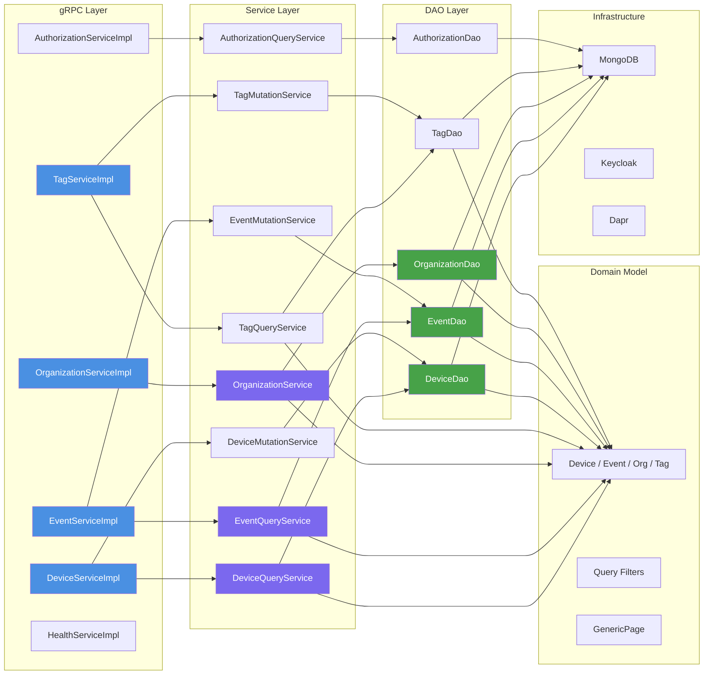
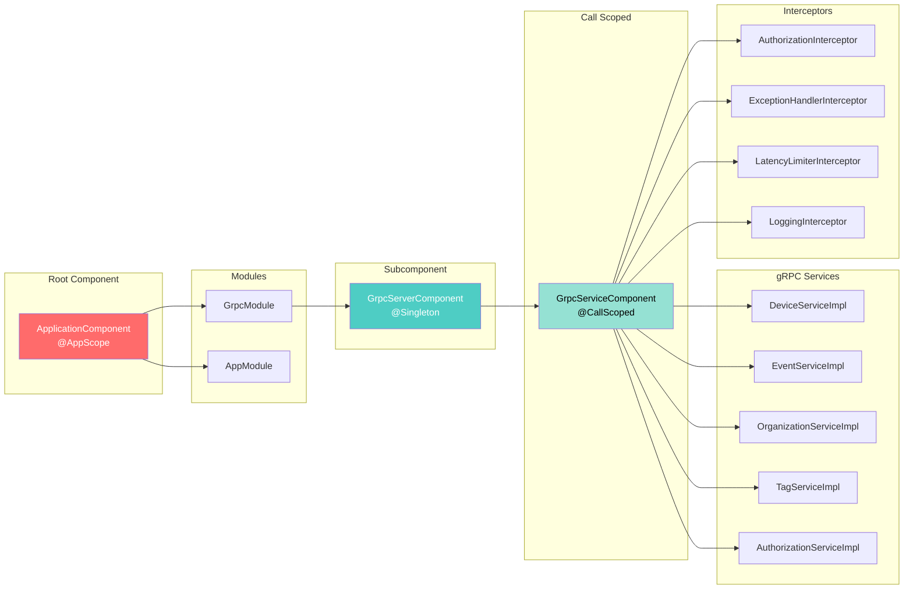
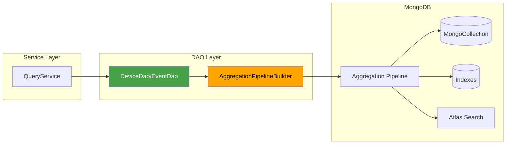
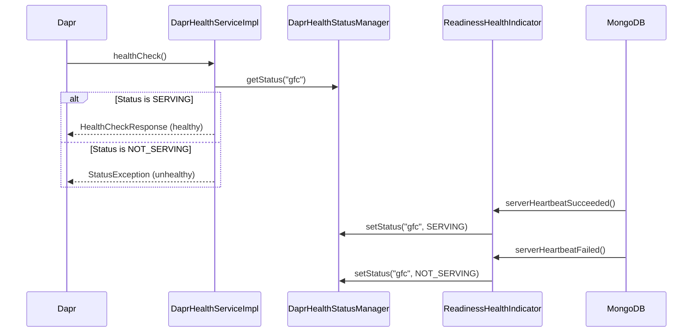
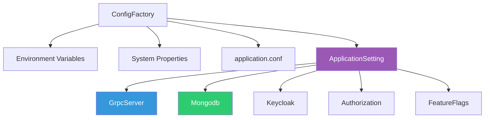

# Architecture & Components
- [Component layers](#component-layers)
- [gRPC server and Dagger modules](#grpc-server-and-dagger-modules)
- [Persistence and MongoDB integration](#persistence-and-mongodb-integration)
- [Dapr integration](#dapr-integration)
- [Configuration model](#configuration-model)
- [Summary](#summary)
## Component layers
- Service follows strict layered architecture with clear separation of concerns
- Each layer has distinct responsibilities and dependencies flow downward
- Domain model is shared across all layers but owned by domain package


## gRPC server and Dagger modules
- gRPC services are annotated with `@GrpcService` and extend generated gRPC base classes
- Dagger generates proxy and service modules for each gRPC implementation
- `GrpcServerComponent` is a subcomponent that wires all services at call scope
- `ApplicationComponent` is root component providing application-scoped dependencies
- `GrpcModule` provides Netty executors and builds `GrpcServerComponent`
- `AppModule` provides MongoDB client, health managers, and application settings
- Interceptors are provided via `InterceptorsModule` and applied to all gRPC calls
- Service implementations are `@CallScoped` for per-request lifecycle management
- **`Dagger`** → prepares and provides all the objects your services need (Mongo client, config, interceptors, etc.) at compile time, so nothing is guessed at runtime.
- **`Netty`** → runs the actual network layer and threads for handling gRPC calls asynchronously.


## Persistence and MongoDB integration
- All DAOs use `MongoCollection<Document>` with custom codec registry for type conversion
- `CodecRegistryFactory` creates registry supporting `LocalDateTime`, `ObjectId`, and domain types
- `AggregationPipelineBuilder` translates domain query filters to MongoDB aggregation pipelines
- Search strategy (`PRIMARY` vs `ATLAS`) determines whether to use MongoDB Atlas Search or primary index
- DAOs enforce organization-scoped queries via `orgCode` filter in all operations
- Batch operations use `BulkWriteModel` for efficient bulk updates (batch size 350)
- `BatchWriter` utility handles asynchronous batch writes for high-throughput scenarios
- MongoDB connection string includes authentication, heartbeat, and write concern settings
- Health monitoring via `ReadinessHealthIndicator` implements `ServerMonitorListener` for connection health


## Dapr integration
- `DaprHealthServiceImpl` implements `AppCallbackHealthCheckGrpc` for Dapr sidecar health checks
- Health status managed via `DaprHealthStatusManager` synchronized with `HealthStatusManager`
- Service name `gfc` registered in health status map with `SERVING`/`NOT_SERVING` states
- Terminal state entered during shutdown to prevent new health check requests
- Dapr client executor thread pool created with 5x CPU cores for async operations
- Health check endpoint responds to Dapr sidecar probes for service mesh integration
- No actor pattern implementation currently; health checks are primary Dapr integration point


## Configuration model
- `ApplicationSetting` is immutable record type built from `Typesafe Config`
- Configuration hierarchy: `gfc` → `grpc-server`, `mongodb`, `keycloak`, `authorization`, `feature-flags`
- Environment variable overrides via `ConfigFactory.systemEnvironmentOverrides()`
- System property `-Dconfig.file` allows external configuration file specification
- `GrpcServer` record contains port, thread pool counts, max message size, latency threshold
- `Mongodb` record contains connection URI, database name, search strategy, heartbeat frequency
- `Keycloak` record contains server URL, expected audience, allowed realms, resource access key
- `Authorization` record contains method-to-roles and app-to-methods mappings
- `FeatureFlags` record provides feature toggle mechanism via boolean flags
- Default values provided for all optional configuration properties

## Summary
### gRPC layer
* **Role:** pure boundary / transport layer
* **Responsibilities:** delegate requests to service layer
* **Forbidden:** validation, auth, business logic, persistence
* **Impl classes:** adapters implementing gRPC stubs; just delegate
### Service layer
* **Role:** application layer / use-case orchestration
* **Responsibilities:**
  * Query services → read-only, return DTOs
  * Mutation services → state changes, enforce business rules, return DTOs
* **CQRS:** separates queries vs commands clearly
### DAO layer
* **Role:** persistence access (MongoDB)
* **Responsibilities:** CRUD, queries
* **Works with:** domain objects, never DTOs
* **Service layer maps domain → DTO** for output
### Domain model
* **Role:** core business entities and logic
* **Contains:** rich objects (`Device`, `Event`, `Org`, `Tag`)
* **Encapsulates:** rules, invariants, behaviors
* **Does not know about:** service layer, gRPC, or DAOs
## Protos
- The proto files are in a separate module. In `pom.xml` line 419:
```xml
<protoSourceRoot>${basedir}/../gfc-apis/proto</protoSourceRoot>
```
- This points to `../gfc-apis/proto` (sibling directory), so the `.proto` files are in the `gfc-apis` repository/module, not in `gfc-service`.
  - The `gfc-apis` directory exists as a sibling to `gfc-service`.
- **During build**, the protobuf plugin compiles them from that location.
- This is a common pattern where:
  - **API contracts are centralized** in `gfc-apis` (shared repository)
  - **Multiple services reference them** (like `gfc-service`, `api-gateway`, etc.)
  - **Build-time compilation** happens via the protobuf Maven plugin pointing to `${basedir}/../gfc-apis/proto`
- The proto files are located at:
  - `../gfc-apis/proto/core/api/` - main service definitions (device, event, organization, tag, authorization, revision)
  - `../gfc-apis/proto/core/type/` - shared types (search, metering_point, shared)
  - `../gfc-apis/proto/iec61968_connector/` - connector-specific APIs
- During `mvn compile`, the protobuf plugin:
  - Reads proto files from `../gfc-apis/proto`
  - Generates Java classes in `target/generated-sources/protobuf/java`
  - Generates gRPC service stubs in `target/generated-sources/protobuf/grpc-java`
- This keeps **API contracts** in `one place` and `shared across services`.
