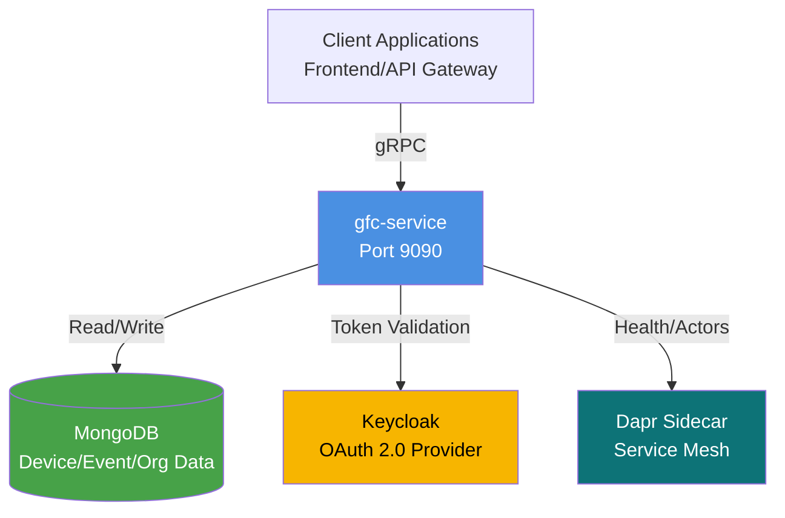

# Introduction
- [Problem statement](#problem-statement)
- [Motivation](#motivation)
- [Design](#design)
- [Design principles](#design-principles)
- [Technology stack](#technology-stack)
- [Core responsibilities](#core-responsibilities)
## Problem statement
- Grid Flex Control application requires a centralized service to manage flexibilities lifecycles, events, multi-tenant organizations, and authorization. 
- Traditional REST APIs with JSON payloads introduce performance bottlenecks and lack strong typing for complex query operations.
## Motivation
- `High-throughput` requirements for device and event management
- Need for `type-safe contracts` between frontend and backend
- Multi-tenant isolation at the organization level
- Fine-grained authorization with role-based access control
- `Integration with service mesh infrastructure` for distributed systems
## Design
- `gfc-service` implements a **gRPC-based microservice** providing CRUD operations for the Grid Flex Control application. 
- It serves as the 
  - Core backend
  - Exposing type-safe APIs through protocol buffers 
  - Integration with 
    - MongoDB for persistence
    - Keycloak for authentication
    - Dapr for service mesh capabilities.

  
mermaid

## Design principles
- **Layered architecture**: Separation between
  - `gRPC handlers`
  - Business logic (`services`)
  - Data access (`dao`)
- **Dependency injection**: Full `Dagger-based DI` for testability and modularity
- **Multi-tenancy**: `Organization-scoped data isolation` at the `DAO layer`
- **Security first**: `Token-based authentication` with method-level authorization checks
- **Observability**: Health indicators, structured logging, and latency tracking via interceptors
## Technology stack
- **Runtime**: `Java 25` with preview features (`--enable-preview` for unnamed variables)
- **API**: `gRPC` with Protocol Buffers for `type-safe contracts`
- **DI framework**: `Dagger 2` for **`compile-time`** dependency injection
- **Database**: `MongoDB` with Atlas search support for **full-text queries**
- **AuthN/AuthZ**: `Keycloak` (OAuth 2.0 / OpenID Connect) for token validation
- **Service mesh**: `Dapr` sidecar for health checks and distributed system integration
- **Configuration**: `Typesafe Config` (**HOCON** format) with environment variable overrides
- **Logging**: `SLF4J` with `Logback` for structured logging
## Core responsibilities
- **Device management**: Lifecycle, registration, state transitions, and querying with complex filters
- **Event management**: Storage, filtering, and retrieval of operational events
- **Organization management**: Multi-tenant settings, configuration, and data isolation
- **Tag management**: Device categorization and metadata tagging
- **Authorization**: Permission management and RBAC enforcement
