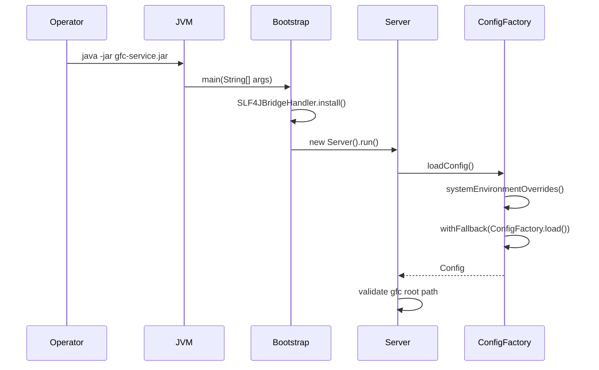
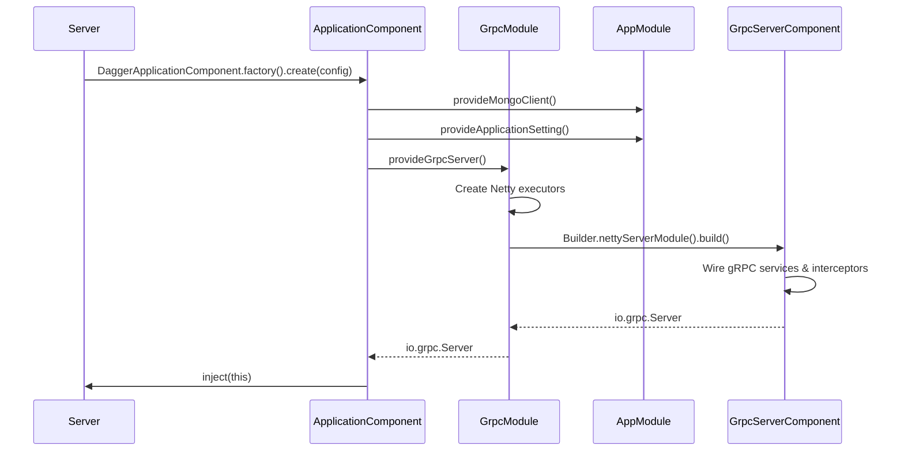
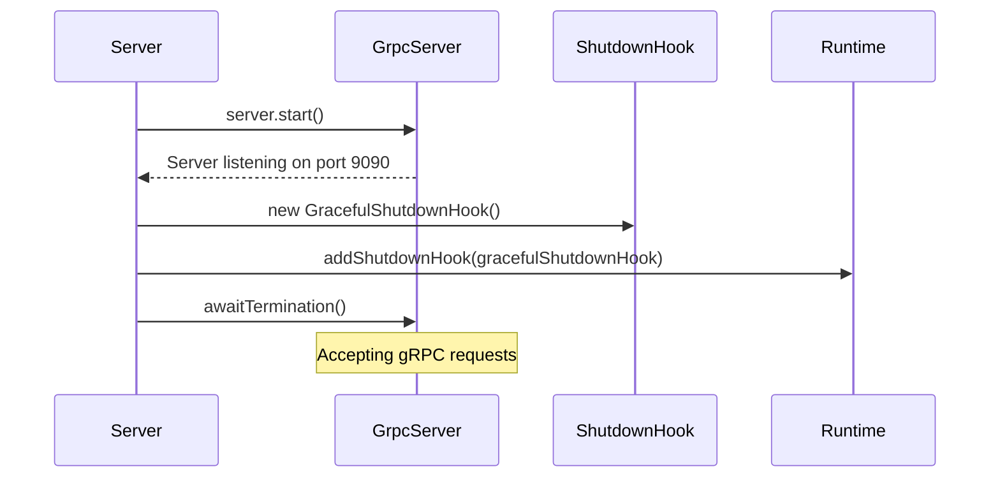
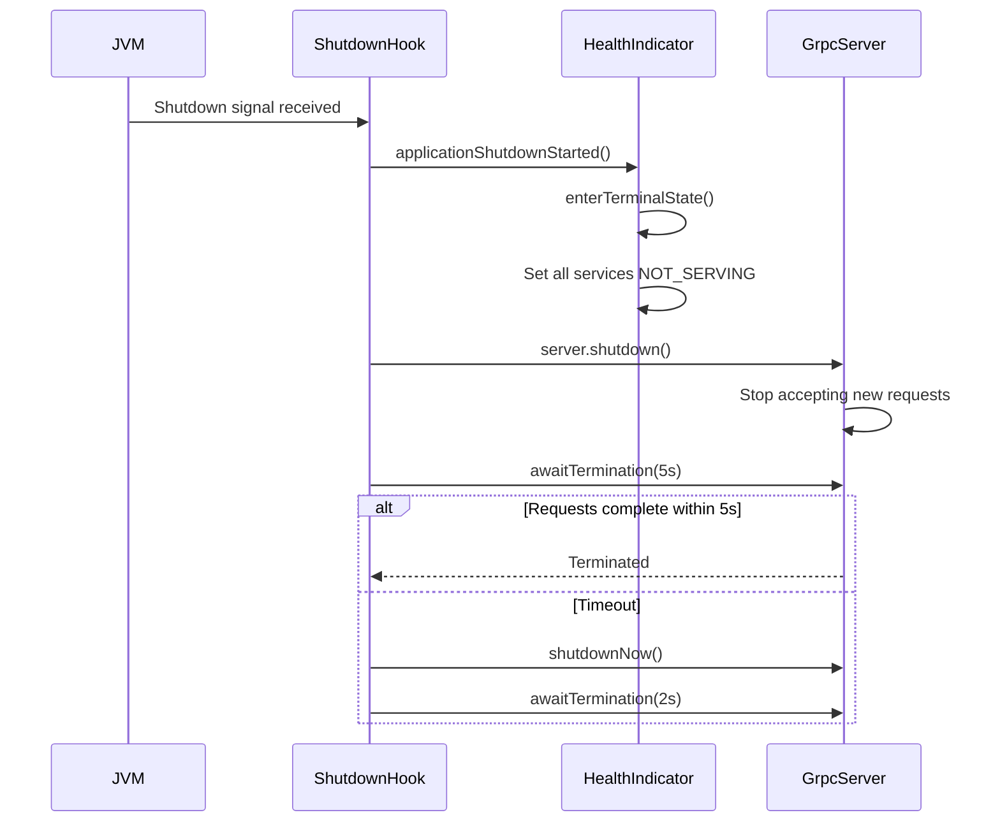

# Run time
- [Startup sequence](#startup-sequence)
- [Bootstrap & configuration](#bootstrap--configuration)
- [Dependency injection wiring](#dependency-injection-wiring)
- [Server startup](#server-startup)
- [Shutdown sequence](#shutdown-sequence)
## Startup sequence
- Service lifecycle follows strict initialization sequence ensuring dependencies wired before accepting requests
- Entry point is `Bootstrap.main()` which delegates to `Server.run()` for startup logic
- Configuration loading uses `Typesafe Config` with environment variable overrides (`-Dconfig.file` system property)
- Dependency injection happens via `Dagger` at compile time, creating `ApplicationComponent` with `GrpcModule` and `AppModule`
- gRPC server initialization requires Netty executors (boss/worker thread pools), MongoDB client, and health indicators
- Graceful shutdown ensures in-flight requests complete before termination
## Bootstrap & configuration
- `Bootstrap.main()` entry point initializes logging bridge (`SLF4JBridgeHandler`) and instantiates `Server`
- `Server.run()` loads configuration from `ConfigFactory` (system properties → environment → classpath)
- Configuration validation checks for `gfc` root path, throws `ConfigException.Missing` if absent

## Dependency injection wiring
- `DaggerApplicationComponent.factory().create(config)` builds the dependency graph
- `ApplicationComponent` injects dependencies into `Server` instance: `io.grpc.Server`, `MongoClient`, `ReadinessHealthIndicator`, `GitInfoManager`
- `GrpcModule` provides Netty executors and builds `GrpcServerComponent` with all gRPC services
- `GrpcServerComponent` wires all service implementations (`DeviceServiceImpl`, `EventServiceImpl`, etc.) and interceptors

## Server startup
- `server.start()` binds to configured port (default `9090`) and begins accepting connections
- `GracefulShutdownHook` registered as JVM shutdown hook via `Runtime.addShutdownHook()`
- `server.awaitTermination()` blocks main thread until shutdown signal received

## Shutdown sequence
- JVM shutdown signal triggers registered `GracefulShutdownHook` thread
- `healthIndicator.applicationShutdownStarted()` marks all services as `NOT_SERVING` via `HealthStatusManager.enterTerminalState()`
- `server.shutdown()` initiates graceful shutdown, stops accepting new requests
- `server.awaitTermination(5, TimeUnit.SECONDS)` waits for in-flight requests to complete
- If termination not complete within 5 seconds, `server.shutdownNow()` forces immediate shutdown
- Final `awaitTermination(2, TimeUnit.SECONDS)` allows resource cleanup

