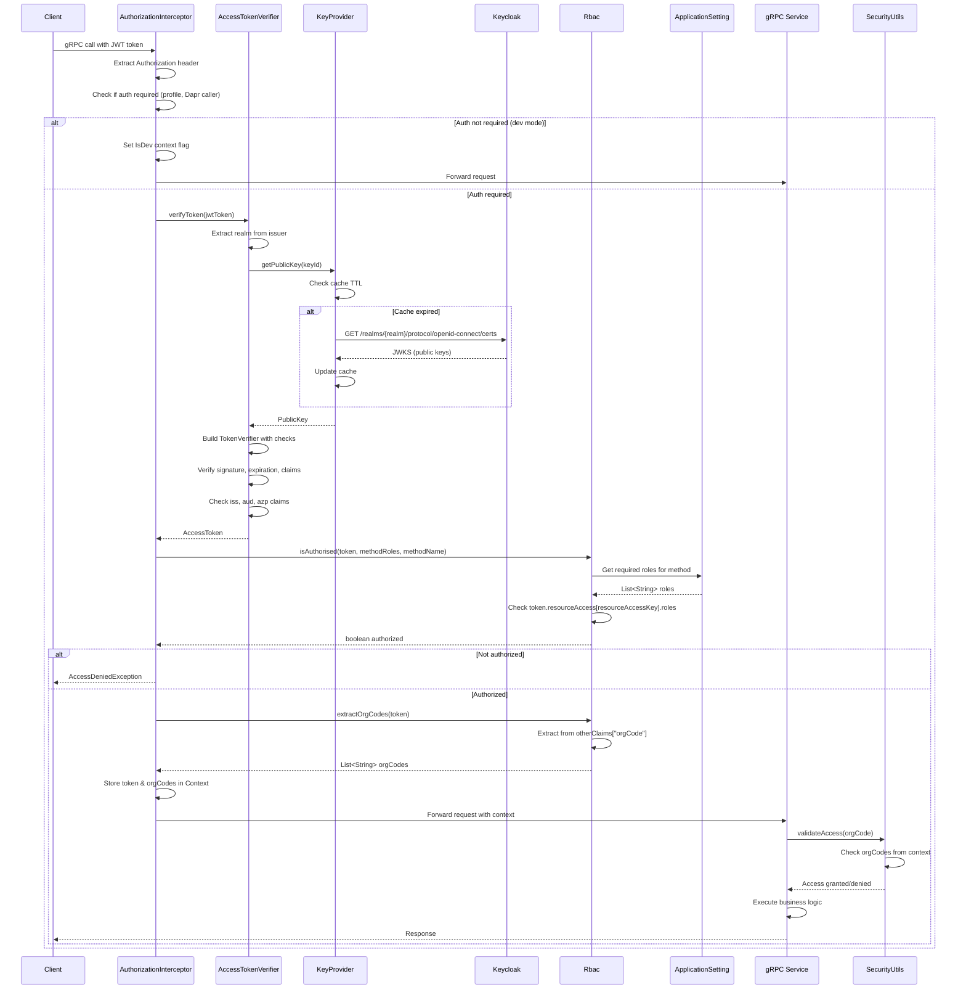

# Security & Authorization
- [Authentication](#authentication)
  - [Keycloak integration](#keycloak-integration)
  - [Token validation](#token-validation)
  - [JWT claims](#jwt-claims)
- [Authorization](#authorization)
  - [RBAC implementation](#rbac-implementation)
  - [Method-level enforcement](#method-level-enforcement)
  - [Organization access control](#organization-access-control)
- [RPC to roles mapping](#rpc-to-roles-mapping)
- [Authentication and authorization flow](#authentication-and-authorization-flow)

## Authentication
- All gRPC requests require JWT Bearer token in `Authorization` header (except Dapr service-to-service calls)
- Token validation happens in `AuthorizationInterceptor` before request reaches service implementation
- Keycloak integration uses Keycloak Admin Client library for token verification
- Public key caching with configurable TTL (default 1 day) and minimum request interval (default 5 minutes)
- Development mode bypass: when `profile != "prod"` or Dapr caller is `device-hub`, authentication is skipped
- Token verification is asynchronous via `CompletableFuture` to avoid blocking gRPC thread

## Keycloak integration
- Configuration via `ApplicationSetting.Keycloak` record: `serverUrl`, `expectedAudience`, `expectedIssuedFor`, `allowedRealms`, `resourceAccessKey`
- `AccessTokenVerifier` creates `TokenVerifier` with multiple validation checks
- `KeyProvider` fetches public keys from Keycloak JWKS endpoint (`/realms/{realm}/protocol/openid-connect/certs`)
- Public key lookup by `kid` (key ID) from JWT header, cached in `ConcurrentHashMap` with TTL
- Realm extraction from token issuer URL for multi-realm support
- `IssuersCheck`: validates token issuer (`iss` claim) against allowed realms list
- `IssuedForCheck`: validates authorized party (`azp` claim) against expected client IDs
- Key refresh: keys refreshed when cache expires or minimum request interval elapsed

## Token validation
- Token verification checks: `IS_ACTIVE` (not expired), `SUBJECT_EXISTS_CHECK` (subject claim present), `TokenTypeCheck` (Bearer token type)
- Audience validation: token `aud` claim must match `expectedAudience` (typically `"account"`)
- Issuer validation: token `iss` must match one of configured realm issuer URLs
- Authorized party validation: token `azp` must be in `expectedIssuedFor` list (client ID whitelist)
- Public key signature verification: JWT signature verified using public key from Keycloak JWKS
- Token expiration: checked automatically by Keycloak `TokenVerifier.IS_ACTIVE` check
- Verification exceptions: `TokenNotActiveException` and `VerificationException` converted to `AccessDeniedException`

## JWT claims
- Standard OAuth 2.0 / OpenID Connect claims: `iss` (issuer), `aud` (audience), `azp` (authorized party), `sub` (subject)
- Custom claims: `orgCode` (array of organization codes user has access to) extracted from `otherClaims`
- Resource access: roles stored in `resourceAccess` map under `resourceAccessKey` (configurable)
- Role structure: `AccessToken.getResourceAccess().get(resourceAccessKey).getRoles()` returns list of role names
- Organization codes: extracted via `Rbac.extractOrgCodes()` from `otherClaims.get("orgCode")` as `List<String>`
- Token context: validated `AccessToken` stored in gRPC `Context` for use in service layer

## Authorization
- Role-based access control (RBAC) implemented via `Rbac` singleton class
- Method-to-roles mapping configured in `application.conf` under `authorization.methodRoles`
- Authorization check happens after authentication in `AuthorizationInterceptor`
- Organization-scoped access: users can only access data for organizations in their `orgCode` claim
- App permissions: legacy `appRoles` mapping for frontend compatibility (temporary until frontend migrates)
- Authorization failure: throws `AccessDeniedException` with method name in error message

## RBAC implementation
- `Rbac.isAuthorised()` checks if token contains any required role for method
- Role lookup: `methodRoles.get(methodName)` returns list of allowed roles for method
- Role matching: token must have at least one role from method's required roles list
- Resource access: roles checked in `AccessToken.getResourceAccess().get(resourceAccessKey)`
- Singleton pattern: `Rbac.getInstance()` provides thread-safe singleton instance
- Organization extraction: `Rbac.extractOrgCodes()` extracts organization codes from token claims

## Method-level enforcement
- `AuthorizationInterceptor` intercepts all gRPC calls before service implementation
- Method name: extracted from `ServerCall.getMethodDescriptor().getFullMethodName()` (e.g., `"core.api.device.v1.DeviceService/GetDevice"`)
- Role check: `isAuthorised()` called with token, method roles map, method name, and resource access key
- Context storage: validated token and organization codes stored in gRPC `Context` for downstream use
- Development mode: when `IsDev` context flag set, authorization bypassed (returns `true`)
- Service layer access: `SecurityUtils.validateAccess()` checks organization codes from context

## Organization access control
- Organization codes extracted from JWT `orgCode` claim and stored in gRPC context
- `SecurityUtils.validateAccess(orgCode)` validates single organization access
- `SecurityUtils.validateAccess(Set<String> orgCodes)` validates multiple organization access
- Access check: requested organizations must be subset of user's granted organizations
- Empty organization list: if user has no organizations, access denied (except in dev mode)
- Super admin: empty organization list in dev mode grants access to all organizations
- Service layer enforcement: all DAO operations filter by `orgCode` from context

## RPC to roles mapping
- Method-to-roles mapping configured in `authorization.methodRoles` list
- Each entry maps gRPC fully qualified method name to list of required roles
- Multiple roles: method can require any role from list (OR logic, not AND)
- Example mappings from configuration:

| RPC Method | Required Roles | Notes |
|------------|----------------|-------|
| `core.api.device.v1.DeviceService/GetDevice` | `["read-device", "read-issue"]` | Read device details |
| `core.api.device.v1.DeviceService/QueryDevices` | `["read-device", "read-issue"]` | Query devices with filters |
| `core.api.device.v1.DeviceService/PingDevice` | `["xread-device"]` | Device ping operation |
| `core.api.event.v1.EventService/QueryEvent` | `["read-device", "read-issue"]` | Query events |
| `core.api.event.v1.EventService/GetEventCount` | `["read-device"]` | Get event counts |
| `core.api.organization.OrganizationService/AddOrganization` | `["gfc-admin"]` | Admin-only operation |
| `core.api.organization.OrganizationService/UpdateOrganizationSettings` | `["gfc-admin"]` | Admin-only operation |
| `core.api.tag.TagService/CreateOrUpdateTag` | `["read-device"]` | Tag management |
| `core.api.tag.TagService/TagDevice` | `["read-device"]` | Device tagging |
| `core.api.issue.v1.IssueService/GetIssue` | `["read-issue"]` | Issue read access |
| `core.api.issue.v1.IssueService/ResolveIssue` | `["read-issue"]` | Issue resolution |
| `core.api.datamanagement.DataManagement/UpdateDevices` | `["data-manager"]` | Data management operations |

## Authentication and authorization flow
- Request flow from client through interceptors to service with full security checks
- Token extraction from metadata, verification, role checking, and organization validation
- Context propagation ensures security context available throughout request lifecycle

