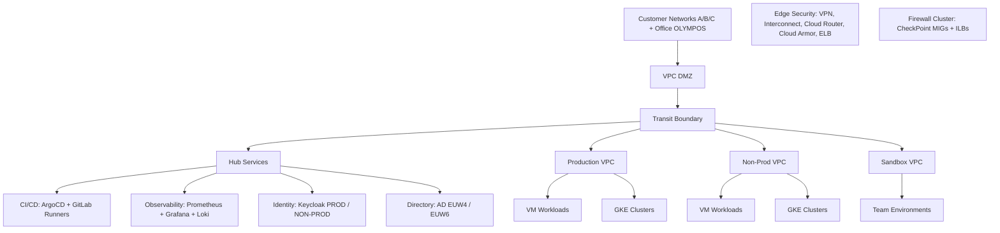

# Secure Enterprise Hub-and-Spoke Network Architecture in GCP
- [Introduction](#introduction)
- [Architecture overview](#architecture-overview)
- [Ingress layer](#ingress-layer)
- [Core firewall layer checkPoint managed instance groups](#core-firewall-layer-checkpoint-managed-instance-groups)
- [Nerve center](#nerve-center)
  - [Subnet cicd services](#subnet-cicd-services)
  - [Subnet shared services](#subnet-shared-services)
  - [Subnet active directory ad](#subnet-active-directory-ad)
- [Spoke layers](#spoke-layers)
  - [VPC prod and VPC non prod](#vpc-prod-and-vpc-non-prod)
  - [VPC sandboxes team A B and C](#vpc-sandboxes-team-a-b-and-c)
- [Takeaways](#takeaways)

## Introduction
- As enterprise cloud environments scale, managing network security, connectivity, and shared services across multiple business units becomes an operational challenge. Moving every application into a single Virtual Private Cloud (VPC) creates massive blast radiuses, while connecting every VPC to each other creates an unmanageable, web-like mesh.
- The industry gold standard for solving this is the **Hub-and-Spoke topology**.
- In this post, we’ll break down a highly secure, multi-region GCP architecture featuring next-generation firewalls (NGFW), decentralized sandbox teams, and dedicated shared services environments.
## Architecture overview
- This design relies on a centralized **VPC Hub** that acts as the traffic controller, connecting an external-facing **VPC DMZ**, a dedicated **Shared Services** zone, and multiple localized application networks (**Spokes**).

```
[ Customer/Office Networks ] ──> [ VPC DMZ ]
                                     │
                        (CheckPoint NGFW Inspection)
                                     │
                                     ▼
                                [ VPC HUB ]
                                     │
         ┌───────────────────────────┼───────────────────────────┐
         ▼                           ▼                           ▼
  [ VPC PROD ]                [ VPC NON-PROD ]           [ VPC SANDBOXES ]

```
## Ingress layer
- Ingress layer: VPC DMZ
- Traffic entering from external boundaries—whether it’s Customer Networks (A, B, and C) via Cloud VPN, or corporate headquarters via Dedicated Interconnect—is terminated inside **VPC DMZ**.
  - **Edge Security:** Google Cloud Armor and External Load Balancers (`ELB Z,Y,Z`) filter out DDoS attacks and malicious web traffic before it penetrates deeper into the network.
  - **Traffic Isolation:** The DMZ subnet holds no application backend workloads. Its sole purpose is to capture north-south traffic and force it through the security appliance layer.
## Core firewall layer
- Core firewall layer: CheckPoint managed instance groups
- You cannot rely on basic firewall rules alone when handling enterprise data. To ensure deep packet inspection (DPI) and threat prevention, this architecture sandwiches a layer of **CheckPoint Next-Generation Firewalls (NGFW)** between the DMZ and the Hub.
  - **Multi-Region Resilience:** Firewalls are split into Managed Instance Groups across multiple European regions:
    - `Group EUW4` (europe-west4)
    - `Group EUW6` (europe-west6)
- **Internal Load Balancing (ILB):** Traffic leaving the DMZ hits an Internal Load Balancer (`ILB 0.0.0.0/0`) which acts as the next hop, smoothly distributing inspection loads across the active firewall instances.
## Nerve center
- Nerve center: VPC hub and shared services
- Once traffic passes inspection, it reaches the **VPC HUB**. The Hub handles custom cloud routing and plays host to centralized platform tools, saving you from deploying repetitive tools in every application spoke.
### Subnet CICD services
- Houses centralized deployment runners, featuring **ArgoCD** for GitOps-driven Kubernetes management and **GitLab Runners** interacting securely with external SaaS repositories.
### Subnet shared services
- Contains your enterprise observability and identity stacks:
  - **Monitoring:** A consolidated Prometheus, Grafana, and Loki stack pulling metrics and logs from all spokes.
  - **Identity & Access:** High-availability **Keycloak** instances split cleanly between PROD and NON-PROD roles.
### Subnet active directory (AD)
- To support legacy enterprise authentication and Windows workloads, dedicated Primary and Secondary Domain Controllers (DCs) are replicated across both `europe-west4` and `europe-west6` for regional fault tolerance.
## Spoke Layers
- Spoke Layers: Production, Non-Prod, and Sandboxes
- The actual workloads run inside isolated spoke VPCs connected to the Hub via **VPC Peering**. Traffic between spokes must route back through the hub, enforcing isolation.
### VPC prod & VPC non-prod
- To mirror environments perfectly, both Prod and Non-Prod deploy symmetrical architectures across `europe-west4` and `europe-west6`:
  - **Subnet App A1/B1 (VMs):** Traditional compute environments backed by custom local Cloud Firewall Rules.
  - **Subnet App A2/B2 (GKE):** Containerized applications running on isolated Google Kubernetes Engine clusters.
### VPC sandboxes (Team A, B, and C)
- To prevent developers from accidentally disrupting business infrastructure, teams are allocated distinct **Sandbox VPCs**.
- These environments are isolated with highly restrictive Cloud Firewall rules, allowing rapid experimentation without putting production systems at risk.
## Takeaways
- **Zero-Trust Ingress:** No external entity talks directly to a database or app backend. Everything passes through Cloud Armor and a CheckPoint NGFW first.
- **Blast Radius Limitation:** A security breach in `Sandbox Team A` is entirely contained. VPC Peering boundaries prevent it from pivoting into `VPC PROD`.
- **Cost & Operational Efficiency:** Centralizing identity (Keycloak), monitoring (Prometheus/Grafana), and active directory inside the VPC Hub dramatically slashes licensing costs and maintenance overhead.

| Architectural stage          | Subnet / zone                              | Services & components                                                                               | Purpose / process                                                                                                                                              |
| ---------------------------- | ------------------------------------------ | --------------------------------------------------------------------------------------------------- | -------------------------------------------------------------------------------------------------------------------------------------------------------------- |
| Ingress & edge security      | VPC DMZ                                    | Cloud VPN, Interconnect, Cloud Router, Cloud Armor, External Load Balancers (ELB Z, Y, Z)           | Terminates traffic from customer networks (A, B, C) and office network (OLYMPOS). Provides DDoS protection, web filtering, and edge routing before inspection. |
| Firewall & inspection        | Transit boundary                           | CheckPoint Managed Instance Groups, Internal Load Balancer (ILB A, B, C), ILB 0.0.0.0/0 (EUW4/EUW6) | Forces all north-south traffic through HA firewall clusters across regions for deep packet inspection.                                                         |
| CI/CD & deployment           | Subnet CICD services (hub)                 | ArgoCD, GitLab Runners                                                                              | Manages CI/CD pipelines. Pulls code from repositories and deploys to GKE clusters using GitOps.                                                                |
| Observability & monitoring   | Subnet shared services (hub)               | Prometheus, Grafana, Loki                                                                           | Centralized metrics, logs, and monitoring across all workloads and spokes.                                                                                     |
| Identity & access management | Subnet shared services (hub)               | Keycloak PROD, Keycloak NON-PROD                                                                    | Central authentication and SSO, separated by environment.                                                                                                      |
| Directory services           | Subnet AD EUW4 / EUW6 (hub)                | Active Directory Primary DC, Secondary DC                                                           | Enterprise identity and domain services with cross-region replication for resilience.                                                                          |
| Workload spokes (production) | VPC PROD (europe-west4 / europe-west6)     | Subnet App A1/B1 (VM01, VM02), Subnet App A2/B2 (GKE)                                               | Production workloads on VMs and Kubernetes clusters, secured via firewall rules.                                                                               |
| Workload spokes (non-prod)   | VPC NON-PROD (europe-west4 / europe-west6) | Subnet App A1/B1 (VM01, VM02), Subnet App A2/B2 (GKE)                                               | Staging/QA environments mirroring production topology for testing.                                                                                             |
| Isolated testing (sandbox)   | VPC SANDBOX TeamA/B/C                      | Subnet App A1 (VM01, VM02), Cloud Firewall Rules                                                    | Isolated developer environments for experimentation without impacting core systems.                                                                            |


