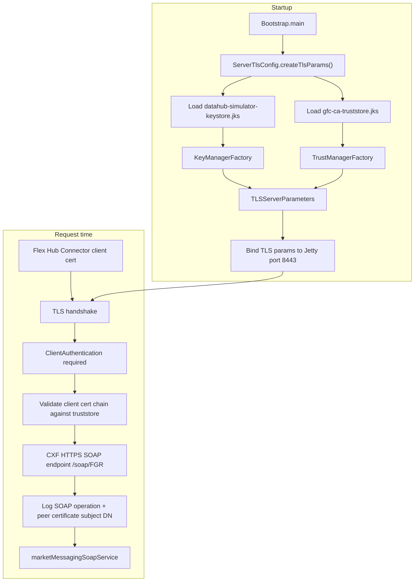

# ServerTlsConfig
- [Overview](#overview)
- [Tls flow](#tls-flow)
- [Code interpretation](#code-interpretation)
- [Important tls settings](#important-tls-settings)
- [Key concept](#key-concept)
- [Related files](#related-files)
## Overview
- `ServerTlsConfig` is the server-side TLS wiring for the Data Hub Simulator.
- It does not process SOAP business logic.
- Its responsibility is:
  - Build the SSL/TLS parameters.
  - Load the server identity.
  - Load trusted client certificate authorities.
  - Configure mutual TLS (mTLS).
  - Provide TLS settings that `Bootstrap` attaches to the HTTPS listener on port `8443`.
- The SOAP endpoint itself is served later by `CamelRoutes`.
## Tls flow

## Code interpretation
- Read the code as four steps:
  - `KeyStore.getInstance("JKS")` + `datahub-simulator-keystore.jks`
    - Means:
      - Load the simulator's own identity.
      - This contains the server certificate and private key.
  - `KeyManagerFactory`
    - Converts the keystore into server-side TLS keys.
    - These keys are used during the TLS handshake.
  - `gfc-ca-truststore.jks`
    - Means:
      - Load the certificate authorities trusted for incoming client certificates.
  - `TrustManagerFactory`
    - Converts the truststore into validation rules.
    - These rules decide whether the client certificate chain is accepted.
## Important tls settings
- The important TLS settings are:
  - `clientAuthentication.setRequired(true)`
    - Enables mandatory client authentication.
    - The client must provide a certificate.
    - This makes the connection mutual TLS (mTLS).
  - `clientAuthentication.setWant(true)`
    - Allows requesting a client certificate.
    - In this configuration it is redundant because `required(true)` already enforces it.
  - `setSecureSocketProtocol("TLSv1.3")`
    - Restricts the listener to TLS 1.3.
  - `setCipherSuites(...)`
    - Limits allowed cipher suites.
    - Only the configured AES-GCM TLS 1.3 suites are accepted.
  - `setSniHostCheck(false)`
    - Disables hostname/SNI validation.
    - Useful for local development.
    - Should be reviewed before production use.
## Key concept
- **Keystore = who the server is**
  - Server certificate.
  - Server private key.
  - Used to prove server identity.
- **Truststore = which clients the server accepts**
  - Trusted CA certificates.
  - Used to validate incoming client certificates.
## Security boundary
- `ServerTlsConfig` only protects the HTTPS path.
- In `Bootstrap`:
  - TLS configuration is attached to:
    - HTTPS listener → port `8443`
    - `CamelRoutes` also defines:
      - Plain HTTP SOAP route → port `9090`
- So this class secures the TLS endpoint, not every endpoint in the application.
## Logging consideration
- Transport encryption does not automatically protect logged data.
- `CamelRoutes` enables CXF logging on the HTTPS SOAP endpoint.
- It logs:
  - SOAP operation.
  - Peer certificate subject DN (when available).
- This helps trace requests, but excessive logging can expose sensitive SOAP payload data.
## Related files
- `ServerTlsConfig.java`
- `Bootstrap.java`
- `CamelRoutes.java`
- `SSLContextParameterFactory.java`
- `how-to-manage-certificates.md`
