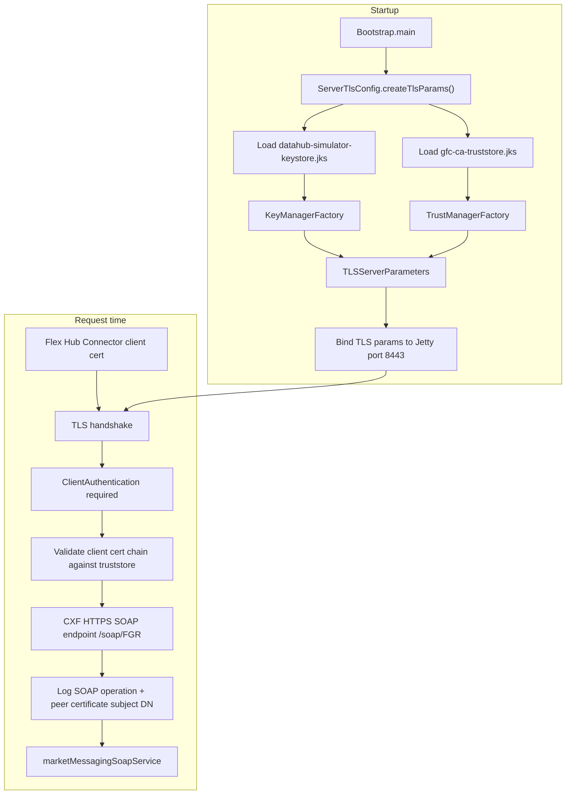

# ServerTlsConfig
- [Overview](#overview)
- [Tls flow](#tls-flow)
- [Code interpretation](#code-interpretation)
- [Important tls settings](#important-tls-settings)
- [Key concept](#key-concept)
- [Related files](#related-files)

# Overview
- `ServerTlsConfig` is the server-side TLS wiring for the Data Hub Simulator.
- It does not process SOAP business logic.
- Its responsibility is:
  - Build the SSL/TLS parameters.
  - Load the server identity.
  - Load trusted client certificate authorities.
  - Configure mutual TLS (mTLS).
  - Provide TLS settings that `Bootstrap` attaches to the HTTPS listener on port `8443`.
- The SOAP endpoint itself is served later by `CamelRoutes`.

# Tls flow

