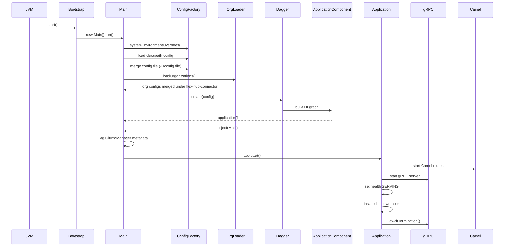

# Flex hub connector
* [Overview](#overview)
* [Boot flow](#boot-flow)
* [Config loading flow](#config-loading-flow)
* [Config structure](#config-structure)
* [Sequence diagram](#sequence-diagram)
* [Dagger](dagger/README.md)
## Overview
* This describes how the JVM application
  * boots
  * builds configuration
  * wires dependencies via Dagger
  * hands control to the runtime system (Camel + gRPC) with config assembly as the central spine.
## Boot flow
* JVM entrypoint: `Bootstrap.java`
  * installs SLF4J bridge
  * calls `new Main().run()`
* Main runtime flow (`Main.java → run()`)
  * `loadConfig()` builds merged Typesafe config
  * Dagger creates DI graph via `ApplicationComponent.factory().create(config)`
  * application instance is resolved from DI graph
  * Main class fields are injected (`appComponent.inject(this)`)
  * Git metadata is logged via `GitInfoManager`
  * `app.start()` hands control to runtime
* Application start (`Application.java`)
  * starts Camel routes
  * starts gRPC server
  * sets health state to SERVING
  * installs shutdown hook
  * blocks on `grpc.awaitTermination()`
## Config loading flow
* Base config source:
  * `systemEnvironmentOverrides()`
  * fallback: `ConfigFactory.load()`
* External overrides:
  * reads `-Dconfig.file`
  * loads sibling `organizations/` directory
  * merges all org configs under `flex-hub-connector`
* Validation:
  * requires top-level `flex-hub-connector` section
  * logs config with sensitive fields masked
* Organization loading (`loadOrganizations()`)
  * assumes `config.file` is set
  * reads parent directory
  * parses each file in `organizations/`
  * nests results under `flex-hub-connector.organizations`
* Typed mapping (`ApplicationSetting`)
  * converts merged config into typed objects:
    * gRPC server settings
    * remote service endpoints
    * scheduled tasks
    * keystore/truststore configs
    * tenant definitions
* Tenant model:
  * becomes `TenantConfiguration`
    * organization-identifier
    * organization-name
    * organization-user
## Config structure

| Layer                | Source                         | Purpose                            |
| -------------------- | ------------------------------ | ---------------------------------- |
| System overrides     | `systemEnvironmentOverrides()` | Highest priority runtime overrides |
| Classpath config     | `ConfigFactory.load()`         | Default application config         |
| External config file | `-Dconfig.file`                | Environment-specific overrides     |
| Organization configs | `organizations/*.conf`         | Multi-tenant org definitions       |
| Merged root          | `flex-hub-connector`           | Required top-level namespace       |
| Typed config         | `ApplicationSetting`           | Runtime-usable structured settings |

## Sequence diagram

