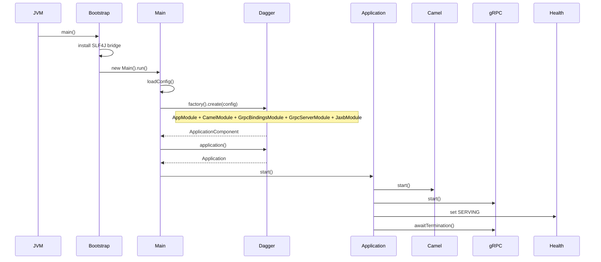

## Dagger
* [Dagger in flex-hub-connector](#dagger-in-flex-hub-connector)
* [Configuration summary](#configuration-summary)
* [What dagger is doing here](#what-dagger-is-doing-here)
* [Standard wiring vs dagger](#standard-wiring-vs-dagger)
* [Startup sequence](#startup-sequence)
## Dagger in flex-hub-connector
* [`Main.java`](Main.java) is the composition root, not where the application is manually assembled.
* It:
  * loads configuration
  * asks Dagger for an `Application`
  * starts it
* The actual wiring lives inside Dagger modules:
  * AppModule
  * CamelModule
  * GrpcBindingsModule
  * GrpcServerModule
  * JaxbModule
* Think of Main as ignition logic, not construction logic.

## Configuration summary

| config area                                        | source                                          | used by                              | purpose                                           |
| -------------------------------------------------- | ----------------------------------------------- | ------------------------------------ | ------------------------------------------------- |
| `-Dconfig.file`                                    | JVM argument read by `Main.loadOrganizations()` | Main                                 | Points to environment-specific `application.conf` |
| `flex-hub-connector.grpc-server`                   | `etc/application.conf`                          | ApplicationSetting, GrpcServerModule | gRPC port and max message size                    |
| `flex-hub-connector.remote-services`               | `application.conf`                              | outbound adapters                    | SOAP + gRPC endpoints                             |
| `flex-hub-connector.scheduled-tasks.peek-messages` | `application.conf`                              | ScheduledCamelRoutes                 | polling interval                                  |
| `flex-hub-connector.system-user`                   | system/system.conf                              | TLS-related services                 | keystore + truststore config                      |
| `flex-hub-connector.organizations`                 | `etc/organizations/*.conf`                      | lookup services                      | tenant mapping                                    |

* Main merges env overrides + base config + organization files before Dagger runs
* ApplicationSetting converts merged config into typed objects
## What dagger is doing here
* Dagger is responsible for assembling the runtime object graph.
* `@BindsInstance` Config
  * seeds the dependency graph
* `AppModule`
  * converts config → ApplicationSetting
  * binds interfaces to implementations
* `CamelModule`
  * collects RouteBuilders via @IntoSet
  * builds a single CamelContext
* `GrpcBindingsModule`
  * collects ServerServiceDefinitions via @IntoSet
  * applies tenant interceptors
* `GrpcServerModule`
  * builds Netty gRPC server from config
* `JaxbModule`
  * provides shared JAXB data format for Camel
* `Application`
  * starts Camel
  * starts gRPC
  * sets health to SERVING
  * blocks on termination
## Standard wiring vs dagger

| Concern          | Manual approach                | Dagger approach                   | Benefit                  |
| ---------------- | ------------------------------ | --------------------------------- | ------------------------ |
| startup          | Main builds everything         | ApplicationComponent builds graph | Main stays minimal       |
| shared objects   | manual singleton handling      | @Singleton scope                  | one instance per runtime |
| camel routes     | registered in bootstrap code   | @IntoSet RouteBuilder             | modular route addition   |
| grpc services    | manual registration            | @IntoSet ServerServiceDefinition  | additive architecture    |
| interface wiring | concrete classes used directly | @Binds abstraction mapping        | decoupling               |
| validation       | runtime failures               | compile-time graph checks         | earlier error detection  |

## Startup sequence

If you want, I can next compress this into a **1-page “architecture cheat sheet”** or expand it into a **module-by-module dependency map (AppModule → Camel → gRPC wiring graph)**.
