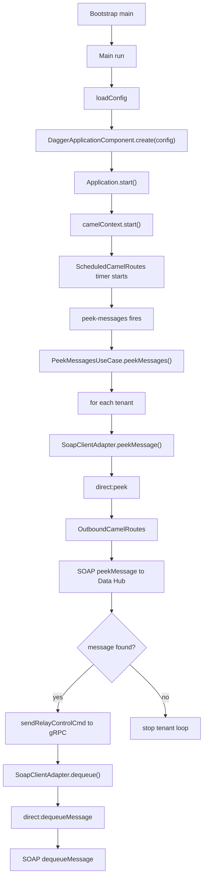

# Poll messages

Files
- Main.java: C:\Git\gfc-app\flex-hub-connector\src\main\java\com\landisgyr\gfc\flexhub_connector\app\Main.java
- Application.java: C:\Git\gfc-app\flex-hub-connector\src\main\java\com\landisgyr\gfc\flexhub_connector\infrastructure\di\Application.java
- ScheduledCamelRoutes.java: C:\Git\gfc-app\flex-hub-connector\src\main\java\com\landisgyr\gfc\flexhub_connector\adapters\inbound\scheduler\ScheduledCamelRoutes.java
- PeekMessagesUseCase.java: C:\Git\gfc-app\flex-hub-connector\src\main\java\com\landisgyr\gfc\flexhub_connector\app\usecase\PeekMessagesUseCase.java
- SoapClientAdapter.java: C:\Git\gfc-app\flex-hub-connector\src\main\java\com\landisgyr\gfc\flexhub_connector\adapters\outbound\soap\SoapClientAdapter.java
- OutboundCamelRoutes.java: C:\Git\gfc-app\flex-hub-connector\src\main\java\com\landisgyr\gfc\flexhub_connector\adapters\outbound\soap\OutboundCamelRoutes.java
