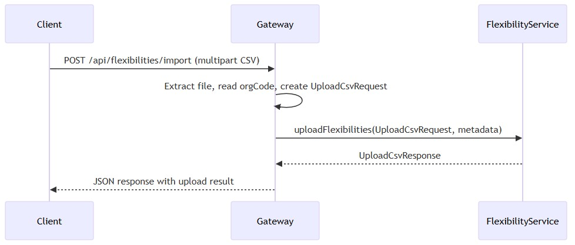
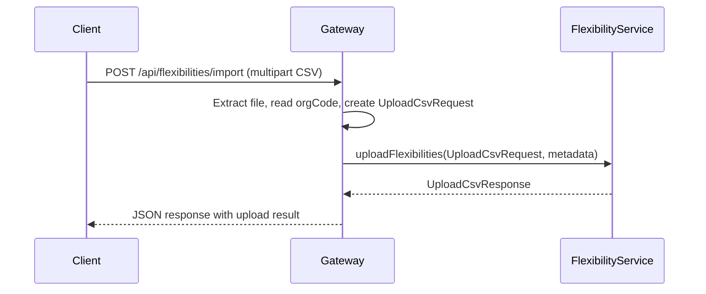
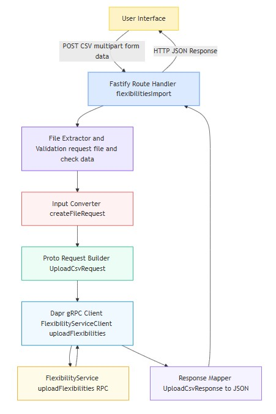
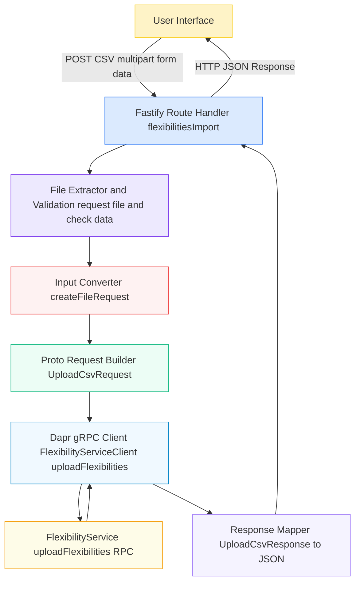

# File upload
* [Apollo server](apollo-server/README.md)
* [Overview](#overview)
* [Flow](#flow)
* [Functions](#functions)
* [GraphQL vs REST context](#graphql-vs-rest-context)
* [Proto mapping](#proto-mapping)
* [Summary](#summary)
## Overview
- Handle **file uploads** (CSV in this case) from a client.
```ts
// Fastify route expects multipart/form-data
const data = await request.file();
if (!data) {
  return reply.code(400).send({ error: "Invalid data." });
}
```
* `Fastify` acts as the **HTTP API gateway** endpoint.
```ts
// Exported as a route handler
export const flexibilitiesImport = async (
  request: FastifyRequest,
  reply: FastifyReply,
) => { ... }
```
* The file is converted into a **gRPC proto request** (`UploadCsvRequest`) and sent to `DeviceServiceClient`.
```ts
const fileReq = await createFileRequest(data as MultipartFile);

const createFileRequest = async (data: MultipartFile): Promise<UploadCsvRequest> => {
  const orgCode = (data.fields?.orgCode as MultipartValue)?.value;
  const metadata = JSON.stringify({ mimetype: data.mimetype, orgCode });
  const buf = await data.toBuffer();
  return new UploadCsvRequest()
    .setMetadata(metadata)
    .setContent(buf)
    .setFilename(data.filename || "");
};
```
* `Dapr gRPC client` is used for **service invocation**, similar to your Organization API flows.
```ts
const response: any = await new Promise((resolve, reject) => {
  daprGrpcClient(DeviceServiceClient).uploadFlexibilities(
    fileReq,
    metaData(request.headers.authorization as string, appId),
    (err, res: UploadCsvResponse) => {
      if (err) return reject(err);
      return resolve(res ? res.toObject() : {});
    },
  );
});
```
* Response (`UploadCsvResponse`) is mapped back to HTTP JSON and sent to the client.
```ts
console.log(`Uploaded flexibilities file: ${data.filename}, ${data.mimetype}`);
return reply.code(200).send(response);
```
## Flow
* Client uploads a CSV using multipart/form-data.
* Gateway endpoint receives the request (`flexibilitiesImport`).
* Gateway converts the uploaded file into a proto request:
  * Metadata JSON includes `orgCode` and MIME type.
  * File content is converted to `Uint8Array` / Buffer.
  * Filename is included.
* Gateway calls gRPC `DeviceServiceClient.uploadFlexibilities`.
* Gateway handles proto response:
  * Converts proto `UploadCsvResponse` to plain object (`toObject()`).
  * Returns JSON to the client.
* Errors are caught and returned as HTTP errors (400 for invalid input, 500 for server/proto errors).


<details>
  <summary>mermaid</summary>


</details>

## Functions

| Function                                 | Purpose                                              | Proto Interaction                                              |
| ---------------------------------------- | ---------------------------------------------------- | -------------------------------------------------------------- |
| `createFileRequest(data: MultipartFile)` | Converts multipart file into `UploadCsvRequest`      | Sets `metadata`, `content`, `filename`                         |
| `flexibilitiesImport(request, reply)`    | Fastify handler for POST `/api/flexibilities/import` | Calls `DeviceServiceClient.uploadFlexibilities` via Dapr       |
| `daprGrpcClient(DeviceServiceClient)`    | Returns gRPC client for service invocation           | Handles metadata, authentication token, app ID                 |
| `metaData(authHeader, appId)`            | Creates gRPC metadata                                | Includes authorization token and target appId for Dapr routing |

---

## Graphql vs REST context
* Current implementation is **REST over HTTP** (`FastifyInstance`) for file upload.
* Unlike GraphQL queries/mutations, file uploads are easier to handle via multipart REST endpoints.
* In GraphQL, uploading files usually requires **Apollo’s `Upload` scalar** or custom resolvers that internally call the same proto service.
* Conceptually, this is similar to Organization API:
  * Input conversion → proto request
  * gRPC call → service
  * Proto response → output mapping
## Proto mapping

| REST / Gateway                      | Proto Message      | Fields Set                                                |
| ----------------------------------- | ------------------ | --------------------------------------------------------- |
| File upload (`MultipartFile`)       | `UploadCsvRequest` | `metadata` (JSON), `content` (bytes), `filename` (string) |
| gRPC response (`UploadCsvResponse`) | JSON HTTP response | `toObject()` mapping of proto fields to plain JSON        |

* Metadata includes `orgCode` to associate the uploaded file with the correct organization.
* File content is sent as raw bytes (`setContent(buf)`), similar to sending structured fields in Organization API requests.
## Summary
* `Fastify endpoint` = API Gateway for file uploads.
* Gateway `converts HTTP input` → `gRPC proto request` (like GraphQL resolvers do for queries/mutations).
* Dapr gRPC client manages `service discovery` and `routing`.
* Response is converted back → **client-friendly format**.
* GraphQL equivalent could wrap this in a mutation with `Upload` scalar → internally call same proto service.


<details>
  <summary>mermaid</summary>


</details>
