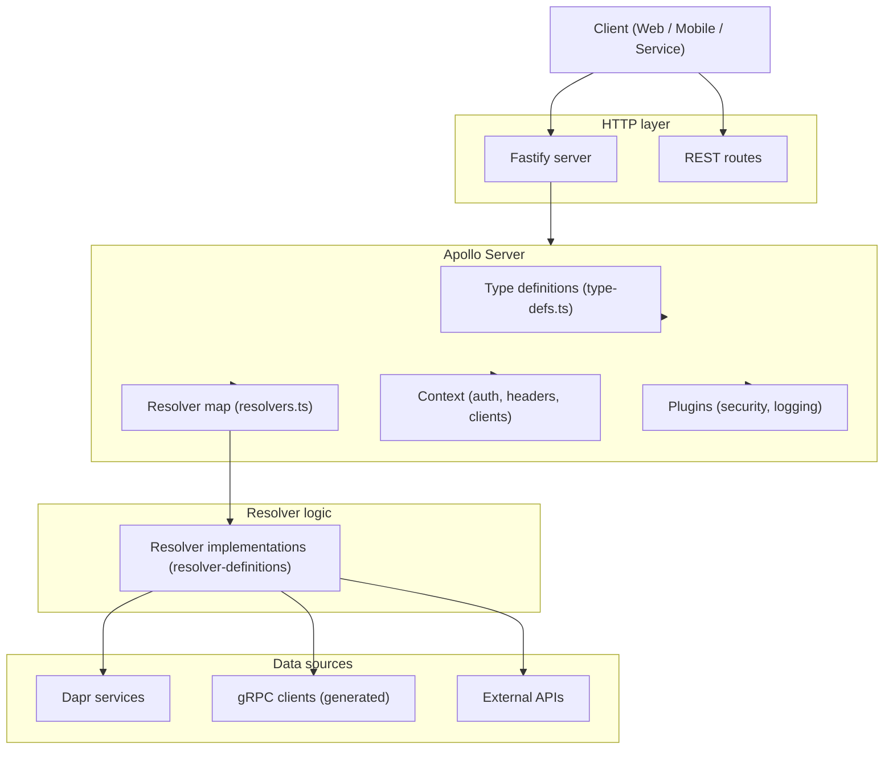

# Apollo server
- [Introduction](#introduction)
## Introduction
- Top to bottom is `request flow`
- Left to right is `responsibility split`
- Apollo Server is the `orchestrator`, not the business logic
- `Resolvers` are the only place where **real work** happens
- `Fastify` is just the `transport shell`

  
mermaid

