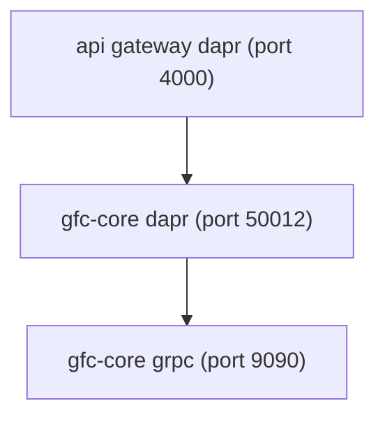
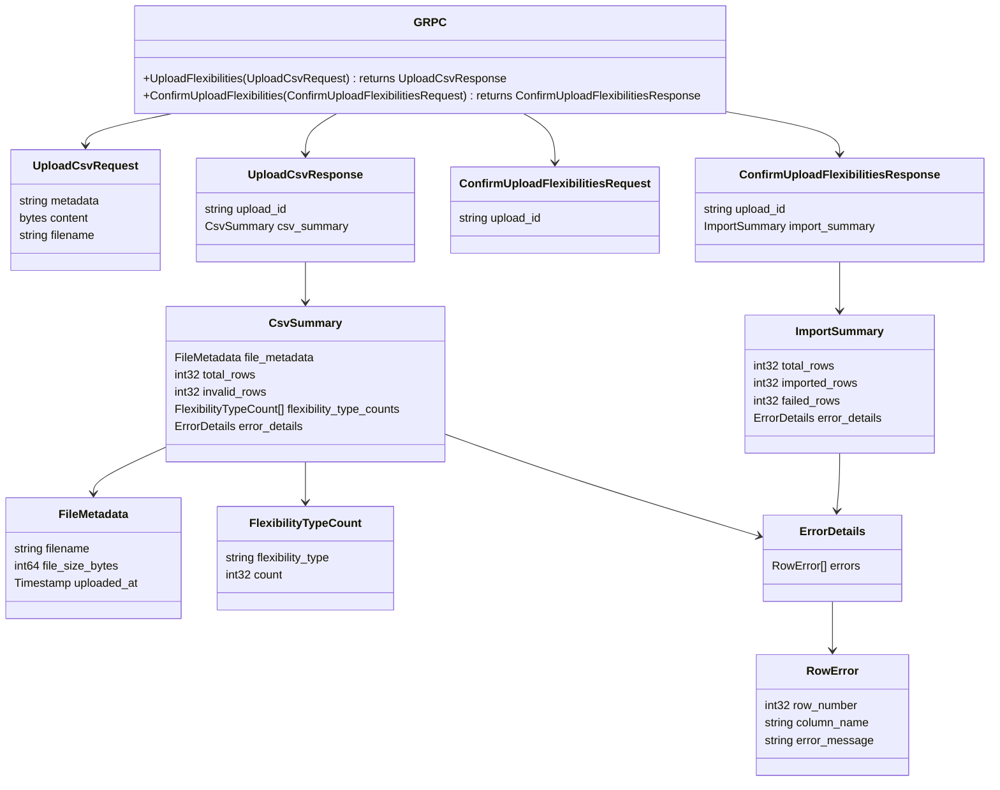
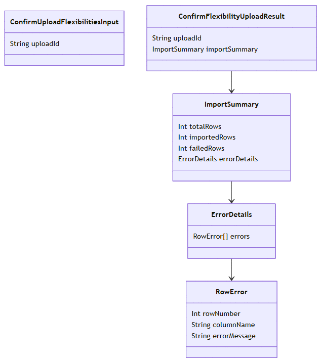
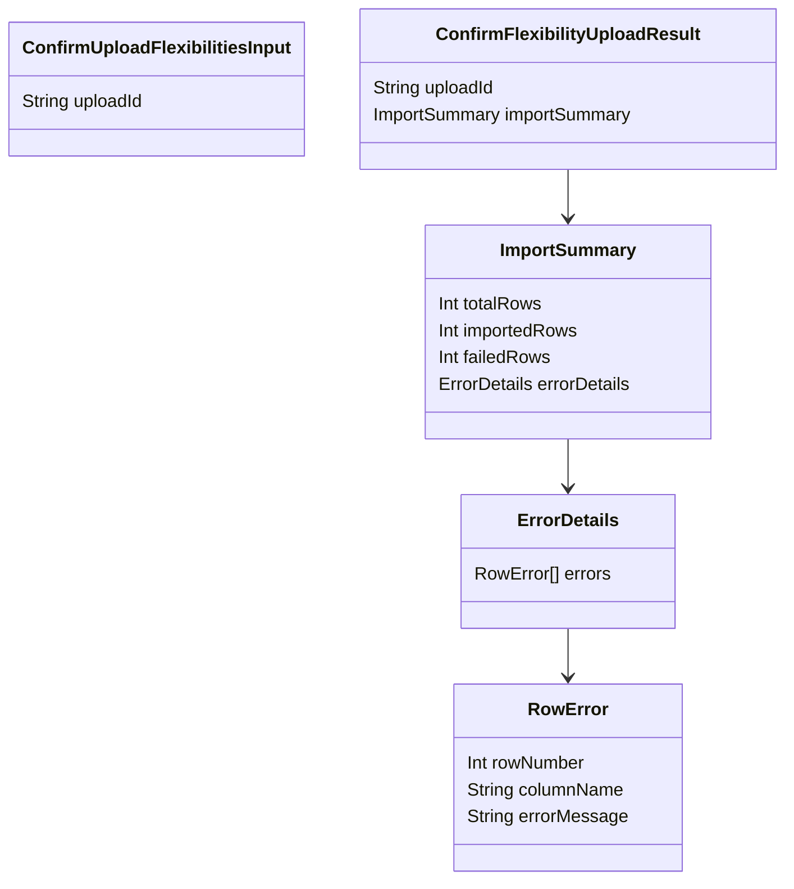

# Import flexibilities
- [File upload](file-upload/README.md)
- [Confirm upload](confirm-upload/README.md)
- [Query flexibilities](query/README.md)
---
- [Dapr service invocation](#dapr-service-invocation)
- [Protos](#protos)
- [GraphQL schema](#graphql-schema)
- [Response](#response)
## Dapr service invocation
* Dapr sidecar discovers `gfc-core` service via mDNS
* Routes gRPC request to target service

## Protos


<details>
  <summary>mermaid</summary>


</details>

## GraphQL schema


<details>
  <summary>mermaid</summary>


</details>

## Response
```json
{
  "uploadId": "a4fed697-c437-44e4-846f-d0e093283c6f",
  "csvSummary": {
    "fileMetadata": {
      "filename": "Flexibilities-L540.csv",
      "fileSizeBytes": "13157",
      "uploadedAt": "2026-01-28T19:49:08.264Z"
    },
    "totalRows": 100,
    "invalidRows": 12,
    "flexibilityTypeCounts": [
      {
        "flexibilityType": "Boiler",
        "count": 45
      },
      {
        "flexibilityType": "Heat pump",
        "count": 32
      },
      {
        "flexibilityType": "Lighting",
        "count": 28
      },
      {
        "flexibilityType": "PV",
        "count": 18
      }
    ],
    "errorDetails": {
      "errors": [
        {
          "rowNumber": 5,
          "columnName": "FlexibilityId",
          "errorMessage": "Duplicate FlexibilityId found: FLEX-001"
        },
        {
          "rowNumber": 12,
          "columnName": "Tenant",
          "errorMessage": "Invalid tenant format: expected alphanumeric"
        },
        {
          "rowNumber": 18,
          "columnName": "FlexibilityId",
          "errorMessage": "Duplicate FlexibilityId found: FLEX-042"
        },
        {
          "rowNumber": 23,
          "columnName": "FlexibilityType",
          "errorMessage": "Unknown flexibility type: InvalidType"
        },
        {
          "rowNumber": 31,
          "columnName": "Name",
          "errorMessage": "Missing required field: Name"
        },
        {
          "rowNumber": 45,
          "columnName": "FlexibilityId",
          "errorMessage": "Duplicate FlexibilityId found: FLEX-078"
        },
        {
          "rowNumber": 67,
          "columnName": "Capacity",
          "errorMessage": "Invalid format: expected numeric value"
        },
        {
          "rowNumber": 89,
          "columnName": "Location",
          "errorMessage": "Missing required field: Location"
        }
      ]
    }
  }
}
```
