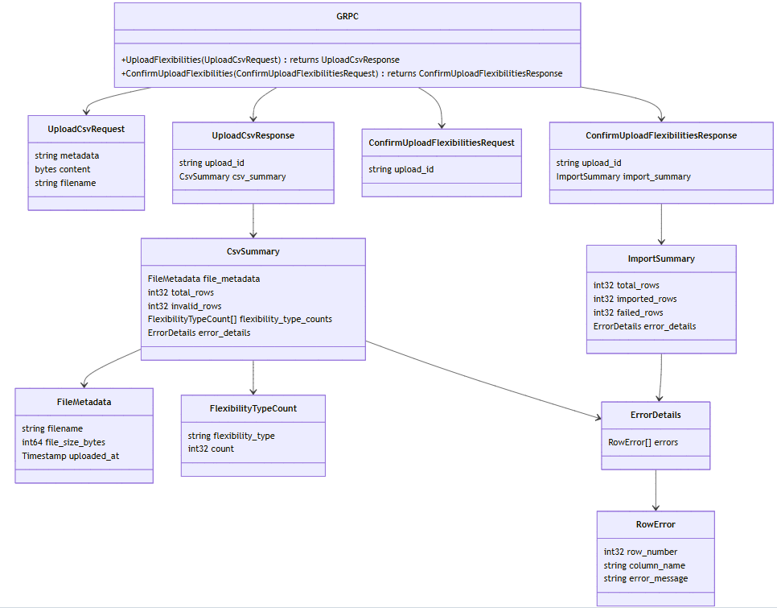
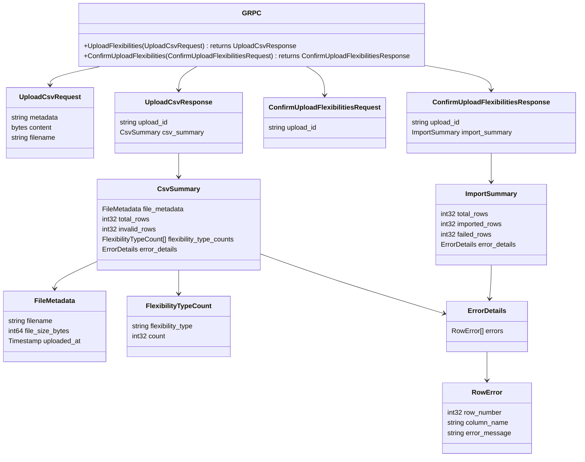
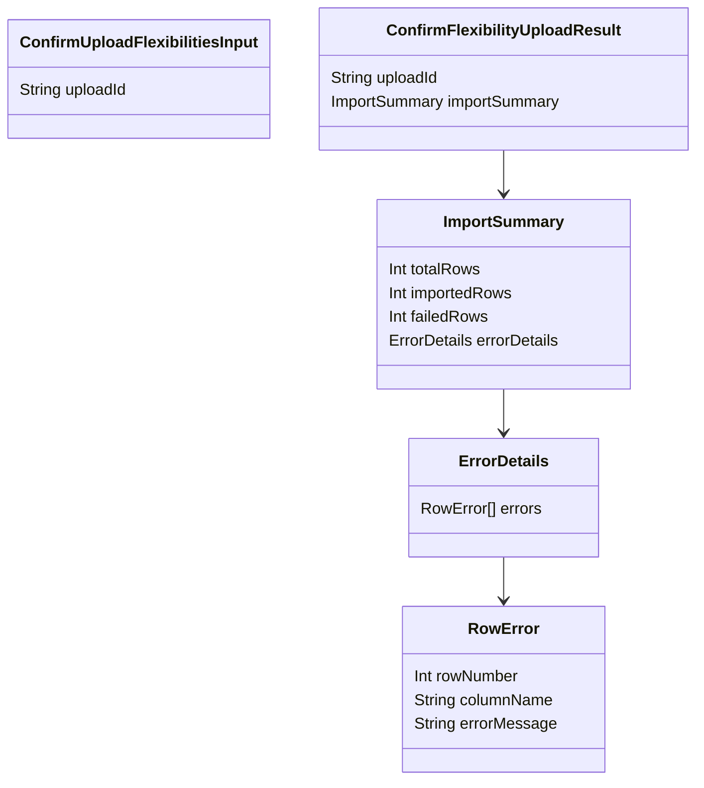

# File upload
- [Basics](basics/README.md)
- [Protos](#protos)
- [GraphQL schema](#graphql-schema)
- [Response](#response)
- [Flexibilities import route](#flexibilities-import-route)
- [GraphQL query entry](#graphql-query-entry)
- [Schema definition](#schema-definition)
- [Resolver execution](#resolver-execution)
- [gRPC client](#grpc-client)
- [Dapr service invocation](#dapr-service-invocation)
- [gRPC service handler](#grpc-service-handler)
- [MongoDB query](#mongodb-query)
- [Response flow](#response-flow)
- [Authentication flow](#authentication-flow)
- [Error handling](#error-handling)
- [Configuration dependencies](#configuration-dependencies)
## Protos


<details>
  <summary>mermaid</summary>


</details>

## GraphQL schema


<details>
  <summary>mermaid</summary>


</details>

## Response
```json
{
  "uploadId": "a4fed697-c437-44e4-846f-d0e093283c6f",
  "csvSummary": {
    "fileMetadata": {
      "filename": "Flexibilities-L540.csv",
      "fileSizeBytes": "13157",
      "uploadedAt": "2026-01-28T19:49:08.264Z"
    },
    "totalRows": 100,
    "invalidRows": 12,
    "flexibilityTypeCounts": [
      {
        "flexibilityType": "Boiler",
        "count": 45
      },
      {
        "flexibilityType": "Heat pump",
        "count": 32
      },
      {
        "flexibilityType": "Lighting",
        "count": 28
      },
      {
        "flexibilityType": "PV",
        "count": 18
      }
    ],
    "errorDetails": {
      "errors": [
        {
          "rowNumber": 5,
          "columnName": "FlexibilityId",
          "errorMessage": "Duplicate FlexibilityId found: FLEX-001"
        },
        {
          "rowNumber": 12,
          "columnName": "Tenant",
          "errorMessage": "Invalid tenant format: expected alphanumeric"
        },
        {
          "rowNumber": 18,
          "columnName": "FlexibilityId",
          "errorMessage": "Duplicate FlexibilityId found: FLEX-042"
        },
        {
          "rowNumber": 23,
          "columnName": "FlexibilityType",
          "errorMessage": "Unknown flexibility type: InvalidType"
        },
        {
          "rowNumber": 31,
          "columnName": "Name",
          "errorMessage": "Missing required field: Name"
        },
        {
          "rowNumber": 45,
          "columnName": "FlexibilityId",
          "errorMessage": "Duplicate FlexibilityId found: FLEX-078"
        },
        {
          "rowNumber": 67,
          "columnName": "Capacity",
          "errorMessage": "Invalid format: expected numeric value"
        },
        {
          "rowNumber": 89,
          "columnName": "Location",
          "errorMessage": "Missing required field: Location"
        }
      ]
    }
  }
}
```
## Flexibilities import route
- [`routes/flexibilities-import.route.ts`](routes/flexibilities-import.route.ts)
- `curl -X POST http://localhost:4000/api/flexibilities/import -F file=@Flexibilities-L540.csv`
## GraphQL query entry
- **File:** GraphQL Playground / client: `http://127.0.0.1:4000/api/graphql`
- Query
```graphql
query ExampleQuery($input: FlexibilitiesInput) {
  flexibilities(input: $input) {
    items {
      flexibilityType
      name
      id
    }
  }
}
````
## Schema definition
* **File:** [`graphql/operations.graphql`](gateway/graphql/operations.graphql)
  * Defines the flexibilities `query and mutations signature`
* **File:** [`graphql/core/api/v1/flexibility.graphql`](gateway/graphql/flexibility.graphql)
  * Defines `Flexibility` type (what data you can read)
  * Defines `Flexibilities` type (what data you can read)
  * Defines `ConfirmUploadFlexibilitiesInput` input type (what data you can send)
  * [Documentation](gateway/graphql/README.md)
## Resolver execution
* **File:** [`src/resolver-definitions/core/flexibilities/flexibilities.ts`](gateway/resolver/flexibilities.ts)
* Receives GraphQL arguments and context
* Extracts auth token from context
* Creates `FlexibilityClient` instance
* Builds `QueryFlexibilitiesRequest` protobuf object
* Calls `client.queryFlexibilities()`
* [Documentation](gateway/resolver/README.md)
## gRPC client
* **File:** [`src/clients/flexibility-client.ts`](gateway/client/flexibility-client.ts)
* `queryFlexibilities()` method
* Retrieves Dapr proxy
* Creates dapr metadata with auth token
* Makes gRPC call via Dapr
* [Documentation](gateway/client/README.md)
## Dapr service invocation
* Dapr sidecar discovers `gfc-core` service via mDNS
* Routes gRPC request to target service
```
API Gateway Dapr (port 4000) 
  ↓ 
gfc-core Dapr (port 50012)
  ↓
gfc-core gRPC (port 9090)
```
## gRPC service handler
* **Proto:** [`gfc-apis/proto/core/api/flexibility/v1/flexibility.proto`](gfc-core/proto/flexibility.proto)
  * [Documentation](gfc-core/proto/README.md)
* ServiceImpl: [`src/main/java/com/landisgyr/gfc/grpc/FlexibilityServiceImpl.java`](gfc-core/serviceimpl/FlexibilityServiceImpl.java)
  * [Documentation](gfc-core/serviceimpl/README.md)
* Validates JWT token (Keycloak)
* Parses filter & pagination
* Queries MongoDB
## MongoDB query
* **Database:** `gfc-dev`
* **Collection:** `flexibilities` (assumed)
* Applies filters
* Executes pagination
* Returns results + totalCount

## Response flow
* gRPC response returned to `FlexibilityClient`
* Protobuf mapped to GraphQL types
* Response returned to resolver
* GraphQL formats and returns final response
```
MongoDB → gfc-core → Dapr → API Gateway → Client
```
## Authentication Flow
- Client sends JWT in `Authorization` header
- API Gateway extracts token → context
- Token forwarded via Dapr metadata
- gfc-core validates against Keycloak
- Checks realm: `gfc`, client: `test-client-01`
## Error Handling
- **GraphQL errors:** Thrown as `GraphQLError` with codes
- **gRPC errors:** Caught and wrapped in GraphQL errors
- **Auth failures:** Return `UNAUTHENTICATED` status
## Configuration Dependencies
- **API gateway:** `BACKEND_API`, Keycloak config
- **gfc-core:** MongoDB credentials, Keycloak validation
- **Dapr:** App IDs, ports, config.
