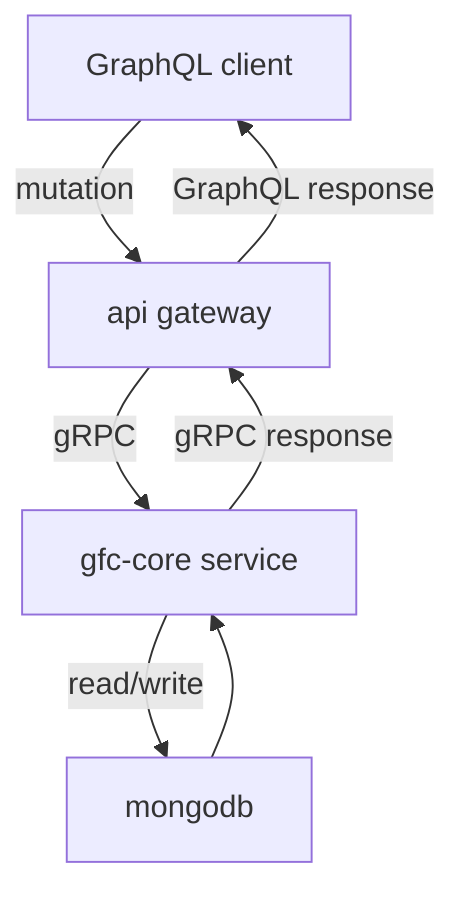
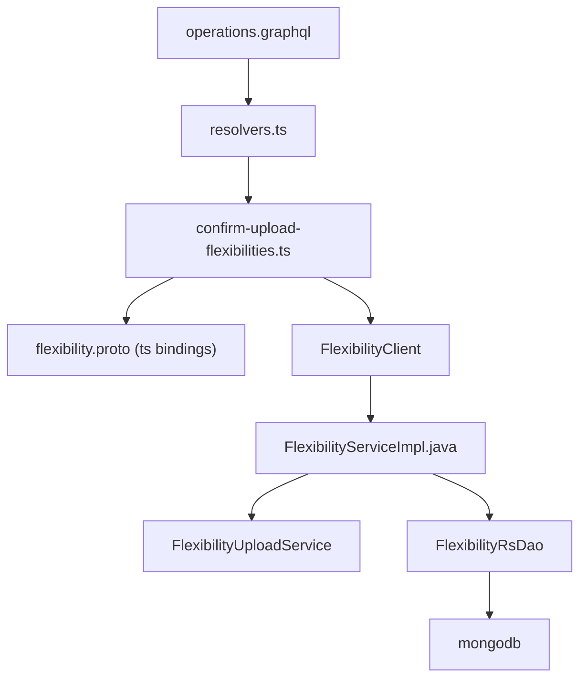
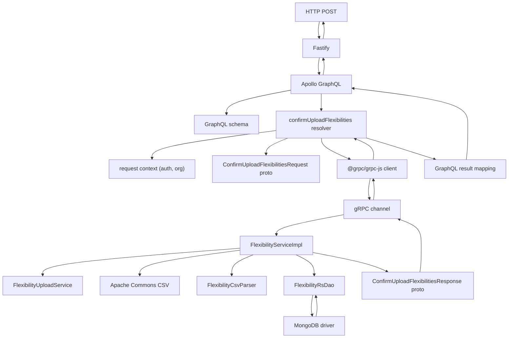

# Confirm upload
- [Basics](basics/README.md)
- [GraphQL mutation entry](#graphql-mutation-entry)
- [Overview](#overview)
- [Tracing the code](#tracing-the-code)
- [Dependencies](#dependencies)
- [API gateway](#api-gateway)
  - [Schema definition](#schema-definition)
  - [Resolver execution](#resolver-execution)
  - [gRPC client](#grpc-client)
  - [Dapr service invocation](#dapr-service-invocation)
- [GFC core](#gfc-core)
  - [gRPC service handler](#grpc-service-handler)
  - [MongoDB query](#mongodb-query)
- [Response flow](#response-flow)
- [Authentication flow](#authentication-flow)
- [Error handling](#error-handling)
- [Configuration dependencies](#configuration-dependencies)
## GraphQL mutation entry
- **File:** GraphQL Playground / client: `http://127.0.0.1:4000/api/graphql`
- Query
```graphql
mutation Mutation($input: ConfirmUploadFlexibilitiesInput!) {
  confirmUploadFlexibilities(input: $input) {
    importSummary {
      totalRows
      importedRows
      failedRows
      errorDetails {
        errors {
          rowNumber
          errorMessage
          columnName
        }
      }
    }
  }
}
```
## Overview
- Gateway acts as protocol translator
  - `schema, resolver, gRPC client`
- gfc-core owns validation and persistence
  - `gRPC service, domain service, DAO`
- MongoDB for persistence

## Tracing the code

## Dependencies
- Fastify hosts Apollo
- Apollo resolves schema to resolver
- gRPC handles transport and streaming
- MongoDB driver handles batching and writes

## API gateway
### Schema definition
* **File:** [`graphql/operations.graphql`](../file-upload/gateway/graphql/operations.graphql)
  * Defines the flexibilities `query and mutations signature`
  * Declares `confirmUploadFlexibilities` mutation
  * Defines input and response contract
  * Single source of truth for API shape
* **File:** [`graphql/core/api/v1/flexibility.graphql`](../file-upload/gateway/graphql/flexibility.graphql)
  * Defines `Flexibility` type (what data you can read)
  * Defines `Flexibilities` type (what data you can read)
  * Defines `ConfirmUploadFlexibilitiesInput` input type (what data you can send)
  * [Documentation](gateway/graphql/README.md)
### Resolver execution
* **File:** [`src/resolver-definitions/core/flexibilities/flexibilities.ts`](../file-upload/gateway/resolver/flexibilities.ts)
* Maps mutation name to resolver function
* Thin routing layer only
* No business logic
* Receives GraphQL arguments and context
* Extracts auth token from context
* Creates `FlexibilityClient` instance
* Builds `QueryFlexibilitiesRequest` protobuf object
* Calls `client.queryFlexibilities()`
* [Documentation](gateway/resolver/README.md)
### confirm-upload-flexibilities.ts
* Extracts input arguments
* Builds gRPC proto request
* Forwards auth/context metadata
* Maps proto response to GraphQL type
* Converts system errors to GraphQL errors
### flexibility.ts (generated proto bindings)
* Auto-generated from `.proto`
* Handles encode/decode and builders
* Ensures type safety across gateway and core
### gRPC client
* **File:** [`src/clients/flexibility-client.ts`](../file-upload/gateway/clients/flexibility-client.ts)
* `queryFlexibilities()` method
* Retrieves Dapr proxy
* Creates dapr metadata with auth token
* Makes gRPC call via Dapr
* [Documentation](../file-upload/gateway/clients/README.md)
## Dapr service invocation
* Dapr sidecar discovers `gfc-core` service via mDNS
* Routes gRPC request to target service
```
API Gateway Dapr (port 4000) 
  ↓ 
gfc-core Dapr (port 50012)
  ↓
gfc-core gRPC (port 9090)
```
## GFC core
### gRPC service handler
* **Proto:** [`gfc-apis/proto/core/api/flexibility/v1/flexibility.proto`](../file-upload/gfc-core/proto/flexibility.proto)
  * [Documentation](../file-upload/gfc-core/proto/README.md)
* ServiceImpl: [`src/main/java/com/landisgyr/gfc/grpc/FlexibilityServiceImpl.java`](../file-upload/gfc-core/serviceimpl/FlexibilityServiceImpl.java)
  * [Documentation](../file-upload/gfc-core/serviceimpl/README.md)
* Validates JWT token (Keycloak)
### FlexibilityServiceImpl.java
* gRPC entry point
* Orchestrates full import flow
* No persistence logic inline
### FlexibilityUploadService
* Retrieves uploaded CSV by uploadId
* Abstracts storage or cache layer
* Returns raw CSV bytes
### Apache Commons CSV
* Parses CSV content
* Handles headers, quotes, delimiters
* Streams records row by row
### FlexibilityCsvParser
* Validates mandatory columns
* Converts CSV rows to domain objects
* Collects row-level errors
### FlexibilityDao
* Queries existing flexibility IDs
* Performs bulk insert
* Isolates MongoDB access
## MongoDB query
* **Database:** `gfc-dev`
* **Collection:** `flexibilities` (assumed)
* Applies filters
* Executes pagination
* Returns results + totalCount
## Request path
* GraphQL mutation received
* Resolver builds gRPC request
* gRPC call to gfc-core
* CSV loaded and parsed
* Rows validated and deduplicated
* Valid rows inserted into MongoDB
## Response path
* Import summary built in core
* gRPC response returned to `FlexibilityClient`
* Gateway maps to GraphQL type
* Response returned to resolver
* GraphQL formats and returns final response
* JSON response sent to client
```
MongoDB → gfc-core → Dapr → API Gateway → Client
```
## Authentication Flow
- Client sends JWT in `Authorization` header
- API Gateway extracts token → context
- Token forwarded via Dapr metadata
- gfc-core validates against Keycloak
- Checks realm: `gfc`, client: `test-client-01`
## Error Handling
- Row-level errors returned in payload
- System errors via gRPC status
- Gateway converts to GraphQL errors
- **GraphQL errors:** Thrown as `GraphQLError` with codes
- **gRPC errors:** Caught and wrapped in GraphQL errors
- **Auth failures:** Return `UNAUTHENTICATED` status
## Configuration Dependencies
- **API gateway:** `BACKEND_API`, Keycloak config
- **gfc-core:** MongoDB credentials, Keycloak validation
- **Dapr:** App IDs, ports, config.
