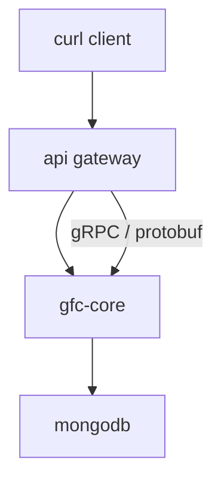
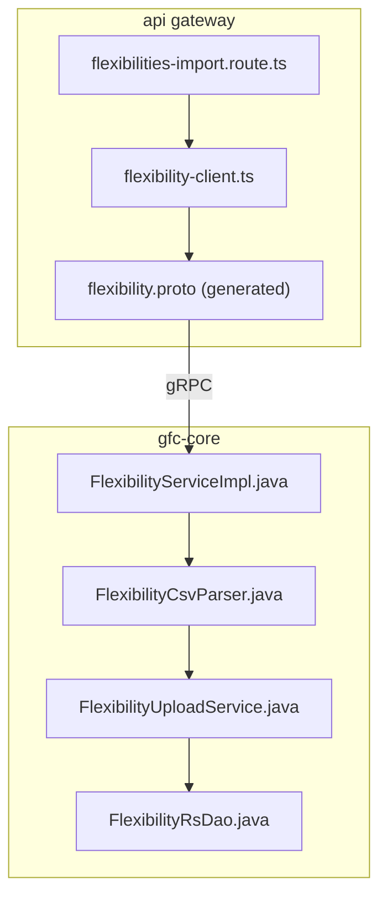
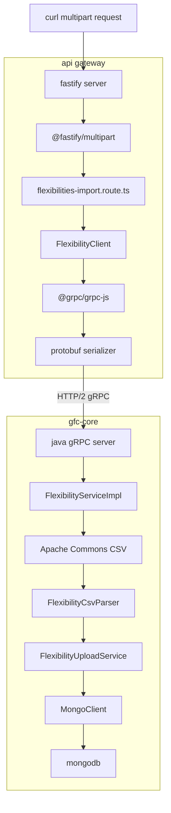

# File upload
* [Overview](#overview)
  * [Dapr service invocation](#dapr-service-invocation)
* [Tracing the code](#tracing-the-code)
* [Dependencies](#dependencies)
* [code brief](#code-brief)
* [design notes](#design-notes)
* [response structure](#response-structure)
## Overview
* Multipart CSV sent via HTTP
* Gateway translates HTTP → gRPC
* Core parses, validates, stores CSV
* MongoDB used for temporary persistence

### Dapr service invocation
* Dapr sidecar discovers `gfc-core` service via mDNS
* Routes gRPC request to target service
```
API Gateway Dapr (port 4000) 
  ↓ 
gfc-core Dapr (port 50012)
  ↓
gfc-core gRPC (port 9090)
```
## Tracing the code
* Route handles HTTP and file extraction
* Client wraps gRPC invocation
* Proto defines shared contract
* Core parses, validates, stores data

## Dependencies
* Fastify handles streaming multipart parsing
* gRPC abstracts HTTP/2 framing
* Protobuf enforces schema consistency
* CSV library handles quoting and delimiters


### api gateway
- [Flexibilities import route](#flexibilities-import-route)
- [gRPC service handler](#grpc-service-handler)
## Flexibilities import route
- [`routes/flexibilities-import.route.ts`](gateway/routes/flexibilities-import.route.ts)
- `curl -X POST http://localhost:4000/api/flexibilities/import -F file=@Flexibilities-L540.csv`

## gRPC service handler
* ServiceImpl: [`src/main/java/com/landisgyr/gfc/grpc/FlexibilityServiceImpl.java`](gfc-core/serviceimpl/FlexibilityServiceImpl.java)
  * [Documentation](gfc-core/serviceimpl/README.md)
**flexibilities-import.route.ts**

* HTTP endpoint definition
* Extracts multipart file
* Converts file to protobuf request
* Returns HTTP JSON response

**FlexibilityClient**

* gRPC client abstraction
* Injects auth metadata
* Handles serialization and errors

**protobuf generated files**

* Shared request/response schema
* Enforces type safety across services

### gfc-core

**FlexibilityServiceImpl**

* gRPC entry point
* Orchestrates upload workflow
* Builds summary response

**FlexibilityCsvParser**

* Row-level CSV parsing
* Field validation
* Domain object creation

**FlexibilityUploadService**

* Temporary persistence layer
* Stores raw CSV and metadata

**FlexibilityRsDao**

* Not used in upload phase
* Used later during confirmation

## design notes

### upload pattern

* Two-phase workflow

  * Upload and validate
  * Confirm and persist

### error handling

* Row-level errors accumulated
* Upload does not fail fast
* Client decides next action

### performance

* Streaming CSV parsing
* No full file buffering in memory

### contract safety

* Protobuf shared schema
* Strong typing across Node.js and Java

---

## response structure

```json
{
  "uploadId": "uuid",
  "csvSummary": {
    "totalRows": 100,
    "invalidRows": 5,
    "flexibilityTypeCounts": [],
    "errorDetails": []
  }
}
```
