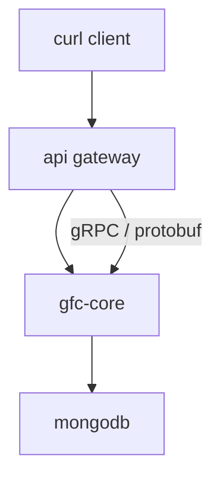
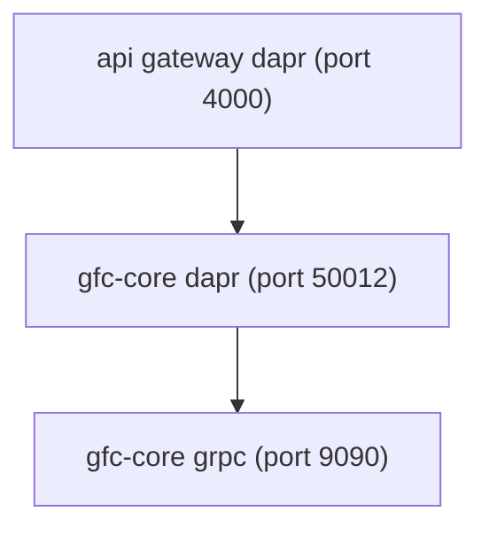
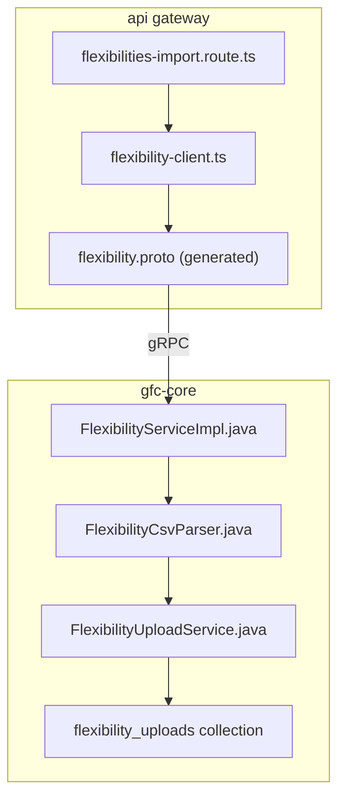
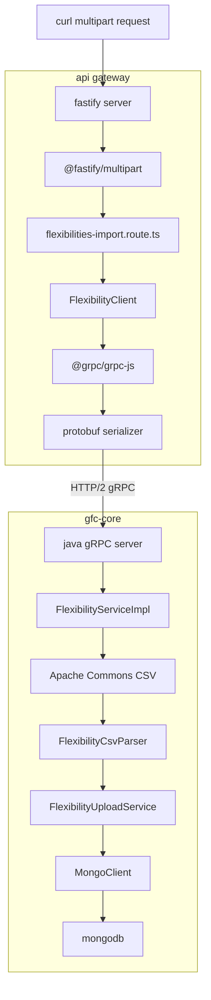

# File upload
* [Overview](#overview)
* [Dapr service invocation](#dapr-service-invocation)
* [Tracing the code](#tracing-the-code)
* [Dependencies](#dependencies)
* [API gateway](#api-gateway)
* [GFC core](#gfc-core)
* [Design notes](#design-notes)
* [Response structure](#response-structure)
## Overview
* Multipart CSV sent via HTTP
* Gateway translates `HTTP → gRPC`
* Core `parses`, `validates`, `stores` CSV
* MongoDB used for temporary `persistence`

## Dapr service invocation
* Dapr sidecar discovers `gfc-core` service via mDNS
* Routes gRPC request to target service

## Tracing the code
* Route handles HTTP and file extraction
* Client wraps gRPC invocation
* Proto defines shared contract
* Core parses, validates, stores data

## Dependencies
* Fastify handles `streaming multipart parsing`
* gRPC abstracts `HTTP/2 framing`
* Protobuf enforces `schema consistency`
* CSV library handles `quoting` and `delimiters`


## API gateway
* **Flexibilities import route**: [`routes/flexibilities-import.route.ts`](gateway/routes/flexibilities-import.route.ts)
  * **`curl -X POST http://localhost:4000/api/flexibilities/import -F file=@Flexibilities-L540.csv`**
  * HTTP endpoint definition
  * Extracts multipart file
  * Converts file to protobuf request
  * Returns HTTP JSON response
* **FlexibilityClient**: [`clients/flexibility-client.ts`](gateway/clients/flexibility-client.ts)
  * gRPC client abstraction
  * Injects auth metadata
  * Handles serialization and errors
* **Protobuf generated files**
  * Shared request/response schema
  * Enforces type safety across services
## GFC core
* **Proto:** [`gfc-apis/proto/core/api/flexibility/v1/flexibility.proto`](gfc-core/proto/flexibility.proto)
  * [Documentation](gfc-core/proto/README.md)
* **FlexibilityServiceImpl**: [`grpc/FlexibilityServiceImpl.java`](gfc-core/serviceimpl/FlexibilityServiceImpl.java)
  * gRPC entry point
  * Orchestrates upload workflow
  * Builds summary response
  * [Documentation](gfc-core/serviceimpl/README.md)
* **FlexibilityCsvParser**: [`domain/FlexibilityCsvParser.java`](gfc-core/domain/FlexibilityCsvParser.java)
  * Row-level CSV parsing
  * Field validation
  * Domain object creation
* **FlexibilityUploadService**: [`services/FlexibilityUploadService.java`](gfc-core/services/FlexibilityUploadService.java)
  * Temporary persistence layer
  * Stores raw CSV and metadata
* **flexibility_uploads collection**
  * Mongodb collection
    ```
    {
      "uploadId": "...",
      "filename": "...",
      "content": "base64-encoded-string-here",  // ← Binary stored as string
      "orgCode": "...",
      "status": "pending",
      "createdAt": 1234567890
    }
    ```
## Design notes
### Upload pattern
* Two-phase workflow
  * Upload and validate
  * Confirm and persist
### Error handling
* Row-level errors accumulated
* Upload does not fail fast
* Client decides next action
### Performance
* Streaming CSV parsing
* No full file buffering in memory
### Contract safety
* Protobuf shared schema
* Strong typing across Node.js and Java
## Response structure
```json
{
  "uploadId": "uuid",
  "csvSummary": {
    "totalRows": 100,
    "invalidRows": 5,
    "flexibilityTypeCounts": [],
    "errorDetails": []
  }
}
```
