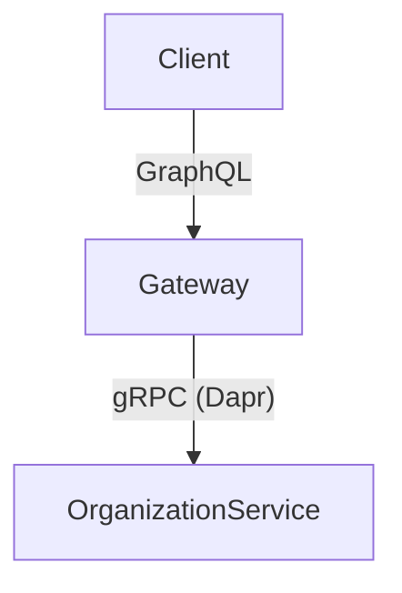
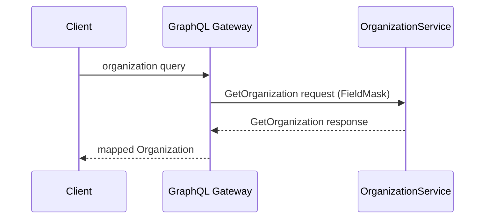

# Organization API
- [Introduction](introduction/README.md)
  - Purpose, Scope, Audience
- [Organization domain overview](organization-domain-overview/README.md)
  - Organization entity, Settings, Warranty rule, Ownership of data, Domain invariants
- [Architecture](architecture/README.md)
  - Components, Responsibility boundaries, Why GraphQL and gRPC
- [Proto contract](proto-contract/README.md)
  - RPCs, Messages, Enums, FieldMask usage
- [Graphql domain schema](graphql-domain-schema/README.md)
 - Types, Inputs, Enums, Scalars, Proto mapping
- [Graphql API surface](graphql-api-surface/README.md)
  - Queries, Mutations, Resolver mapping table
- [Execution flow: read path](execution-flow-read-path/README.md)
- [Execution flow: write path](execution-flow-write-path/README.md)
- [Field projection and performance](field-projection-and-performance/README.md)
- [Enum and scalar translation rules](enum-and-scalar-translation-rules/README.md)
- [Error handling and responsibility boundaries](error-handling-and-responsibility-boundaries/README.md)
- [Extending the organization API safely](extending-the-organization-api-safely/README.md)
- [Summary](#summary)
## Introduction and scope
- Purpose of the document
- What is covered
- What is explicitly out of scope
- Intended audience
## Organization domain overview
- Organization entity
- Settings
- WarrantyRule
- Ownership of data and business logic
- Domain invariants
## High-level architecture
- Components involved
- Responsibility boundaries
- Why both GraphQL and gRPC exist

## Proto contract
* OrganizationService RPCs:
  * `GetOrganization`
  * `GetOrganizations`
  * `AddOrganization`
  * `UpdateOrganizationSettings`
* Message structures
* Enum semantics
* FieldMask usage and expectations
* Proto defines truth. Everything else adapts.
## Graphql domain schema
* GraphQL types vs proto messages
* Input vs output separation
* Enum reshaping
* Wrapper types (`Organizations.items`)
* Scalars (Date, DateTime)
## Graphql API surface
* Code-first schema explanation
* Resolver index as schema definition
* Implicit `Query` and `Mutation`
* Mapping table:
  * `Query.organization` → `GetOrganization`
  * `Query.organizations` → `GetOrganizations`
  * `Mutation.updateOrganizationSettings` → `UpdateOrganizationSettings`
## Execution flow
* Read path
  * Client GraphQL query
  * Resolver invocation
  * Selection set extraction
  * FieldMask construction
  * Dapr gRPC invocation
  * Proto response
  * Enum and scalar translation
  * GraphQL response shaping


* Write path
  * Input mapping
  * Enum conversion
  * Date conversion
  * Response normalization
## Field projection and performance
* GraphQL selection sets
* `graphql-fields` usage
* Shallow vs deep projection
* Current limitations
* Performance implications
* Recommended improvements
## Enum and scalar translation rules
* Proto enum defaults
* GraphQL enum safety
* Handling unknown values
* Date and DateTime conversion rules
* Nullability expectations
## Error handling and responsibility boundaries
* What GraphQL validates
* What proto enforces
* Transport vs business errors
* Error propagation strategy
## Extending the organization API safely
* Adding fields
* Adding RPCs
* Adding GraphQL operations
* Backward compatibility rules
* Common pitfalls to avoid
## Summary
* Key takeaways
* Architectural principles reinforced

Do you want me to proceed with that?
```
