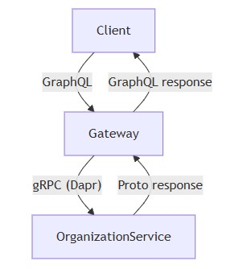
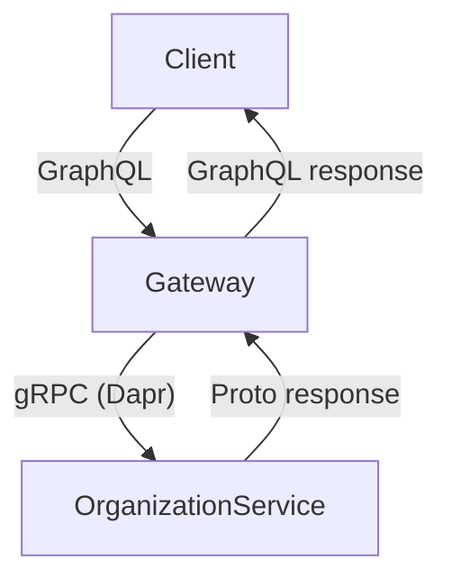

# Architecture
- [Components involved](#components-involved)
- [Responsibility boundaries](#responsibility-boundaries)
- [Why GraphQL and gRPC](#why-graphql-and-grpc)
- [Architecture diagram](#architecture-diagram)
## Components involved
- **Client:** Sends GraphQL queries or mutations requesting Organization data or updates.
- **GraphQL Gateway:** Receives client requests, resolves them using gateway resolvers, translates GraphQL input into gRPC requests, and maps responses back.
- **Dapr:** Provides gRPC client connectivity, metadata handling, and service discovery.
- **OrganizationService (gRPC):** Maintains the authoritative data for Organization entities and handles business logic.

  
mermaid

## Responsibility boundaries
- **GraphQL Gateway:**  
  - Defines the API surface via resolvers (`Query` and `Mutation`).
  - Converts GraphQL types, inputs, enums, and dates into proto messages.
  - Handles field projection via `FieldMask`.
- **OrganizationService:**  
  - Single source of truth for Organization data.
  - Implements RPCs for retrieving and updating organizations.
  - Enforces business rules, validations, and proto schema constraints.
## Why graphql and grpc
- GraphQL provides a flexible, frontend-friendly API with field-level selection.
- gRPC provides a strongly typed, efficient backend contract.
- Separating concerns allows frontend to evolve independently from internal service APIs.
