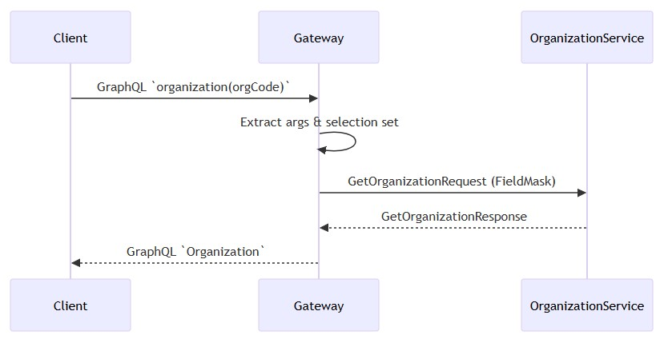
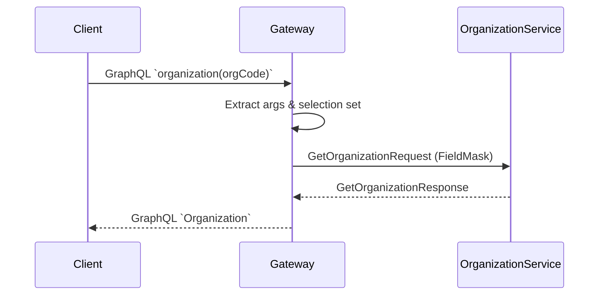
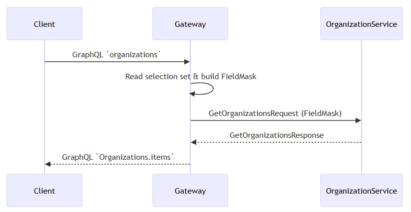
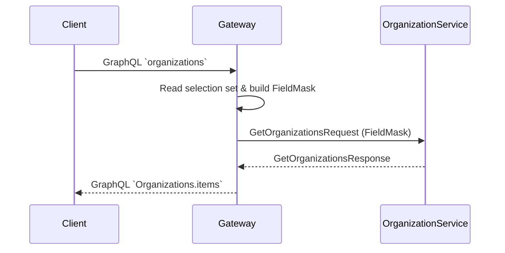

# Read path
- [GetOrganization](#getorganization)
- [GetOrganizations](#getorganizations)
- [Field projection](#field-projection)
## GetOrganization
- Client sends a GraphQL query `organization(orgCode: String!)`.
- GraphQL Gateway resolver receives the request.
- Resolver extracts `orgCode` from arguments.
- Resolver reads the GraphQL selection set from `info`.
- Field selections are converted into a `FieldMask` for gRPC.
- Resolver constructs `GetOrganizationRequest` with:
  - `org_code` set to requested `orgCode`.
  - `field_projections` set from FieldMask.
- Resolver calls `OrganizationService.GetOrganization` via Dapr gRPC client.
- OrganizationService processes the request and returns `GetOrganizationResponse`.
- Resolver converts proto response into GraphQL `Organization` type:
  - Maps enums (`DeviceIdentifierType`, `WarrantyEventTrigger`) to GraphQL enums.
  - Converts dates from proto to GraphQL `Date`.
- GraphQL Gateway returns the `Organization` object to the client.

  
mermaid

## Getorganizations
* Client sends a GraphQL query `organizations`.
* Resolver receives request and reads selection set.
* Selection set fields are converted into `FieldMask`.
* Resolver constructs `GetOrganizationsRequest` with `field_projections`.
* Resolver calls `OrganizationService.GetOrganizations` via Dapr gRPC client.
* OrganizationService returns `GetOrganizationsResponse` with list of organizations.
* Resolver maps each proto `Organization` to GraphQL `Organization` type.
* Gateway returns `Organizations.items` to the client.

  
mermaid

## Field-projection
* `FieldMask` ensures only requested fields are retrieved from proto service.
* Reduces payload size and improves performance.
* GraphQL selection set → `FieldMask` paths conversion is handled in gateway resolvers.
* Nested fields are flattened for FieldMask paths.
