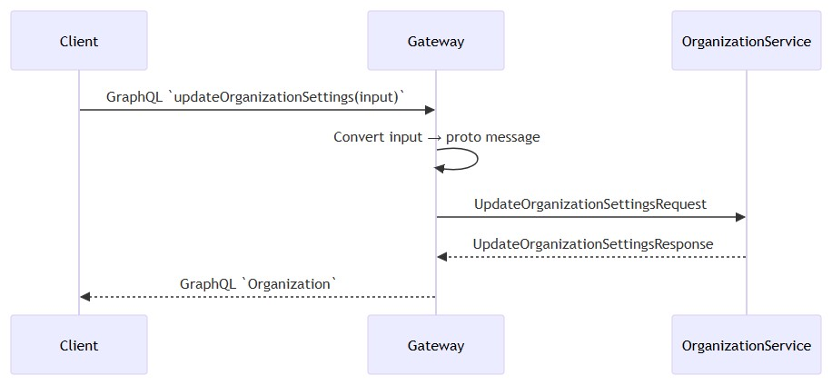
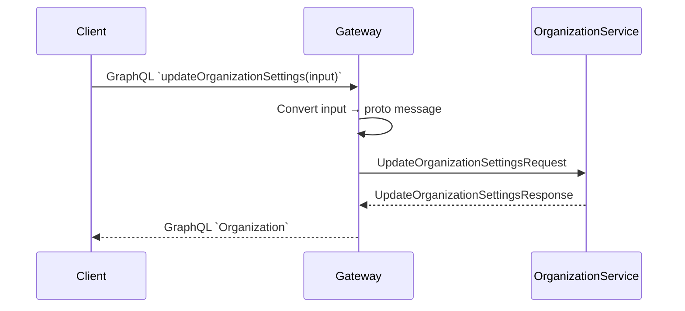
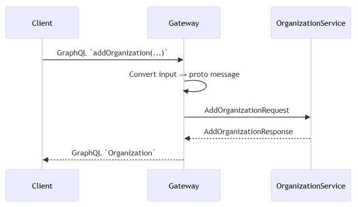
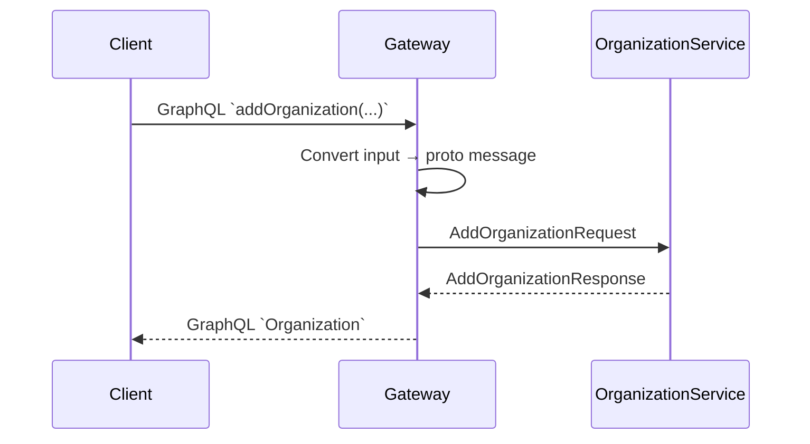

# Write path
- [UpdateOrganizationSettings](#updateorganizationsettings)
- [AddOrganization](#addorganization)
- [Input Output mapping](#input-output-mapping)
## UpdateOrganizationSettings
- Client sends GraphQL mutation `updateOrganizationSettings(input: UpdateOrganizationSettingsInput!)`.
- Resolver receives mutation request.
- Resolver extracts `orgCode` and `settings` from input.
- Resolver converts GraphQL input into proto `UpdateOrganizationSettingsRequest`:
  - Maps `deviceIdentifier` enum to proto `DeviceIdentifierType`.
  - Maps `warrantyRules` list to proto `WarrantyRule` messages.
  - Converts `activationDate` to proto `google.type.Date`.
- Resolver calls `OrganizationService.UpdateOrganizationSettings` via Dapr gRPC client.
- OrganizationService processes request and returns `UpdateOrganizationSettingsResponse`.
- Resolver converts proto response into GraphQL `Organization` type:
  - Maps enums back to GraphQL enums.
  - Converts proto dates to GraphQL `Date`.
- Gateway returns updated `Organization` object to the client.

  
mermaid

## AddOrganization

* Client sends GraphQL mutation `addOrganization(orgCode, name, parent, settings)`.
* Resolver receives mutation request.
* Resolver extracts `orgCode`, `name`, `parent`, `settings` from input.
* Resolver converts GraphQL input into proto `AddOrganizationRequest`.
* Resolver calls `OrganizationService.AddOrganization` via Dapr gRPC client.
* OrganizationService creates new organization and returns `AddOrganizationResponse`.
* Resolver converts proto response into GraphQL `Organization`.
* Gateway returns created `Organization` object to client.

  
mermaid

## inputoutput mapping
* GraphQL input → proto request mapping:

| GraphQL Input                     | Proto Message                       | Notes                                                               |
| --------------------------------- | ----------------------------------- | ------------------------------------------------------------------- |
| `UpdateOrganizationSettingsInput` | `UpdateOrganizationSettingsRequest` | Maps `settings.deviceIdentifier` and `warrantyRules` to proto types |
| `addOrganization` args            | `AddOrganizationRequest`            | Maps `orgCode`, `name`, `parent`, `settings` to proto message       |

* Proto response → GraphQL output mapping:

| Proto Response                                    | GraphQL Output | Notes                                |
| ------------------------------------------------- | -------------- | ------------------------------------ |
| `UpdateOrganizationSettingsResponse.organization` | `Organization` | Maps enums and dates back to GraphQL |
| `AddOrganizationResponse.organization`            | `Organization` | Maps enums and dates back to GraphQL |

