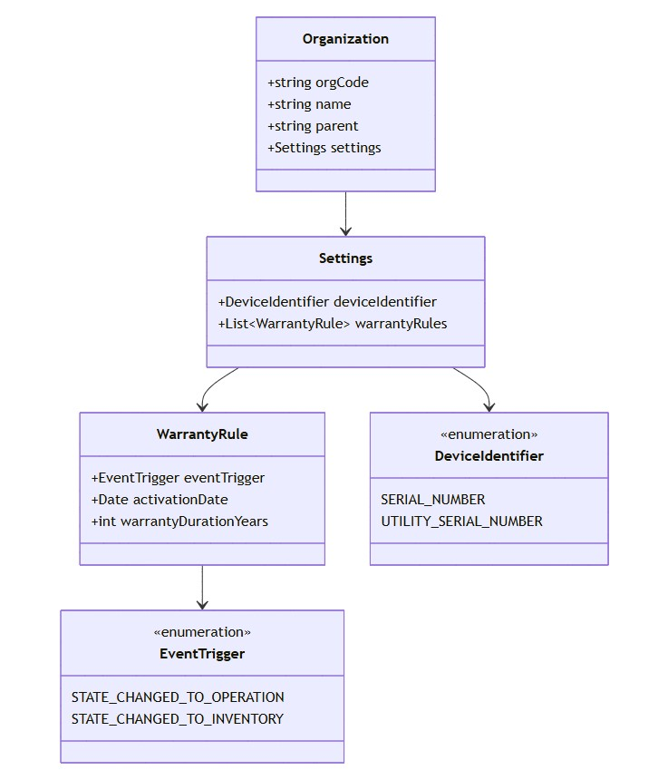
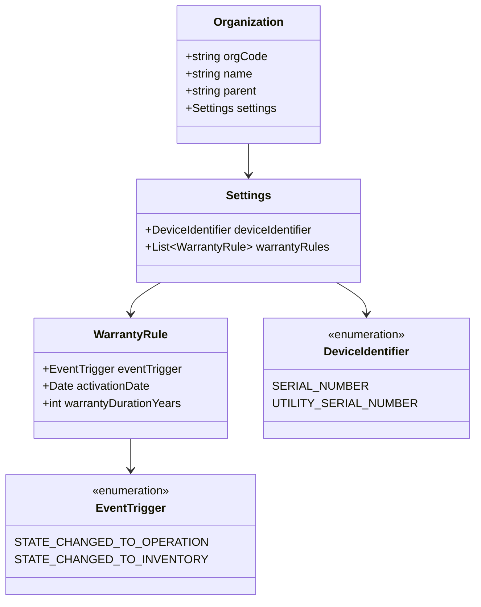

# Organization domain
- [Organization entity](#organization-entity)
- [Settings](#settings)
- [Warranty rule](#warranty-rule)
- [Ownership of data](#ownership-of-data)
- [Domain invariants](#domain-invariants)
## Organization entity
- Represents a business unit or organizational structure in the system.
- **Key attributes:**
  - `orgCode` (string) – unique identifier of the organization
  - `name` (string) – human-readable name
  - `parent` (string) – optional reference to parent organization
  - `settings` (Settings) – configuration related to devices and warranties
## Settings
- Encapsulates configuration applied to devices in the organization.
- **Attributes:**
  - `deviceIdentifier` – type of device identifier used
    - Allowed values: `SERIAL_NUMBER`, `UTILITY_SERIAL_NUMBER`
  - `warrantyRules` – list of rules defining warranty duration for devices
## Warranty rule
- Defines conditions under which warranty applies.
- **Attributes:**
  - `eventTrigger` – event that activates the rule
    - Allowed values: `STATE_CHANGED_TO_OPERATION`, `STATE_CHANGED_TO_INVENTORY`
  - `activationDate` – date when the rule becomes active
  - `warrantyDurationYears` – duration of the warranty if the rule is triggered
## Ownership of data
- The **OrganizationService** is the single source of truth for all Organization-related data.
- GraphQL exposes these entities via resolvers and maps client requests to gRPC calls.
## Domain invariants
- `orgCode` must be unique within the system.
- `Settings.deviceIdentifier` must be one of the allowed enum values.
- `WarrantyRule.activationDate` cannot be in the past when creating a new rule.
- Multiple warranty rules can exist, but `eventTrigger` values should not conflict for the same device type.

  
mermaid

