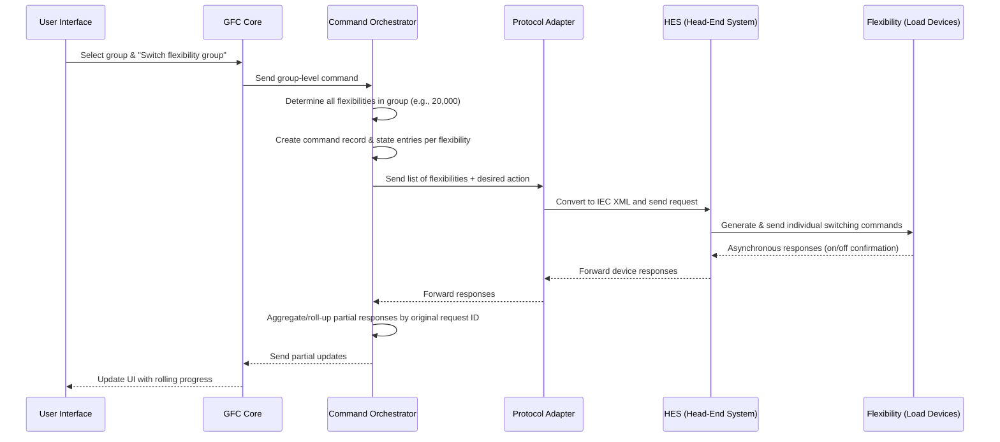

# Switching flexibilities

```mermaid
sequenceDiagram
    participant User as User Interface
    participant GFC as GFC Core
    participant CO as Command Orchestrator
    participant PA as Protocol Adapter
    participant HES as HES (Head-End System)
    participant Flex as Flexibility (Load Devices)

    User->>GFC: Select group & "Switch flexibility group"
    GFC->>CO: Send group-level command
    CO->>CO: Determine all flexibilities in group (e.g., 20,000)
    CO->>CO: Create command record & state entries per flexibility
    CO->>PA: Send list of flexibilities + desired action
    PA->>HES: Convert to IEC XML and send request
    HES->>Flex: Generate & send individual switching commands

    Flex-->>HES: Asynchronous responses (on/off confirmation)
    HES-->>PA: Forward device responses
    PA-->>CO: Forward responses
    CO->>CO: Aggregate/roll-up partial responses by original request ID
    CO-->>GFC: Send partial updates
    GFC-->>User: Update UI with rolling progress
```
