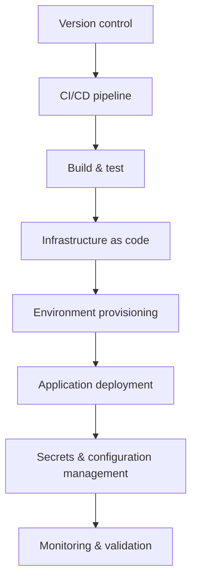

# Automation and CICD enablement
* [Pipeline overview](#pipeline-overview)
* [Infrastructure as code](#infrastructure-as-code)
* [Environment provisioning](#environment-provisioning)
* [Application deployment](#application-deployment)
* [Secrets and configuration management](#secrets-and-configuration-management)
* [Takeaways](#takeaways)
## Pipeline overview
* Implement centralized CI/CD pipelines for all environments
* Automate build, test, and deployment processes
* Ensure pipelines integrate with version control, artifact storage, and approval workflows
## Infrastructure as code
* Use IaC tools (`Terraform`, `ARM`, `CloudFormation`) to define environments
* Version control all infrastructure definitions
* Apply automated validation and linting before deployment
## Environment provisioning
* Automate the creation of service projects, networking, and compute resources
* Apply predefined templates for consistent configuration
* Include guardrails for IAM, network policies, and resource quotas
## Application deployment
* Deploy workloads using CI/CD pipelines for repeatability and auditability
* Support multiple deployment strategies: rolling, blue/green, canary
* Integrate with monitoring and alerting systems to validate deployments
## Secrets and configuration management
* Integrate secrets management (`Vault`, KMS, or equivalent) into pipelines
* Automate injection of secrets and configuration into workloads
* Rotate credentials and enforce least privilege access
## Takeaways
* Use CI/CD pipelines to standardize and automate deployments
* Apply IaC for environment consistency and auditability
* Automate provisioning with templates and guardrails
* Deploy applications using repeatable strategies with integrated monitoring
* Centralize secrets and configuration management, enforcing rotation and access control

