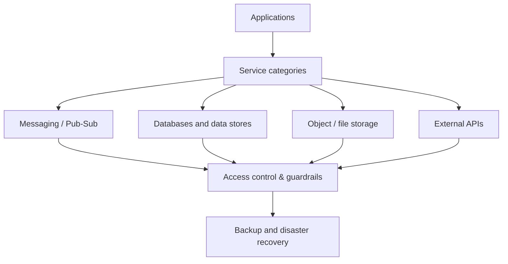

# Cloud service access and dependencies
* [Service categories](#service-categories)
* [Access control and guardrails](#access-control-and-guardrails)
* [Backup and disaster recovery](#backup-and-disaster-recovery)
* [Takeaways](#takeaways)
## Service categories
* Define general service categories required by applications:
  * Messaging / pub-sub systems
  * Databases and data stores
  * Object / file storage
  * External APIs and integrations
* Abstract cloud-specific services; focus on capabilities and access patterns
* Applications should declare which services they need when requesting environments
## Access control and guardrails
* Use dedicated service accounts for applications to access cloud services
* Apply least privilege principles for all service account permissions
* Implement network, IAM, and policy guardrails for all services
* Enforce quotas and monitor usage to prevent overconsumption
## Backup and disaster recovery
* Ensure all critical data has scheduled backups
* Define retention policies and storage locations (regional or multi-region)
* Implement DR strategies with failover plans for critical services
* Test backups and DR plans periodically to validate recoverability
## Takeaways
* Categorize services by capability rather than cloud-specific products
* Apply least privilege and dedicated accounts for service access
* Implement guardrails and monitor usage for all cloud services
* Ensure backup and DR strategies are in place and regularly tested

