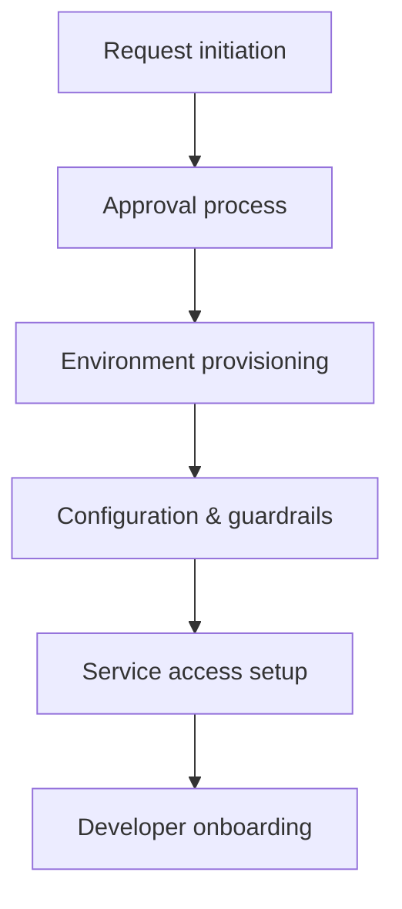

# Environment request and onboarding workflow
* [Request initiation](#request-initiation)
* [Approval process](#approval-process)
* [Environment provisioning](#environment-provisioning)
* [Configuration and guardrails](#configuration-and-guardrails)
* [Service access setup](#service-access-setup)
* [Developer onboarding](#developer-onboarding)
* [Takeaways](#takeaways)
## Request initiation
* New hires or development teams submit environment requests
* Requests specify environment type (dev, test, prod) and required services
* Include service dependencies and workload requirements
## Approval process
* Automated or manual approvals by platform/security teams
* Ensure request adheres to organizational policies and guardrails
* Track approvals for audit and compliance purposes
## Environment provisioning
* Provision landing zone resources and service projects
* Apply networking, compute, and storage templates via Infrastructure as Code
* Enforce IAM roles, policies, and quotas consistently
## Configuration and guardrails
* Apply baseline configuration for monitoring, logging, and observability
* Enforce security, network, and policy guardrails
* Verify environment readiness before handover
## Service access setup
* Configure service accounts and API access for requested cloud services
* Apply secrets management for credentials and configuration
* Enable access to messaging, databases, and storage as required
## Developer onboarding
* Provide documentation and guidance for environment usage
* Integrate developers with CI/CD pipelines and monitoring dashboards
* Train teams on policies, guardrails, and best practices
## Takeaways
* Standardize environment request and approval workflows
* Automate provisioning and configuration via templates and IaC
* Enforce guardrails for security, network, and policies consistently
* Provide access setup and onboarding support for development teams

