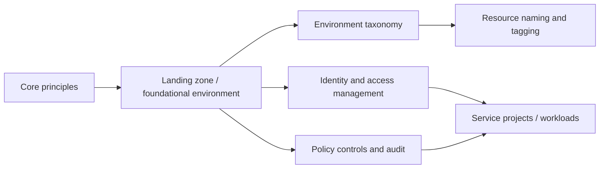

# Governance and foundation
* [Core principles](#core-principles)
* [Organizational structure](#organizational-structure)
* [Landing zone](#landing-zone)
* [Environment taxonomy](#environment-taxonomy)
* [Resource naming, labeling, and tagging standards](#resource-naming-labeling-and-tagging-standards)
* [Identity and access management strategy](#identity-and-access-management-strategy)
* [Policy controls, audit, and compliance framework](#policy-controls-audit-and-compliance-framework)
* [Takeaways](#takeaways)
## Core principles
* **Security-first:** enforce least privilege and role separation
* **Scalability:** design environments to support growth without friction
* **Automation:** ensure provisioning, compliance, and deployments are repeatable
* **Resilience:** implement backup, disaster recovery, and high availability practices
* **Compliance:** adhere to enterprise policies and regulatory standards
## Organizational structure
* **Hierarchy:** projects/environments, teams, and resource boundaries
* Clearly defined ownership for platform, security, networking, and development teams
## Landing zone
* **Foundational environment**
* Centralized baseline environment hosting shared services and platform controls
* Provides network, security, `IAM`, and observability building blocks for service projects
## Environment taxonomy
* Standardized categories: dev, test, prod, sandbox, shared services
* Environment types dictate policies, access controls, and approval workflows
## Resource naming, labeling, and tagging standards
* Consistent naming for projects, environments, resources, and services
* Labels/tags used for cost allocation, ownership, and compliance
## Identity and access management strategy
* Role-based access control (`RBAC`) and least privilege
* Separation of human and service accounts
* Access review and lifecycle management
## Policy controls, audit, and compliance framework
* Policy-as-Code enforcement and guardrails
* Centralized logging and audit across environments
* Continuous compliance monitoring and reporting
## Takeaways
* Apply least privilege and role separation consistently across environments
* Use centralized landing zones to enforce platform standards
* Define environment taxonomy and tagging upfront for governance and cost allocation
* Implement `RBAC` and separate human/service accounts
* Enforce policies via Policy-as-Code and monitor compliance continuously

