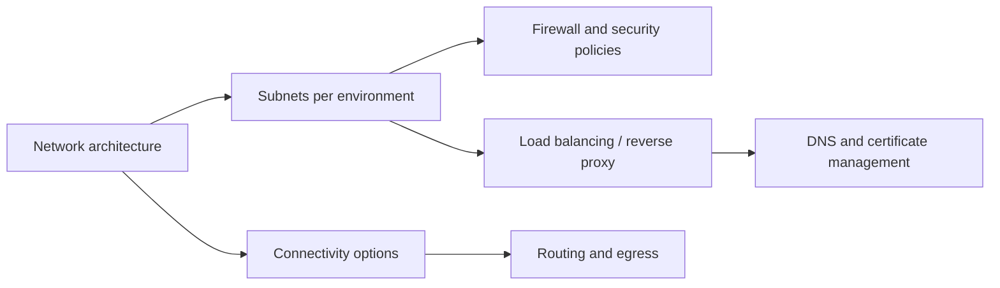

# Network and connectivity
* [Network architecture](#network-architecture)
* [Subnet design](#subnet-design)
* [Firewall and security policies](#firewall-and-security-policies)
* [Load balancing and reverse proxy](#load-balancing-and-reverse-proxy)
* [DNS and certificate management](#dns-and-certificate-management)
* [Connectivity options](#connectivity-options)
* [Routing and egress](#routing-and-egress)
* [Takeaways](#takeaways)
## Network architecture
* Define isolated network segments for different environments and workloads
* Centralized management of network topology and IP addressing
* Logical separation between management, workload, and data planes
## Subnet design
* Create subnets for management, workloads, data, and ingress/egress
* Align subnets with environment taxonomy (dev, test, prod)
* Use shared subnet models for cross-project connectivity when needed
## Firewall and security policies
* Apply network security controls at subnet and project levels
* Use allowlists and deny rules for access restriction
* Implement audit and logging for all network traffic
## Load balancing and reverse proxy
* Use load balancers to distribute traffic across services
* Deploy reverse proxies for web application ingress
* Ensure high availability and failover support
## DNS and certificate management
* Centralize internal DNS for service discovery
* Use consistent naming standards for all environments
* Manage certificates using internal PKI or public CA for secure communications
## Connectivity options
* Support hybrid connectivity (VPN, private links, or peering)
* Control egress and ingress paths with network policies
* Maintain secure, monitored paths to external and internal services
## Routing and egress
* Define routing tables per environment and subnet
* Ensure controlled egress to external networks or cloud services
* Monitor and log routing changes for compliance
## Takeaways
* Isolate networks per environment and workload for security and compliance
* Standardize subnets and IP addressing across projects
* Apply consistent firewall rules and logging for observability
* Use load balancers and reverse proxies for high availability and traffic management
* Centralize DNS and certificate management to simplify service access
* Provide secure hybrid connectivity while controlling egress and ingress

