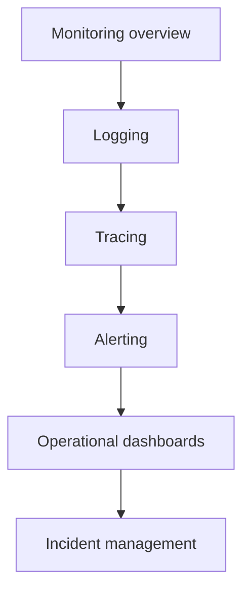

# Observability and operations
* [Monitoring overview](#monitoring-overview)
* [Logging](#logging)
* [Tracing](#tracing)
* [Alerting](#alerting)
* [Operational dashboards](#operational-dashboards)
* [Incident management](#incident-management)
* [Takeaways](#takeaways)
## Monitoring overview
* Implement centralized monitoring for all environments and workloads
* Track system health, performance metrics, and service-level indicators (SLIs)
* Ensure monitoring covers compute, networking, storage, and application layers
## Logging
* Centralize log collection from all services and environments
* Standardize log formats for easier correlation and analysis
* Apply retention policies based on compliance and operational needs
## Tracing
* Implement distributed tracing for application workloads
* Capture request flows across services to identify bottlenecks
* Integrate tracing data with monitoring dashboards for visibility
## Alerting
* Define thresholds for metrics and service-level indicators
* Trigger alerts through multiple channels (email, messaging, incident systems)
* Ensure alerts are actionable and tied to incident response processes
## Operational dashboards
* Provide dashboards for engineering, security, and platform teams
* Visualize key metrics, trends, and health of applications and infrastructure
* Use dashboards for both real-time monitoring and historical analysis
## Incident management
* Define workflows for detecting, triaging, and resolving incidents
* Track incidents for post-mortem analysis and continuous improvement
* Integrate incident data with monitoring, logging, and alerting systems
## Takeaways
* Centralize monitoring, logging, and tracing for all environments
* Define actionable alerting thresholds and channels
* Provide operational dashboards for visibility and analysis
* Implement structured incident management processes for reliability

