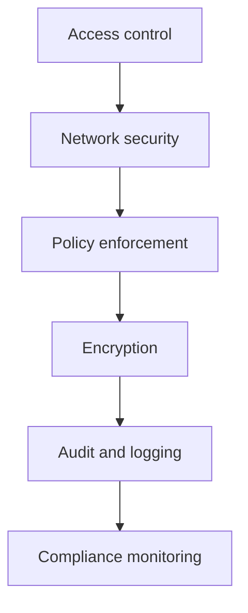

# Security and compliance
* [Access control](#access-control)
* [Network security](#network-security)
* [Policy enforcement](#policy-enforcement)
* [Encryption](#encryption)
* [Audit and logging](#audit-and-logging)
* [Compliance monitoring](#compliance-monitoring)
* [Takeaways](#takeaways)
## Access control
* Apply role-based access control (`RBAC`) across environments
* Separate human and service accounts for security and traceability
* Enforce least privilege for all users and workloads
## Network security
* Implement network segmentation per environment and workload
* Apply firewalls, allowlists/denylists, and secure ingress/egress controls
* Monitor network traffic and detect anomalies
## Policy enforcement
* Use Policy-as-Code to enforce organizational standards
* Apply automated guardrails for IAM, networking, and service usage
* Ensure policies are versioned, reviewed, and auditable
## Encryption
* Encrypt data at rest and in transit using strong encryption standards
* Manage keys centrally with automated rotation and access control
* Ensure workloads follow encryption requirements consistently
## Audit and logging
* Centralize logs for user activity, configuration changes, and system events
* Enable traceability for all access and resource modifications
* Maintain logs for compliance and forensic analysis
## Compliance monitoring
* Continuously monitor environments against regulatory and enterprise standards
* Detect deviations and generate alerts for remediation
* Integrate compliance monitoring with operational dashboards
## Takeaways
* Enforce RBAC, least privilege, and separation of accounts consistently
* Apply network segmentation and secure ingress/egress controls
* Automate policy enforcement with Policy-as-Code
* Ensure encryption of data at rest and in transit
* Centralize audit logs and integrate compliance monitoring with dashboards

