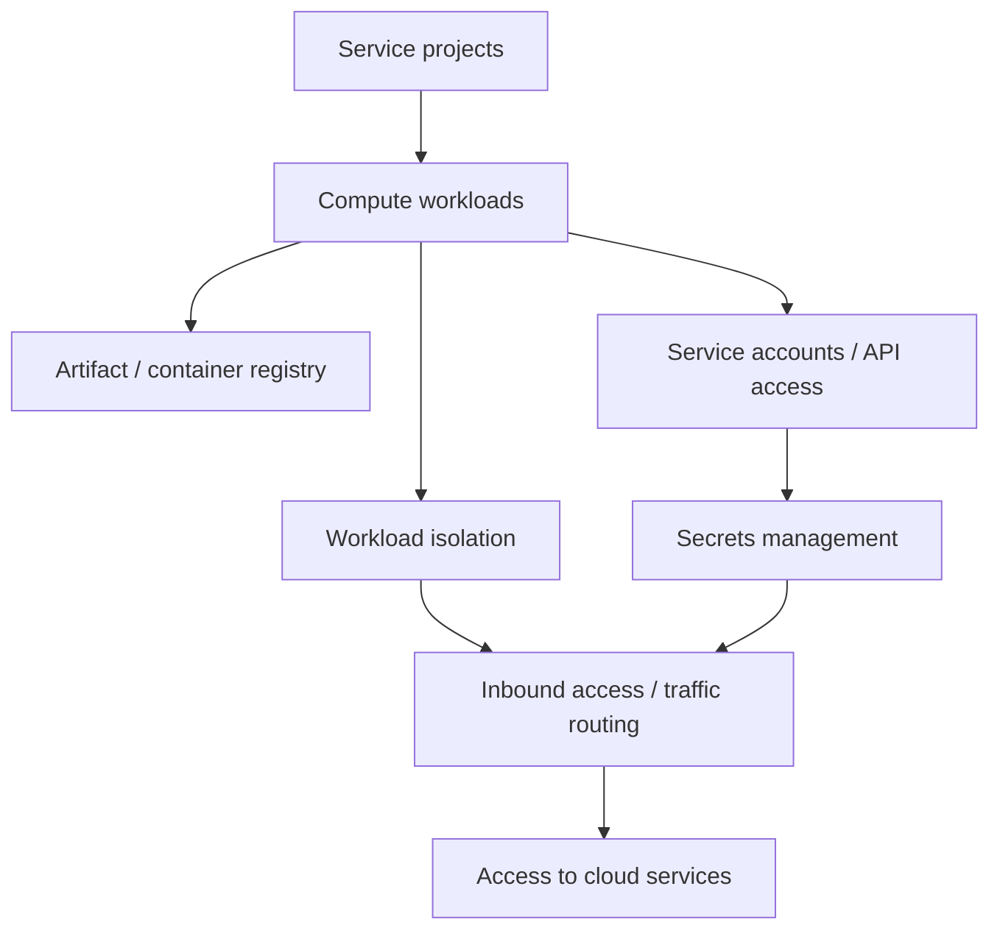

# Service projects and workload hosting
* [Environment/project linkage](#environmentproject-linkage)
* [Compute workloads](#compute-workloads)
* [Workload isolation](#workload-isolation)
* [Artifact and container registry](#artifact-and-container-registry)
* [Service accounts and API access](#service-accounts-and-api-access)
* [Secrets management](#secrets-management)
* [Inbound access and traffic routing](#inbound-access-and-traffic-routing)
* [Access to cloud services](#access-to-cloud-services)
* [Takeaways](#takeaways)
## Environment/project linkage
* Map service projects to networking and landing zones
* Define access and ownership boundaries for each service project
* Ensure projects comply with organization-wide policies and guardrails
## Compute workloads
* Support VMs, containers, and serverless workloads
* Standardize resource types and sizing guidelines
* Align compute deployments with environment taxonomy (dev, test, prod)
## Workload isolation
* Use logical separation between workloads within the same environment
* Apply network and IAM controls to enforce isolation
* Implement quotas and limits to prevent resource contention
## Artifact and container registry
* Centralize artifact and container storage for all environments
* Ensure versioning and access control for build artifacts
* Integrate with CI/CD pipelines for automated deployment
## Service accounts and API access
* Create dedicated service accounts per workload or service
* Apply least privilege principles for all accounts
* Control access to cloud APIs and external services via roles
## Secrets management
* Use centralized secrets management (`Vault`, KMS, or equivalent)
* Rotate secrets and credentials regularly
* Control access via service accounts and IAM policies
## Inbound access and traffic routing
* Use reverse proxies or ingress controllers for controlled access
* Enforce secure access policies for internal and external traffic
* Centralize routing rules for maintainability and auditability
## Access to cloud services
* Define general service categories required by applications (databases, storage, messaging, APIs)
* Implement guardrails for usage, quotas, and connectivity
* Ensure service dependencies are documented and discoverable
## Takeaways
* Map service projects to landing zones and networking projects for consistent governance
* Standardize compute workloads and resource sizing
* Enforce workload isolation using network and IAM controls
* Centralize artifact storage and integrate with CI/CD pipelines
* Use dedicated service accounts and apply least privilege for API access
* Centralize secrets management and enforce rotation policies
* Control inbound traffic via reverse proxies and ingress controllers
* Apply guardrails and document service dependencies for cloud services

