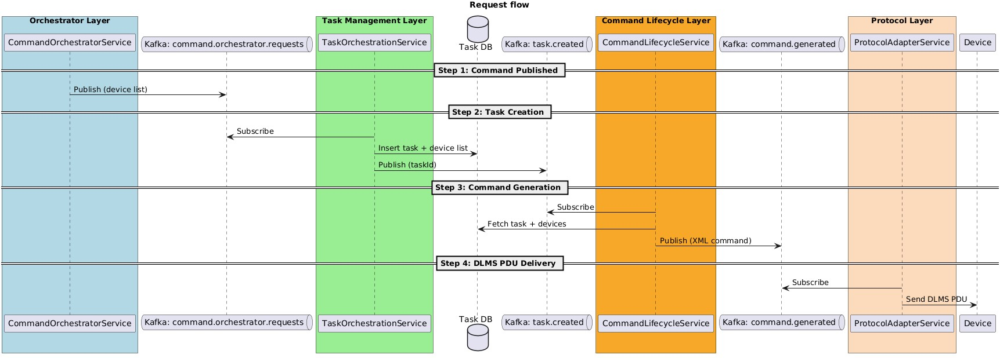
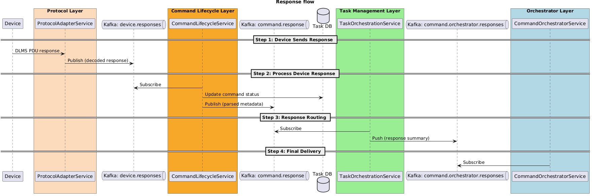

# Architecture
- [Request](#request)
- [Response](#response)
## Request


<details>
  <summary>Click</summary>

  ```plantuml
  @startuml
  title Request flow
  
  box "Orchestrator Layer" #LightBlue
    participant CommandOrchestratorService
  end box
  
  queue "Kafka: command.orchestrator.requests" as KafkaGFC
  
  box "Task Management Layer" #LightGreen
    participant TaskOrchestrationService
  end box
  
  database "Task DB" as TaskDB
  queue "Kafka: task.created" as KafkaTask
  
  box "Command Lifecycle Layer" #Orange
    participant CommandLifecycleService
  end box
  
  queue "Kafka: command.generated" as KafkaCommand
  
  box "Protocol Layer" #PeachPuff
    participant ProtocolAdapterService
  end box
  
  participant "Device" as Device
  
  == Step 1: Command Published ==
  CommandOrchestratorService -> KafkaGFC: Publish (device list)
  
  == Step 2: Task Creation ==
  TaskOrchestrationService -> KafkaGFC: Subscribe
  TaskOrchestrationService -> TaskDB: Insert task + device list
  TaskOrchestrationService -> KafkaTask: Publish (taskId)
  
  == Step 3: Command Generation ==
  CommandLifecycleService -> KafkaTask: Subscribe
  CommandLifecycleService -> TaskDB: Fetch task + devices
  CommandLifecycleService -> KafkaCommand: Publish (XML command)
  
  == Step 4: DLMS PDU Delivery ==
  ProtocolAdapterService -> KafkaCommand: Subscribe
  ProtocolAdapterService -> Device: Send DLMS PDU
  
  @enduml
  ```
</details>

## Response


<details>
  <summary>Click</summary>

  ```plantuml
  @startuml
  title Response flow
  
  participant "Device" as Device
  box "Protocol Layer" #FFDAB9
    participant ProtocolAdapterService
  end box
  
  queue "Kafka: device.responses" as KafkaResponse
  
  box "Command Lifecycle Layer" #Orange
    participant CommandLifecycleService
  end box
  
  queue "Kafka: command.response" as KafkaCommandResponse
  database "Task DB" as TaskDB
  
  box "Task Management Layer" #LightGreen
    participant TaskOrchestrationService
  end box
  
  queue "Kafka: command.orchestrator.responses" as KafkaOrchestratorResponse
  
  box "Orchestrator Layer" #LightBlue
    participant CommandOrchestratorService
  end box
  
  == Step 1: Device Sends Response ==
  Device -> ProtocolAdapterService: DLMS PDU response
  ProtocolAdapterService -> KafkaResponse: Publish (decoded response)
  
  == Step 2: Process Device Response ==
  CommandLifecycleService -> KafkaResponse: Subscribe
  CommandLifecycleService -> TaskDB: Update command status
  CommandLifecycleService -> KafkaCommandResponse: Publish (parsed metadata)
  
  == Step 3: Response Routing ==
  TaskOrchestrationService -> KafkaCommandResponse: Subscribe
  TaskOrchestrationService -> KafkaOrchestratorResponse: Push (response summary)
  
  == Step 4: Final Delivery ==
  CommandOrchestratorService -> KafkaOrchestratorResponse: Subscribe
  
  @enduml
  ```
</details>
