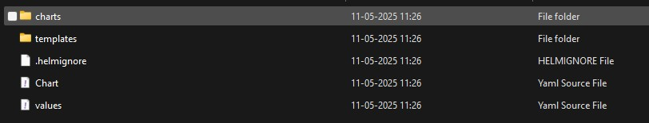

# Helm charts
- [Create Helm chart structure](#create-helm-chart-structure)
- [Clean up the default templates](#clean-up-the-default-templates)
- [Convert your existing YAML into a Helm template](#convert-your-existing-yaml-into-a-helm-template)
  - [Folder structure](#folder-structure)
- [Cleanup existing Kubernetes deployment](#cleanup-existing-kubernetes-deployment)
- [Install Helm release](#install-helm-release)
- [Verify](#verify)
- [Uninstall Helm release](#uninstall-helm-release)
## Create Helm chart structure
- Generate the basic `Helm chart directory`. 
- Run this in your terminal:
  ```
  helm create orchestration-services
  ```
- This creates a directory called [**orchestration-services**](orchestration-services) with default templates and values.


## Clean up the default templates
- Helm’s `create` command generates a bunch of example templates we don’t need. Let’s simplify.
- Go to the `templates` folder:
  ```
  cd orchestration-services/templates
  ```
- Delete all the default templates *except* `_helpers.tpl`.
  - *(Use **`del`** if you’re in Command Prompt on Windows instead of Git Bash or PowerShell)*
  ```bash
  del deployment.yaml service.yaml hpa.yaml ingress.yaml serviceaccount.yaml tests\test-connection.yaml
  del tests\test-connection.yaml & rmdir tests & del NOTES.txt

  rm deployment.yaml service.yaml hpa.yaml ingress.yaml serviceaccount.yaml tests/test-connection.yaml
  ```
- You should only have this file left:
  ```
  _helpers.tpl
  ```
## Convert your existing YAML into a Helm template
- **command-orchestration**
  - [`deployment-command-orchestration.yaml`](orchestration-services/templates/deployment-command-orchestration.yaml)
  - [`service-command-orchestration.yaml`](orchestration-services/templates/service-command-orchestration.yaml)
- **task-orchestration**
  - [`deployment-task-orchestration.yaml`](orchestration-services/templates/deployment-task-orchestration.yaml)
  - [`service-task-orchestration.yaml`](orchestration-services/templates/service-task-orchestration.yaml)
- [**`values.yaml`**](orchestration-services/templates/values.yaml) should be inside `root` of the Helm chart folder, not inside the `templates/` folder
### Folder structure
```pgsql
orchestration-services/
├── charts/
├── templates/
│   ├── deployment-command-orchestration.yaml
│   ├── service-command-orchestration.yaml
│   ├── deployment-task-orchestration.yaml
│   ├── service-task-orchestration.yaml
│   └── _helpers.tpl
├── Chart.yaml
├── values.yaml    ✅ should be here
```
## Cleanup existing Kubernetes deployment 
```
kubectl delete deployment command-orchestration-deployment
kubectl delete deployment task-orchestration-deployment
kubectl delete service command-orchestration-service
kubectl delete service task-orchestration-service

## OR
kubectl delete deployment command-orchestration-deployment task-orchestration-deployment
kubectl delete service command-orchestration-service task-orchestration-service
```
## Install Helm release
- Go to Helm chart folder (e.g., `orchestration-services`), run this command:
  ```powershell
  helm install orchestration-release . 
  ```
- **`orchestration-release`** is the name you're assigning to this Helm release (you can change it if you like).
- `.` means Helm will *install using the chart in the current directory*.
- Helm will deploy both your services using the templates and values from `values.yaml`.
- Verify release `helm list`
  ```
  NAME                    NAMESPACE       REVISION        UPDATED                                 STATUS          CHART                           APP VERSION
  orchestration-release   default         1               2025-05-12 09:53:22.55453 +0300 EEST    deployed        orchestration-services-0.1.0    1.16.0
  ```
## Verify
- Helm list
  ```
  helm list -A
  ```
- **Check pods status**
  ```powershell
  kubectl get pods
  ```
- **Check services and exposed NodePorts**
  ```powershell
  kubectl get svc
  ```
  * `command-orchestration-service` on NodePort `30081`
  * `task-orchestration-service` on NodePort `30082`
- **Access the services**
  - `http://localhost:30081/...` → `commandorchestrationservice`
  - `http://localhost:30082/...` → `taskorchestrationservice`
## Uninstall Helm release
- Delete all Kubernetes resources (Deployments, Services, etc.) that were created by the Helm release named `orchestration-release`
  ```
  helm uninstall orchestration-release
  ``` 
