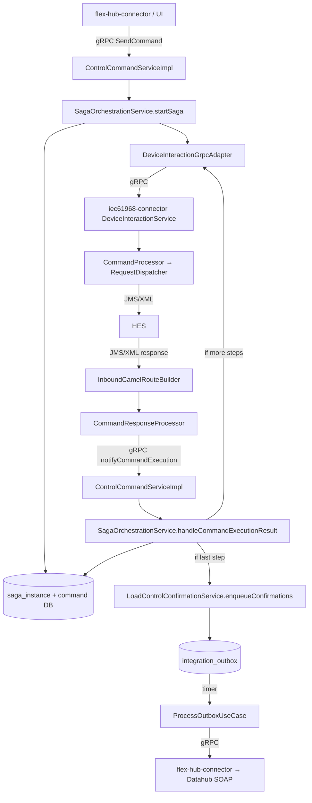

# Summary
- [Saga](saga/README.md)
## Overall system flow

| Stage                          | What is happening                                   | Representation                                                                 |
| ------------------------------ | --------------------------------------------------- | ------------------------------------------------------------------------------ |
| **1. Message Entry**           | Where does the message enter the system?            | `PeekMessagesUseCase` / `UI → API Gateway`                                     |
| **2. Translation & Transport** | Convert the message and move it across the boundary | `Domain Command → Proto → gRPC → Tenant-Id metadata`                           |
| **3. Core Orchestration**      | Request enters the GFC-Core business flow           | `ControlCommandServiceImpl → ControlCommand → SagaOrchestrationService → Saga` |

## Command → Saga

| Stage                     | What happens                                           | Representation                               |
| ------------------------- | ------------------------------------------------------ | -------------------------------------------- |
| **1. Receive**            | gRPC request enters GFC-Core                           | `ControlCommandServiceImpl`                  |
| **2. Translate**          | Proto request becomes domain command                   | `ProtoMapper.fromProto()` → `ControlCommand` |
| **3. Prepare**            | Command is validated/enriched and targets are resolved | `CommandPreparationService.prepare()`        |
| **4. Create Saga**        | Saga context is created and persisted                  | `SagaContext` → `saga_instance`              |
| **5. Persist Command**    | Prepared command is stored and linked to Saga          | `command` + `command.saga_id`                |
| **6. Execute First Step** | Command is forwarded to IEC connector                  | `deviceInteractionPort.forwardCommand()`     |
| **7. Track**              | Saga moves to in-progress                              | `sagaRepository.markInProgress()`            |

## Inside `startSaga()`

| Order | Operation                                   | Result                                      |
| ----- | ------------------------------------------- | ------------------------------------------- |
| **1** | `SagaContextFactory.fromPreparedCommand()`  | Creates `SagaContext`                       |
| **2** | `sagaRepository.create(...)`                | **INSERT `saga_instance`** → gets `sagaId`  |
| **3** | `commandRepository.save(prepared, sagaId)`  | **INSERT `command`** with `command.saga_id` |
| **4** | `deviceInteractionPort.forwardCommand(...)` | Sends command to IEC connector              |
| **5** | `sagaRepository.markInProgress(...)`        | Saga → `IN_PROGRESS`                        |

### Core mental model

```text
MESSAGE ENTRY
      ↓
TRANSLATION & TRANSPORT
      ↓
CORE ORCHESTRATION
      ↓
PREPARE
      ↓
CREATE SAGA
      ↓
SAVE COMMAND
      ↓
SEND FIRST STEP
      ↓
SAGA IN PROGRESS
```

Yes. This part is basically the **recipe book for the Saga engine**.

The easiest way to understand it is to separate **what a Saga is**, **what its steps are**, and **how the system chooses which Saga to run**.

## Saga definition
Think of:

```text
SagaDefinition
    │
    ├── Saga type
    │
    └── List of steps
```

For example:

```text
DH-1223-2
    │
    └── Step 0: SingleControlCommand
```

Whereas:

```text
DH-1221-2
    │
    ├── Step 0: CreateTOUCalendarCommand
    └── Step 1: RolloutTouCalendarCommand
```

So `SagaDefinition` does **not execute anything**.

It simply says:

> "For this type of Saga, these are the steps and this is their order."

---

## 2. The three classes

| Class                                   | Responsibility                 | Think of it as                    |
| --------------------------------------- | ------------------------------ | --------------------------------- |
| `InMemorySagaDefinitionRegistryAdapter` | Stores all Saga definitions    | **Recipe book**                   |
| `SagaDefinition`                        | Defines one Saga and its steps | **One recipe**                    |
| `SagaStepDefinition`                    | Defines one step               | **One instruction in the recipe** |

So the structure is:

```text
InMemorySagaDefinitionRegistryAdapter
              │
              │ DEFINITIONS
              ▼
       SagaDefinition
              │
              ├── Step 0
              │     └── SagaStepDefinition
              │
              └── Step 1
                    └── SagaStepDefinition
```


### B. Saga definition — where steps are declared

```text
gfc-core/.../InMemorySagaDefinitionRegistryAdapter.java
InMemorySagaDefinitionRegistryAdapter (static DEFINITIONS map)
    ↓
gfc-core/.../SagaDefinition.java
SagaDefinition(type, List<SagaStepDefinition>)
    ↓
gfc-core/.../SagaStepDefinition.java
SagaStepDefinition(index, name, SagaStepAction)
```

**Registered sagas:**

| Type | Steps |
|---|---|
| `DH-1221-2` | 0: `CreateTOUCalendarCommand`, 1: `RolloutTouCalendarCommand` |
| `DH-1222-2` | 0: `CreateTOUCalendarCommand`, 1: `RolloutTouCalendarCommand` |
| `DH-1223-2` | 0: `SingleControlCommand` |

**Saga type key** = `command.getMarketProcessIdentification()` (e.g. `"DH-1221-2"`).

**Note:** `SagaStepAction.EMIT_DATAHUB_CONFIRMATION` exists in the enum but is **not used** in step definitions. DataHub confirmation happens outside the step registry (see section G).

**Placeholder (not wired):** `LoadControlStartingContext` (`DH-1211`) is registered in `SagaContext` Jackson subtypes but has **no entry** in `InMemorySagaDefinitionRegistryAdapter` and **no factory path** in `SagaContextFactory`.

---

### C. Step 1 → IEC connector → HES (service boundary #1)

```text
gfc-core/.../DeviceInteractionGrpcAdapter.java
DeviceInteractionGrpcAdapter.forwardCommand(tenantId, command)
    ↓  ProtoMapper.toProto(command) → DeviceInteractionPb.SendCommandRequest
    ↓  gRPC sendCommand / batchSendCommand
iec61968-connector/.../DeviceInteractionService.java
DeviceInteractionService.sendCommand(request, responseObserver)
    ↓  ProtoMapper.fromProto → ControlCommandRequest
iec61968-connector/.../CommandProcessor.java
CommandProcessor.sendCommand(ControlCommandRequest)
    ↓  branches on command type:
    ↓    RelayControlCommand      → RequestDispatcher.dispatchRelayControlCommand
    ↓    CreateTOUCalendarCommand → RequestDispatcher.dispatchCreateTouCalendarCommand
    ↓    RolloutTOUCalendarCommand→ RequestDispatcher.dispatchRolloutTouCalendarCommand
iec61968-connector/.../RequestDispatcher.java
RequestDispatcher.dispatch*(...)
    ↓  builds IEC 61968 XML (JAXB RequestMessageType) and sends via Camel/JMS to HES queue
```

gRPC returns immediately with `SENT` — **orchestration does not wait for HES here**.

---

### D. HES response → step completion callback (the advance trigger)

This is the **exact mechanism** for triggering the next step:

```text
iec61968-connector/.../InboundCamelRouteBuilder.java
  JMS response queue → unmarshal XML → reactive-streams:response-stream
    ↓
CommandResponseProcessor.process(ControlCommandResponse)
    ↓  ProtoMapper.toProto → NotifyCommandExecutionResult
iec61968-connector/.../ControlCommandGrpcClient.java
ControlCommandGrpcClient.notifyCommandExecutionResult(tenantId, protoRequest)
    ↓  gRPC notifyCommandExecution + Tenant-Id metadata
gfc-core/.../ControlCommandServiceImpl.java
ControlCommandServiceImpl.notifyCommandExecution(request, responseObserver)
    ↓  ProtoMapper.fromProto → ControlCommandExecutionResult
gfc-core/.../SagaOrchestrationService.java
SagaOrchestrationService.handleCommandExecutionResult(patch)
```

**Inside `handleCommandExecutionResult`:**

```text
transactionPort.execute(() -> {
    commandRepository.applyPatch(patch)          // UPDATE command + flexibility_commands
    sagaRepository.findByCommandInstanceId(...) // JOIN saga_instance ← command
    return onStepCompleted(saga, command, patch)
})
    ↓  if Optional<ControlCommand> present:
deviceInteractionPort.forwardCommand(tenantId, nextCommand)  // step N+1 to HES
```

**Inside `onStepCompleted`:**

| Condition | Action |
|---|---|
| State ≠ `SUCCEEDED` | `sagaRepository.markFailed`, `commandRepository.updateState`, **stop** |
| `DH-1223-2` + success | `loadControlConfirmationService.updateFlexibilityState` |
| Last step | `sagaRepository.markCompleted`, `loadControlConfirmationService.enqueueConfirmations`, **stop** |
| Not last step | `buildNextStepCommand(...)` → `commandRepository.save(nextCommand, sagaId)` → `sagaRepository.advanceStep(...)` → **return next command** |

**Next-step command building** (only implemented for `DH-1221-2`):

```text
gfc-core/.../SagaOrchestrationService.java
SagaOrchestrationService.buildNextStepCommand(...)
    ↓  case "DH-1221-2", step "RolloutTouCalendarCommand":
gfc-core/.../WeekAheadSagaStepCommandFactory.java
WeekAheadSagaStepCommandFactory.buildRolloutCommand(saga, completedCommand, patch)
```

Builds a new `ControlCommand` with `RolloutTouCalendarParameters` using:
- `calendarId` from `WeekAheadControlContext` (stored at saga start)
- `activationTime` = `patch.getReceivedAt()` (HES response timestamp)
- target/flexibility from `SagaTargetSnapshot` in context

---

### E. Saga state persistence

```text
gfc-core/.../SagaRepositoryAdapter.java
  create()        → INSERT saga_instance (status=STARTED, current_step=0, context=JSONB)
  markInProgress()→ UPDATE status=IN_PROGRESS, current_step
  advanceStep()   → UPDATE current_step + context
  markCompleted() → UPDATE status=COMPLETED, completed_at
  markFailed()    → UPDATE status=FAILED, completed_at
  findByCommandInstanceId() → JOIN command.saga_id
```

**DB schema:** `gfc-core/.../db/migration/V11_create_saga_instance_table.sql`

**Context object:** `SagaContext` hierarchy (`WeekAheadControlContext`, `SingleControlContext`, etc.) serialized as JSONB. Carries:
- `commandInstanceId`, `marketProcessIdentification`, `requestedBy`
- `SagaTargetSnapshot` (target type, metering point, relay, group)
- Type-specific parameters (e.g. `WeekAheadControlParameters` with `calendarId`, `correlationId`)

**Command linkage:** `CommandRepositoryAdapter.insert(..., sagaId)` sets `command.saga_id`.

---

### F. Completion — DataHub confirmation (service boundary #2)

After **last step succeeds**:

```text
gfc-core/.../LoadControlConfirmationService.java
LoadControlConfirmationService.enqueueConfirmations(result, command, saga)
    ↓  OutboxRequest (eventType=DH-1231-1, targetSystem=DataHub, status=PENDING)
gfc-core/.../OutboxRepositoryAdapter (via OutboxRepositoryPort)
    ↓  INSERT integration_outbox
```

Async delivery:

```text
gfc-core/.../ScheduledCamelRoutes.java
  timer:outbox-worker → ProcessOutboxUseCase.process()
gfc-core/.../ProcessOutboxUseCase.java
ProcessOutboxUseCase.doProcess(tenantId)
    ↓  repository.findPendingEvents(100)
    ↓  case "DH-1231-1":
gfc-core/.../FlexibilityConnectorGrpcAdapter.java
FlexibilityConnectorGrpcAdapter.sendLoadControlConfirmation(...)
    ↓  gRPC to flex-hub-connector
flex-hub-connector → SOAP F35 confirmation to Datahub
```

---

### G. Failure handling

| Failure point | What happens |
|---|---|
| `forwardCommand` fails at saga start | `sagaRepository.markFailed`, `commandRepository.updateState(FAILED)` |
| `forwardCommand` fails on step N+1 | Same, looked up via `findByCommandInstanceId` |
| HES returns non-SUCCESS | `onStepCompleted` → `markFailed`, command state updated, **no next step** |
| Outbox delivery fails | Exponential backoff retry in `ProcessOutboxUseCase`; dead-letter after max retries |

**No compensation/rollback** — failed sagas are marked `FAILED`; prior HES commands are not reversed.

**JMS inbound errors** in IEC connector are swallowed (`onErrorResume → Mono.empty()`) — no saga callback on parse failures.

---

## Diagram



---

## Timing (existing behavior only)

| Mechanism | Where | Used by saga? |
|---|---|---|
| `ControlCommand.scheduledAt` | Mapped from proto, stored in `command.scheduled_at` | **No** — orchestrator never reads it; commands forward immediately |
| `RolloutTouCalendarParameters.activationTime` | Set in `WeekAheadSagaStepCommandFactory` from HES response `receivedAt` | **Yes** — passed to HES on step 2 rollout command |
| Outbox timer | `ScheduledCamelRoutes` → `ProcessOutboxUseCase` | **Yes** — async DataHub confirmation delivery |
| Outbox retry backoff | `ProcessOutboxUseCase` exponential delay | **Yes** — for failed outbound notifications |

There is **no scheduler that delays saga step execution based on an incoming start time**.

---

## Mental model — key relationships

1. **`SagaOrchestrationService` is the orchestrator.** It implements both `StartSagaUseCase` and `HandleCommandExecutionNotificationUseCase`. All saga logic lives here.

2. **Saga type = Datahub market process ID** (`DH-1221-2`, etc.), looked up in `InMemorySagaDefinitionRegistryAdapter`.

3. **Steps are not classes — they are metadata.** `SagaStepDefinition` records index/name/action. Actual command construction for step N+1 is hardcoded in `buildNextStepCommand` (today only `DH-1221-2` → `RolloutTouCalendarCommand`).

4. **Advancement trigger = HES callback, not an internal event bus.** The loop is: forward command → wait → `notifyCommandExecution` → `onStepCompleted` → optionally forward next command.

5. **`SagaContext` is the cross-step memory.** Persisted as JSONB, updated on `advanceStep`. Holds target snapshot and parameters needed to build subsequent commands (e.g. `calendarId`).

6. **Each step = one `ControlCommand` row** linked to the same `saga_id`. Step index tracked in `saga_instance.current_step`.

7. **IEC connector is a pass-through adapter.** Receives gRPC, sends XML/JMS to HES, maps XML responses back to gRPC. It has no saga awareness.

8. **DataHub confirmation is post-saga side-effect**, not a saga step. Written to outbox after `markCompleted`, delivered asynchronously to flex-hub-connector.

9. **`LoadControlStartingContext` / `DH-1211` is a stub** — Jackson subtype exists, but no saga definition, no factory, no orchestration path yet.

10. **`ControlCommandMutationService` is unused** in the wired DI graph — the live path always goes through `SagaOrchestrationService`.
