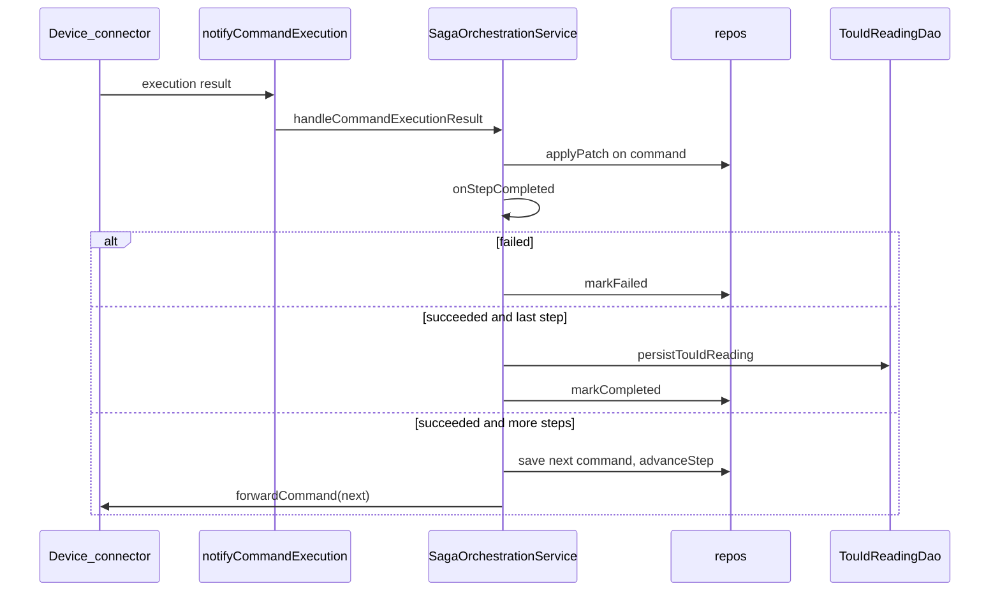

# Saga
# How control advances after `startSaga` in `notifyMPLoadControl`
## Entry point

In [`ControlCommandServiceImpl.notifyMPLoadControl`](gfc-core/src/main/java/com/landisgyr/gfc/core/adapters/inbound/grpc/ControlCommandServiceImpl.java), after the market event is stored, if `request.hasStartTime()`:

1. [`LoadControlStartingSagaCommandFactory.build`](gfc-core/src/main/java/com/landisgyr/gfc/core/app/service/LoadControlStartingSagaCommandFactory.java) builds a `ControlCommand` with:
   - `marketProcessIdentification` = `LOAD_CONTROL_STARTING` (`DH-1211-1`)
   - `ReadTouParameters` (meter number from accounting point)
   - target = metering point + relay `"1"`
2. `startSagaUseCase.startSaga(sagaCommand)` — implemented by [`SagaOrchestrationService`](gfc-core/src/main/java/com/landisgyr/gfc/core/app/service/SagaOrchestrationService.java)

## What `startSaga` does (step 1 only)

```mermaid
sequenceDiagram
  participant gRPC as ControlCommandServiceImpl
  participant Orch as SagaOrchestrationService
  participant DB as Saga_and_Command_repos
  participant Device as DeviceInteractionPort

  gRPC->>Orch: startSaga(command)
  Orch->>Orch: prepare command
  Orch->>DB: create saga STARTED step 0, save command
  Orch->>Device: forwardCommand(ReadTou)
  Orch->>DB: markInProgress step 1
  Note over Orch: Returns immediately; waits for async callback
```

Inside `SagaOrchestrationService.startSaga`:

1. Prepare the command (`CommandPreparationService.prepare`)
2. Resolve `SagaType` from `marketProcessIdentification`
3. In a transaction: create saga context, persist saga (`STARTED`, step `0`), save command linked to saga
4. Forward to the device via `deviceInteractionPort.forwardCommand` (gRPC to iec61968-connector)
5. Mark saga `IN_PROGRESS` at step `1`
6. Return the command instance id — **no further steps run here**

## How “next step” is triggered

Advancement is **callback-driven**, not synchronous and not polling.

The device/connector later calls `notifyCommandExecution` → `HandleCommandExecutionNotificationUseCase` → same `SagaOrchestrationService.handleCommandExecutionResult` → `onStepCompleted`.



Decision logic in `onStepCompleted`:

- Non-`SUCCEEDED` → `markFailed`, stop
- For `LOAD_CONTROL_STARTING` → `persistTouIdReading` (store TOU id from device reading)
- If current step is last → `markCompleted` (and skip DataHub confirmations for this saga type)
- Else → build next command, save it, `advanceStep`, then forward outside the TX

## Important for this call site: no second device step

[`InMemorySagaDefinitionRegistryAdapter`](gfc-core/src/main/java/com/landisgyr/gfc/core/adapters/outbound/saga/InMemorySagaDefinitionRegistryAdapter.java) defines `LOAD_CONTROL_STARTING` as a **single** step:

- Step 1: `ReadTouCommand` / `FORWARD_DEVICE_COMMAND`

So after a successful execution notification:

- TOU reading is persisted
- Saga is marked `COMPLETED`
- `buildNextStepCommand` is **not** called
- No further device command is forwarded

Multi-step advancement (create TOU → rollout) exists only for calendar sagas (`WEEK_AHEAD` / `DAY_AHEAD`), via `WeekAheadSagaStepCommandFactory`.

## End state for this path

| Phase | Saga status | Step |
|-------|-------------|------|
| After create | `STARTED` | 0 |
| After forward | `IN_PROGRESS` | 1 |
| After success callback | `COMPLETED` | 1 |
| On failure | `FAILED` | — |

**Pattern:** in-process command/result saga — DB-backed instance + in-memory step registry + async `notifyCommandExecution` to advance or finish. Not Dapr workflows.
