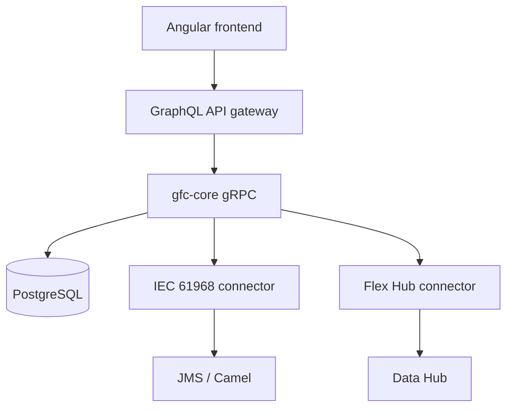
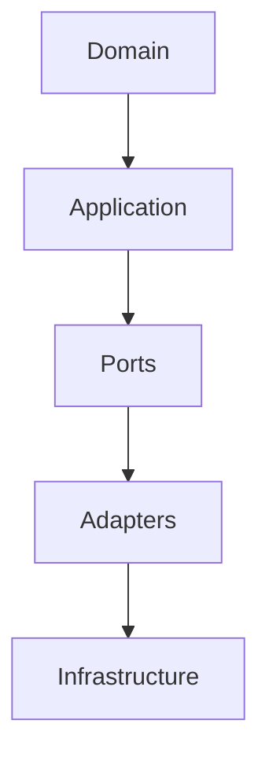
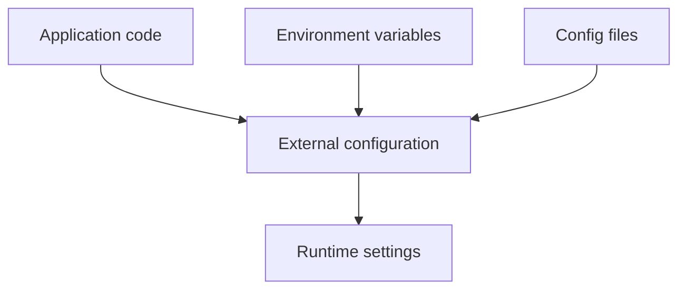

# Code and architecture quality review
* [Scope and system context](#scope-and-system-context)
* [Architecture reviewed](#architecture-reviewed)
* [Module and component boundaries](#module-and-component-boundaries)
* [Architectural shortcuts](#architectural-shortcuts)
* [Static code analysis](#static-code-analysis)
* [Dependency vulnerability and license analysis](#dependency-vulnerability-and-license-analysis)
* [Code review](#code-review)
* [Technical debt](#technical-debt)
* [Configuration management](#configuration-management)
* [Overall assessment](#overall-assessment)
* [Priority actions](#priority-actions)
## Scope and system context
* **Repository:** Multi-service monorepo with Angular, Node.js, Java, gRPC, GraphQL, JMS/Camel, and Data Hub integrations.
* **Request path:** `frontend` → `api-gateway` GraphQL BFF → `gfc-core` gRPC → connectors/integrations.
* **Core services:**
  * `gfc-core` → Java gRPC business service.
  * `iec61968-connector` → IEC 61968/device integration via JMS/Camel.
  * `flex-hub-connector` → Flex Hub/Data Hub SOAP bridge.
  * `data-hub-simulator` → Local Data Hub substitute.
* **Shared contracts:** `gfc-apis/proto/**` contains protobuf contracts.
* **Core architecture:** `domain` → `app` → `adapters` → `infrastructure`.
* **Configuration:** Typesafe Config, environment overrides, `node-config`, and frontend environment files.

## Architecture reviewed
* **Status:** **Partial**
* **Strengths:**
  * Clear service decomposition.
  * Documented request flow and service READMEs.
  * Hexagonal-style Java architecture.
  * Explicit protobuf and GraphQL contracts.
* **Gaps:**
  * No ADRs, architecture decision log, review checklist, or signed architecture review artifact.
  * `docker-compose.yml` describes an obsolete `gfc-service` + MongoDB + Dapr architecture.
  * Current implementation uses `gfc-core`, gRPC, PostgreSQL, and connectors.
* **Risk:** Developers may follow stale local architecture instead of the current production design.
* **Recommendation:**
  * Create a concise architecture document covering services, data stores, synchronous/asynchronous flows, and dependencies.
  * Update or explicitly retire the obsolete `docker-compose.yml`.
  * Capture significant decisions as ADRs.
## Module and component boundaries
* **Status:** **Partial**
* **Strengths:**
  * Clear Gradle project boundaries.
  * Shared API contracts through `gfc-apis`.
  * Application ports such as `CommandRepositoryPort` and `DeviceInteractionPort`.
  * Frontend separation between feature, shared, and application areas.
* **Boundary leakage:**
  * Application services directly reference adapters/DAOs.
  * Domain type `OutboxRequest` contains JDBI-specific annotation.
  * Port naming is inconsistent, for example `JobRepository` vs `*Port`.
  * Multiple `ProtoMapper` implementations exist across modules.
* **Risk:** Persistence and protobuf concerns leak into application/domain layers, increasing coupling.
* **Recommendation:**
  * Enforce `app` → port → adapter dependency direction.
  * Remove JDBI annotations from domain objects.
  * Keep protobuf mapping inside adapters.
  * Standardize port naming.

## Architectural shortcuts
* **Status:** **Fail**
* **Critical findings:**
  * Hardcoded energy-party identifiers in Flex Hub mappers.
  * Hardcoded grid-area identifiers in outbox processing.
  * Command failures are caught without updating command state or creating the required notification.
* **Incomplete functionality:**
  * `DayAheadControlContext` is effectively empty.
  * Groups UI still uses a mock service.
  * Shutdown health wiring contains a null implementation.
  * Sample `main` code exists inside a shared library.
* **Architecture inconsistency:**
  * Local Compose still references the removed `gfc-service` and MongoDB stack.
* **Risk:**
  * Incorrect tenant/grid identity in integration messages.
  * Failed commands may appear successful.
  * Incomplete features may be treated as production-ready.
* **Recommendation:**
  * Externalize market, tenant, GLN, and grid identifiers.
  * Complete or explicitly disable unfinished command/saga paths.
  * Implement command error and outbox handling.
  * Remove or quarantine sample/experimental code.

## Static code analysis
* **Status:** **Partial**
* **Implemented:**
  * Spotless Google Java Format.
  * TypeScript compilation.
  * Biome configuration for frontend and API gateway.
* **CI gaps:**
  * Biome checks are not enforced in CI.
  * Sonar jobs are commented out.
  * No evidence of SpotBugs, PMD, Checkstyle, Error Prone, ArchUnit, or equivalent architecture rules.
* **Relaxed analysis:**
  * Java `-Xlint` warnings are suppressed.
  * TypeScript `strict`, `noImplicitAny`, and `strictNullChecks` are disabled.
  * Biome rules for unused variables and explicit `any` are disabled.
* **Risk:** Formatting and compilation can pass while architectural, nullability, or code-quality defects remain.
* **Recommendation:**
  * Enforce Biome checks in merge-request CI.
  * Restore or replace Sonar/static-analysis tooling.
  * Enable TypeScript strictness incrementally.
  * Remove broad Java lint suppressions.
## Dependency vulnerability and license analysis
* **Status:** **Fail**
* **Current state:**
  * Dependency version reporting exists.
  * Manual dependency upgrade guidance exists.
  * No repository-level CVE or license gate was found.
* **Missing controls:**
  * No OWASP Dependency-Check, Snyk, Trivy, Grype, CycloneDX, or equivalent evidence.
  * No license allowlist or compatibility gate.
  * No repository `LICENSE`/`NOTICE` evidence.
* **Dependency risks:**
  * `jakarta-xml-bind = "4.1.0-M1"` is a milestone release.
  * Some dependencies bypass the central version catalog.
  * gRPC versions are inconsistent between `grpc` and `grpc-bom`.
* **Evidence gap:** External GitLab/JFrog scanning cannot be assessed from this repository.
* **Recommendation:**
  * Add SBOM generation and CVE scanning to CI.
  * Add a license compatibility gate.
  * Centralize remaining dependencies.
  * Replace milestone dependencies with released versions.
  * Document the external scanner if it is the authoritative control.
## Code review
* **Status:** **Not assessable**
* **Repository evidence:**
  * Commit-check automation exists.
* **Missing repository evidence:**
  * `CODEOWNERS`.
  * Merge-request template.
  * Review checklist.
  * Evidence that the current code was reviewed.
* **External dependency:** GitLab approval rules and actual MR review history are outside the repository.
* **Recommendation:**
  * Add `CODEOWNERS`.
  * Add an MR review template/checklist.
  * Assess this criterion using GitLab MR history and approval rules rather than source structure.
## Technical debt
* **Status:** **Fail**
* **Current state:**
  * Numerous `TODO`/`FIXME` items identify unfinished work.
  * Critical issues are mixed with low-priority cleanup items.
* **Critical debt examples:**
  * Command failure handling.
  * Hardcoded integration identifiers.
  * Empty day-ahead saga.
  * Mock-backed production UI path.
  * Experimental JDBI path.
* **Missing controls:**
  * No tracked technical-debt register.
  * No severity classification.
  * No owner or target date.
  * No explicit accepted/“won't fix” disposition.
  * No ADRs documenting accepted shortcuts.
* **Risk:** Critical production risks are indistinguishable from routine cleanup.
* **Recommendation:**
  * Extract critical TODOs into a tracked backlog.
  * Assign severity, owner, and disposition.
  * Treat integration identifiers and command failure handling as mandatory fixes.
  * Remove or quarantine experimental code.
## Configuration management
* **Status:** **Partial**
* **Strengths:**
  * Typed configuration through `ApplicationSetting`.
  * Environment/file-based configuration.
  * Gateway `node-config`.
  * Frontend environment configuration.
* **Configuration embedded in code/docs:**
  * Hardcoded GLN and grid-area identifiers.
  * Default JWT client ID in code.
  * Frontend configuration TODO.
  * Database credentials in documentation examples.
  * Mongo credentials in obsolete Compose configuration.
* **Risk:**
  * Environment-specific behavior may require code changes.
  * Incorrect tenant or grid configuration can affect integration messages.
  * Credentials in examples can be copied into real environments.
* **Recommendation:**
  * Externalize operational identifiers and client IDs.
  * Remove credentials from documentation and Compose examples.
  * Document `dist/etc` as the deployment configuration overlay.

## Overall assessment
* **Overall status:** **Partial**
* **Architecture strengths:**
  * Clear service decomposition.
  * Proto-first service contracts.
  * Hexagonal structure across Java services.
  * Ports for repositories, outbox, device interaction, and sagas.
  * Centralized dependency and configuration mechanisms.
  * GraphQL BFF prevents direct gRPC coupling from the UI.
* **Primary risks:**
  * Two conflicting architectural models exist in the repository.
  * Integration identifiers are compiled into production logic.
  * Application/domain layers contain infrastructure leakage.
  * Incomplete command and saga paths remain in production-shaped code.
  * Static-analysis and dependency-security gates are weak.
  * Technical debt is identified but not dispositioned.
* **Production-quality conclusion:** The system is closer to a maintainable modular architecture than an ad-hoc monolith, but it **does not currently meet a production architecture-quality bar**.
## Priority actions
* **P0: Remove production-risk shortcuts**
  * Externalize Flex Hub and grid identifiers.
  * Fix command failure state and notification handling.
* **P1: Align the architecture**
  * Remove or update obsolete Compose/Dapr/Mongo definitions.
  * Document the current service and integration architecture.
  * Introduce ADRs for significant decisions.
* **P1: Enforce architectural boundaries**
  * Stop application/domain dependencies on DAOs, adapters, JDBI, and protobuf implementation details.
* **P1: Establish quality gates**
  * Enable static analysis in CI.
  * Enable frontend/API lint checks.
  * Introduce dependency vulnerability, SBOM, and license scanning.
* **P1: Formalize technical debt**
  * Convert critical TODOs into owned, prioritized backlog items.
* **P2: Improve configuration hygiene**
  * Externalize remaining operational configuration.
  * Remove credentials from documentation and obsolete local configuration.
* **P2: Establish review evidence**
  * Add `CODEOWNERS`, MR templates, and review requirements in GitLab.
