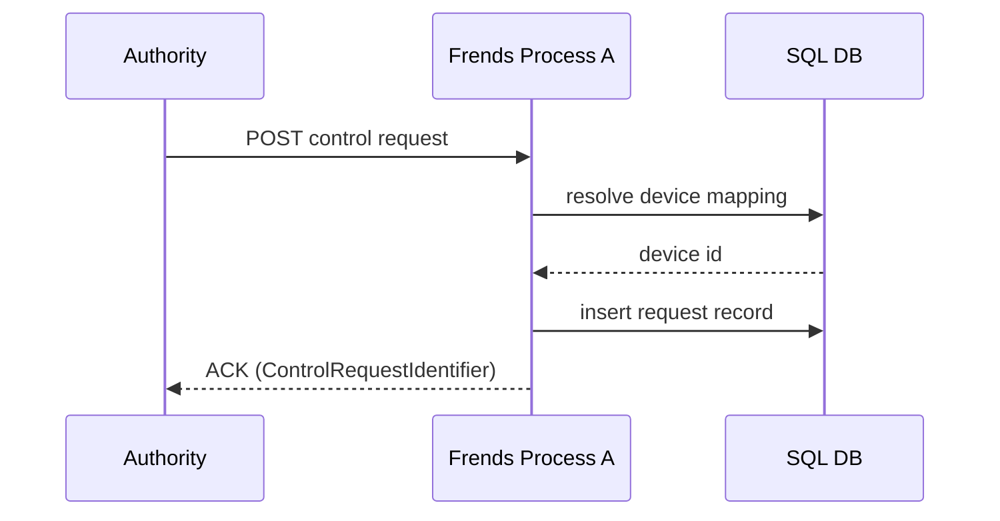
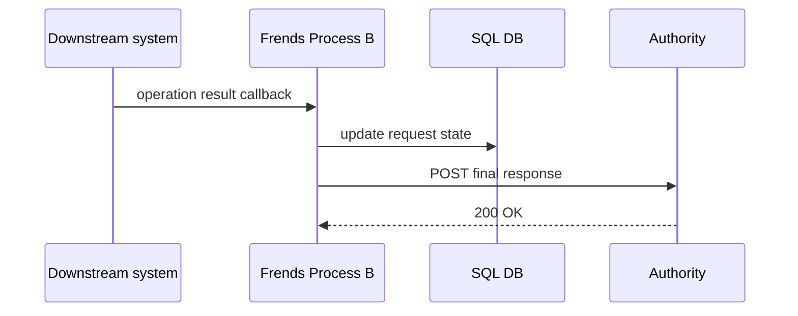
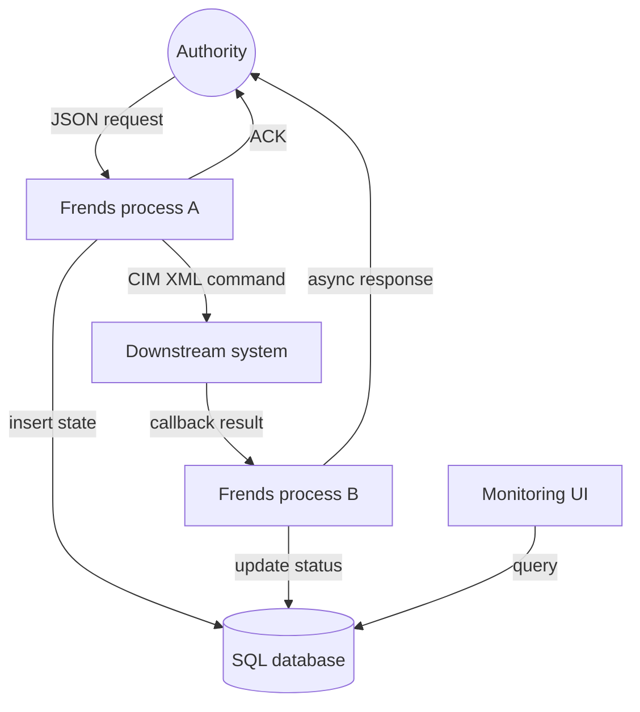

# [frends IPaaS](https://frends.com/ipaas?utm_term=frends%20ipaas&utm_campaign=Sweden+-+Search+-+Lead+Gen+-+Integrations+%7C+Use+Cases+%7C+Competitors+%7C+iPaaS&utm_source=bing&utm_medium=ppc&hsa_acc=4329103541&hsa_cam=22332025085&hsa_grp=1224857051808528&hsa_ad=&hsa_src=o&hsa_tgt=kwd-76553942528120:loc-65&hsa_kw=frends%20ipaas&hsa_mt=e&hsa_net=adwords&hsa_ver=3&msclkid=8a1bf448f3ff126935149de7186b7874)
* [Introduction](#introduction)
* [Integration principles](#integration-principles)
  * [Loose coupling](#loose-coupling)
  * [Deterministic correlation](#deterministic-correlation)
  * [Idempotent processing](#i-processing)
  * [Separation of concerns](#separation-of-concerns)
* [Incoming control request json](#incoming-control-request-json)
* [Mapping JSON to IEC XML](#mapping-json-to-iec-xml)
  * [Field mapping](#field-mapping)
* [Device identification strategy](#device-identification-strategy)
  * [Mapping table example](#mapping-table-example)
  * [Database responsibilities](#database-responsibilities)
  * [Important constraint](#important-constraint)
* [Integration flow design](#integration-flow-design)
  * [Synchronous ack flow](#synchronous-ack-flow)
  * [Asynchronous final response flow](#asynchronous-final-response-flow)
* [Error handling and reliability](#error-handling-and-reliability)
  * [Mapping failure](#mapping-failure)
  * [Downstream failure](#downstream-failure)
  * [Retry strategy](#retry-strategy)
* [Persistence model](#persistence-model)
  * [Correlation table example](#correlation-table-example)
* [Observability and monitoring](#observability-and-monitoring)
  * [frends operational monitoring](#frends-operational-monitoring)
  * [Business monitoring UI](#business-monitoring-ui)
* [Security considerations](#security-considerations)
* [End to end architecture](#recommended-end-to-end-architecture)
* [Conclusion](#conclusion)
## Introduction
* Receiving **authority-issued control requests**
* Converting them to **industry-standard control messages**
* Orchestrating execution across downstream operational systems
* Reporting both **immediate acknowledgement** and **final execution outcome**
* This document describes an integration pattern where:
  * Requests arrive as **JSON**
  * Control messages are converted to **IEC 61968 XML**
  * **Frends iPaaS** orchestrates the workflow
  * A **durable SQL database** stores correlation state
  * A **monitoring UI** provides operational visibility
* The architecture follows a **dual-phase response model**:
  * synchronous **ACK**
  * asynchronous **final outcome**
* This pattern is common in **regulated grid control integrations**.
# Integration principles
### Loose coupling
* Authorities send **logical identifiers**
* Internal systems resolve **physical device identifiers**
### Deterministic correlation
* All workflow steps are linked through:
  * `ControlRequestIdentifier`
* This identifier must remain **globally unique and immutable**.
### Idempotent processing
* Duplicate messages must not trigger repeated control operations.
* Recommended strategy:
  * Enforce uniqueness in the **correlation table**
  * Ignore duplicates based on `ControlRequestIdentifier`.
### Separation of concerns
* Responsibilities are divided between:
  * **Frends orchestration**
  * **External persistence**
  * **Downstream operational systems**
## Incoming control request json
* Authority requests typically contain:
  * `PartyIdentifier`
  * `UsagePointIdentifier`
  * `ControlRequestIdentifier`
  * control operation details
* Example payload:
```json
{
  "EventData": {
    "PartyIdentifier": "SERVICEPROVIDER123",
    "UsagePointBasicInfo": {
      "UsagePointIdentifier": "USAGEPOINT456"
    },
    "ControlRequest": {
      "ControlRequestIdentifier": "CR-789",
      "RelayIdentifier": "1",
      "ControlRequestType": {
        "Type": "SingleControl"
      },
      "ControlRequestDetails": {
        "RelayState": "RelayClosed"
      }
    }
  }
}
```

* In Frends the request is processed using:
  * HTTP trigger
  * JSON parsing tasks
  * optional **.NET script tasks**
* Key identifiers:
  * `ControlRequestIdentifier` → workflow correlation
  * `UsagePointIdentifier` → logical grid connection point
  * `RelayState` → control instruction
## Mapping JSON to IEC XML
* Utility control systems commonly communicate using **IEC XML messages**.
* Frends performs the transformation using:
  * C# script tasks
  * XML generation using `XDocument`
* The transformation produces a **IEC-compliant control command**.
### Field mapping

| JSON field               | IEC XML field               |
| ------------------------ | ----------------------- |
| ControlRequestIdentifier | MessageID               |
| PartyIdentifier          | Destination             |
| UsagePointIdentifier     | Device ID |
| RelayState               | EndDeviceControlType    |

## Device identification strategy
* Authorities reference **UsagePointIdentifier**, while operational systems require **DeviceId**.
* A mapping layer resolves this relationship.
### Mapping table example

| UsagePointIdentifier | DeviceId    | DeviceType |
| -------------------- | ----------- | ---------- |
| USAGEPOINT456        | METER998877 | SmartMeter |

### Database responsibilities
* The database stores:
  * UsagePoint → Device mappings
  * request correlation state
  * lifecycle timestamps
* Frends queries this database during request processing.
### Important constraint
* Avoid using **in-memory storage** such as `StaticStorage`.
* These mechanisms are **non-durable** and unsuitable for production integration.
## Integration flow design
### Synchronous ack flow
* Purpose:
  * accept request
  * validate identifiers
  * create correlation record
  * acknowledge immediately



* Key requirement:
  * response latency should remain **very low**.
### Asynchronous final response flow
* Purpose:
  * receive downstream execution result
  * correlate to original request
  * notify authority


## Error handling and reliability
### Mapping failure
* If no device mapping exists:
  * return **negative acknowledgement**
  * log error
  * do not forward request
### Downstream failure
* If the downstream system fails:
  * record error status
  * return failure response asynchronously
### Retry strategy
* Recommended approach:
  * exponential retry for downstream calls
  * maximum retry threshold
  * alert if retries exhausted
## Persistence model
* Frends stores **platform operational data**:
  * Execution logs
  * Monitoring events
  * Audit trails
* Business-level persistence must reside externally.
### Correlation table example

| ControlRequestIdentifier | UsagePoint | DeviceId | Status | ReceivedTime | CompletedTime |
| ------------------------ | ---------- | -------- | ------ | ------------ | ------------- |

* This table enables:
  * request tracking
  * monitoring UI queries
  * operational reporting
## Observability and monitoring
* Operational visibility is critical for regulated systems.
* Two layers of monitoring are recommended.
### frends operational monitoring
* Used for:
  * workflow execution tracking
  * error diagnostics
  * process history
### Business monitoring UI
* Provides business visibility.
* Example fields:
  * ControlRequestIdentifier
  * UsagePointIdentifier
  * DeviceId
  * lifecycle timestamps
  * execution result
* This interface is typically built using:
  * lightweight web UI
  * direct database queries
## Security considerations
* Authority endpoints should be protected using:
  * TLS encryption
  * API authentication
  * IP allow-listing
* Additional recommendations:
  * validate all incoming JSON payloads
  * enforce schema validation
  * sanitize input before transformation
## End to end architecture


## Conclusion
* This integration pattern combines:
  * **Frends iPaaS orchestration**
  * **CIM XML interoperability**
  * **Dual-phase response model**
  * **Durable external persistence**
  * **Operator monitoring interface**
* The result is a solution that provides:
  * reliable control execution
  * full request traceability
  * operational transparency
  * regulatory compliance for energy-sector integrations.
