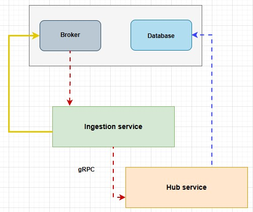

# Architecture
- [gRPC setup](grpcsetup/README.md)
- [Ingestion service](#ingestion-service)
- [Hub service](#hub-service)
## Ingestion service
1.  **Consume from ActiveMQ:** Listen for and receive messages from a specific ActiveMQ queue.
2.  **Act as gRPC Client:** Be able to initiate and make gRPC calls to Service B.
3.  **Data Mapping:** Convert received ActiveMQ message data into the `RegistrationRequestMessage` Protobuf format.
4.  **Error Handling (Client):** Handle potential failures during gRPC calls to Service B (e.g., Service B unavailability, RPC errors).
5.  **Logging:** Log consumed messages, gRPC call attempts, and responses/errors.
6.  **Spring Boot Application:** Be a standalone Spring Boot application.

## Hub service
1.  **Act as gRPC Server:** Expose the `RegistrationService` defined in the `.proto` file to accept incoming gRPC calls from Service A.
2.  **Data Persistence:** Save the `RegistrationRequestMessage` data received via gRPC into a PostgreSQL database.
3.  **ORM Usage:** Utilize Spring Data JPA for interacting with PostgreSQL.
4.  **Database Schema:** Define a database table (e.g., `sensor_registrations`) that maps to the `RegistrationRequestMessage` fields.
5.  **Response Generation:** Send back a `RegistrationResponseMessage` indicating the success or failure of the registration and saving operation.
6.  **Error Handling (Server):** Handle database errors or invalid input gracefully and return appropriate gRPC responses.
7.  **Logging:** Log incoming gRPC requests, database operations, and responses/errors.
8.  **Spring Boot Application:** Be a standalone Spring Boot application.

## Flow 
* The Ingestion Service is set up to:
    * Start as a standalone Spring Boot application.
    * Connect to ActiveMQ.
    * Receive JSON messages from `registration.queue`.
    * Deserialize these JSON messages into **RegistrationRequest`Pojo`** instances.
    * Convert these `RegistrationRequestPojo` instances into **RegistrationRequestMessage `Protobuf` objects**.
    * **Successfully makes gRPC calls to the Hub Service** using the generated `RegistrationServiceGrpc.RegistrationServiceBlockingStub` to send the `RegistrationRequestMessage`.
    * Provides an HTTP endpoint to easily inject test messages into ActiveMQ, which are then processed and sent via gRPC.
**Next Steps (Upcoming):**
* Addressing client-side gRPC error handling (e.g., retries, circuit breakers, dead-letter queues).
* Implementing persistence in the Hub Service (e.g., saving registered sensor data to a database).
* Adding more sophisticated business logic to the Hub Service's `RegisterSensor` method.
