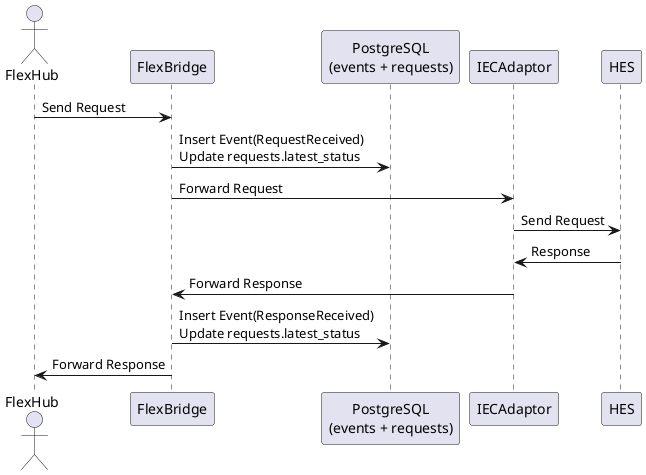

# Event driven approach
- [Problem](#problem)
- [Options](#options)
  - [Denormalized single table](#denormalized-single-table)
  - [Event sourcing with projection](#event-sourcing-with-projection)
- [Insert and Update workflow](#insert-and-update-workflow)
  - [Insert event](#insert-event)
  - [Update request projection](#update-request-projection)
- [Sequence diagram](#sequence-diagram)
- [Pagination strategy](#pagination-strategy)
  - [Requests](#requests)
  - [Events](#events)
- [REST API contract](#rest-api-contract)
  - [Get list of requests](#get-list-of-requests)
  - [Get events for a request](#get-events-for-a-request)
- [Conclusion](#conclusion)
## Problem
- FlexBridge receives requests from FlexHub and forwards them to IEC adaptor → HES.
- Responses come back, and status must be updated.
- UI requirement: show a single row per request, expandable to show the full timeline.

## Options
### Denormalized single table
* ✅ Simple to implement.
* ❌ Hard to evolve: schema changes needed when new steps/events are added.
* ❌ Limited flexibility for complex flows.
```sql
CREATE TABLE requests (
    id SERIAL PRIMARY KEY,
    correlation_id VARCHAR(100) UNIQUE NOT NULL,
    request_received_at TIMESTAMPTZ,
    request_forwarded_at TIMESTAMPTZ,
    sent_to_hes_at TIMESTAMPTZ,
    response_received_at TIMESTAMPTZ,
    response_forwarded_at TIMESTAMPTZ,
    latest_status VARCHAR(50)
);
````

### Event sourcing with projection
- Recommended
- Two tables:
  * **events**: append-only, records full timeline with timestamps.
  * **requests**: projection, keeps only the latest status for fast UI display.
```sql
CREATE TABLE requests (
    id SERIAL PRIMARY KEY,
    correlation_id VARCHAR(100) UNIQUE NOT NULL,
    latest_status VARCHAR(50) NOT NULL,
    last_updated TIMESTAMPTZ DEFAULT now()
);

CREATE TABLE events (
    id SERIAL PRIMARY KEY,
    correlation_id VARCHAR(100) NOT NULL REFERENCES requests(correlation_id),
    event_type VARCHAR(50) NOT NULL,
    payload JSONB,
    created_at TIMESTAMPTZ DEFAULT now()
);

CREATE INDEX idx_events_correlation_id
    ON events (correlation_id, created_at);
```

## Insert and Update workflow
### Insert event
```sql
INSERT INTO events (correlation_id, event_type, payload)
VALUES ('12345', 'RequestReceived', '{"from":"FlexHub"}');
```

### Update request projection
```sql
INSERT INTO requests (correlation_id, latest_status, last_updated)
VALUES ('12345', 'RequestReceived', now())
ON CONFLICT (correlation_id) 
DO UPDATE SET latest_status = EXCLUDED.latest_status,
              last_updated = EXCLUDED.last_updated;
```

## Sequence diagram


## Pagination strategy
### Requests 
- Summary list
```sql
-- First page
SELECT correlation_id, latest_status, last_updated
FROM requests
ORDER BY last_updated DESC
LIMIT 20;

-- Next page
SELECT correlation_id, latest_status, last_updated
FROM requests
WHERE last_updated < '2025-09-12T10:00:00Z'  -- cursor from last row
ORDER BY last_updated DESC
LIMIT 20;
```

### Events 
- Timeline per request
```sql
-- First page
SELECT event_type, payload, created_at
FROM events
WHERE correlation_id = '12345'
ORDER BY created_at ASC
LIMIT 10;

-- Next page
SELECT event_type, payload, created_at
FROM events
WHERE correlation_id = '12345'
  AND created_at > '2025-09-12T10:00:00Z'  -- cursor from last row
ORDER BY created_at ASC
LIMIT 10;
```

## REST API contract
### Get list of requests
- Summary view
```
GET /requests?limit=20&cursor=2025-09-12T10:00:00Z
```
* **limit**: number of rows to fetch.
* **cursor**: `last_updated` of the last row from previous page.
- Sample response
```json
{
  "data": [
    { "correlation_id": "12345", "latest_status": "RequestReceived", "last_updated": "2025-09-12T10:00:00Z" },
    { "correlation_id": "12346", "latest_status": "ResponseForwarded", "last_updated": "2025-09-12T09:59:00Z" }
  ],
  "next_cursor": "2025-09-12T09:59:00Z"
}
```

### Get events for a request
- Timeline view
```
GET /requests/{correlation_id}/events?limit=10&cursor=2025-09-12T10:00:00Z
```
* **limit**: number of events to fetch.
* **cursor**: `created_at` of the last event from previous page.
- Sample response
```json
{
  "data": [
    { "event_type": "RequestReceived", "payload": { "from": "FlexHub" }, "created_at": "2025-09-12T09:55:00Z" },
    { "event_type": "RequestForwarded", "payload": { "to": "IECAdaptor" }, "created_at": "2025-09-12T09:55:05Z" }
  ],
  "next_cursor": "2025-09-12T09:55:05Z"
}
```
## Conclusion
* **Best approach**: Event sourcing with a projection table.
* Preserves full history while still allowing simple, single-row display in the UI.
* Cursor-based pagination ensures scalability for both summary and timeline queries.
* REST API design aligns with UI requirements:
  * `/requests` → summary list with pagination.
  * `/requests/{id}/events` → detailed timeline with pagination.
