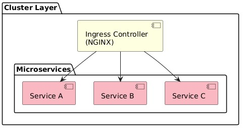
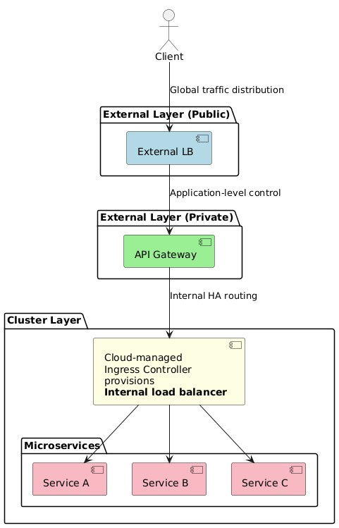
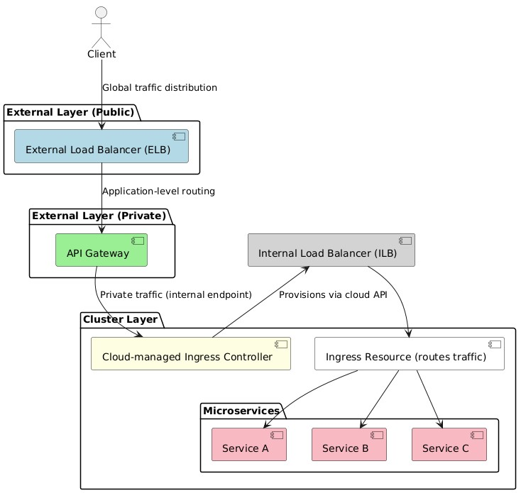

# Designing Microservices
- [Introduction](#introduction)
- [When API gateway helps](#when-api-gateway-helps)
- [Who handles what](#who-handles-what)
- [Setup for development](#setup-for-development)
- [Setup for production](#setup-for-production)
## Introduction
* Layered responsibilities
  * `LB vs Ingress vs API Gateway`
* **Rule of Thumb:** 
  * LB = Availability, 
  * Gateway = Control, 
  * Ingress = Internal routing.

| Layer                   | Role                      | Key Features                                           |
| ----------------------- | ------------------------- | ------------------------------------------------------ |
| **Load Balancer**       | Traffic distribution & HA | Layer 4/7 routing, health checks, failover             |
| **API Gateway**         | Application-level control | Auth, rate limiting, transformations, caching, logging |
| **Ingress Controller**  | Internal routing          | Path-based routing, TLS termination                    |
| **Reverse Proxy / CDN** | UI delivery               | TLS, caching, compression, API routing                 |

## When API gateway helps
* **Multiple external microservices** exposed through a single endpoint.
* **Rate limiting** per client/API key.
* **Auth at the edge** (OAuth, JWT).
* **Request transformations** (REST → gRPC, JSON → XML).
* **Centralized logging & analytics**.
* **Analogy:** 
  * LB = traffic cop
  * Ingress = traffic sign inside cluster
  * API Gateway = security checkpoint + concierge.
## Who handles what

| Feature                    | API Gateway  | Load Balancer | Ingress    |
| -------------------------- | ------------ | ------------- | ---------- |
| Auth & Authorization       | ✅            | ❌             | ⚠️ limited |
| Rate limiting              | ✅ per client | ⚠️ global     | ⚠️ basic   |
| Transformation             | ✅            | ❌             | ❌          |
| Caching                    | ✅            | ❌             | ⚠️ limited |
| Logging / Analytics        | ✅            | ⚠️ metrics    | ⚠️ basic   |
| TLS termination            | ✅            | ✅             | ✅          |
| Circuit breaking / retries | ✅            | ❌             | ❌          |

## Setup for development
* Pros: HA, routing, TLS
* **Cons**: Limited auth, rate limiting, transformations, logging

## Setup for production
* Use **API Gateway for public APIs** requiring auth, rate limiting, transformations.
* Use **Ingress for internal routing** inside Kubernetes.
* Always place **load balancers** for HA in front of key layers.
* For UI outside cluster → **CDN + optional reverse proxy**.
* Avoid over-engineering; introduce API Gateway **only when necessary**.

* This translates to

