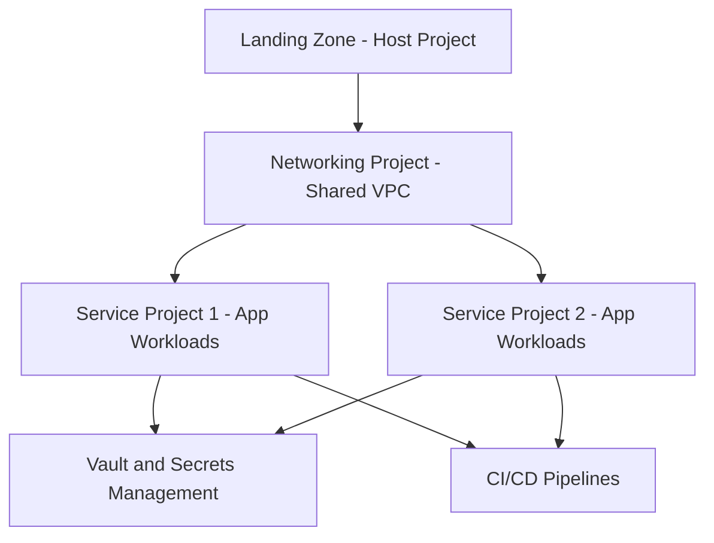
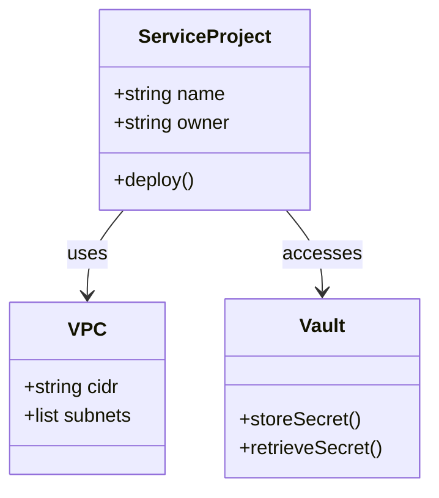
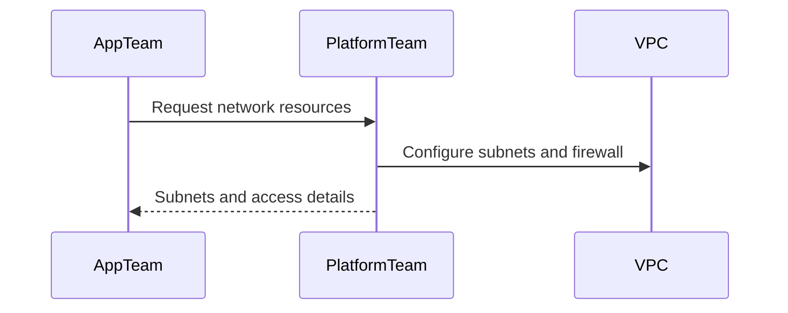
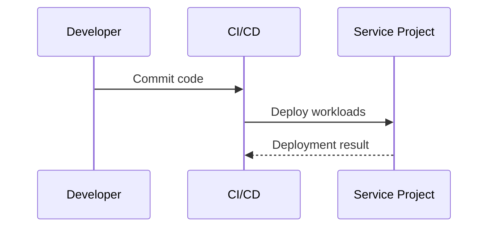
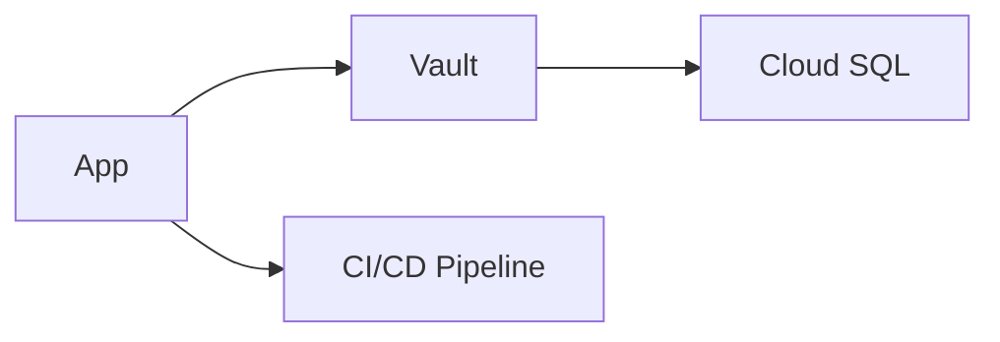
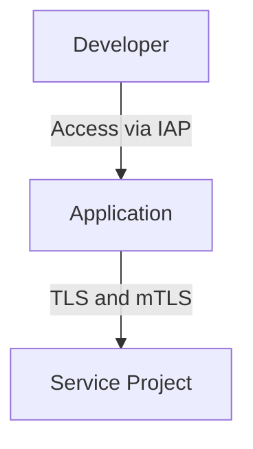
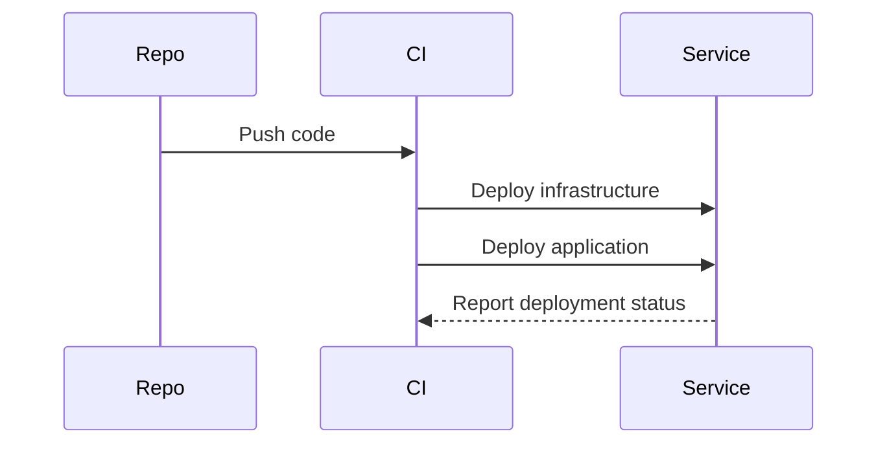
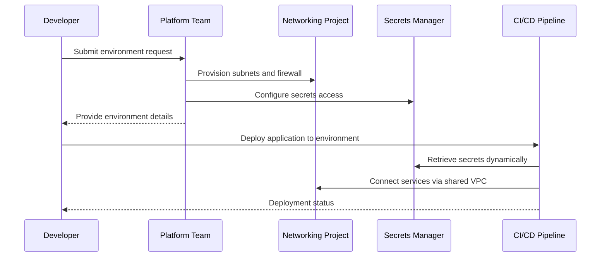

# Architecting for Cloud
* [Goal](#goal)
* [Guiding principles](#guiding-principles)
* [Overview](#overview)
* [Host project](#host-project)
* [Networking and shared VPC](#networking--shared-vpc)
* [Service project lifecycle](#service-project-lifecycle)
* [Secrets and configuration management](#secrets--configuration-management)
* [Access and connectivity](#access--connectivity)
* [Deployment workflow](#deployment-workflow)
* [Cloud readiness checklist](#cloud-readiness-checklist)
* [Environment request process](#environment-request-process)
## Goal
* **Pre-deployment readiness criteria** for apps.
* **Operational best practices** for post-deployment.
## Guiding principles
* **Cloud-native mindset:** scalability, resilience, and automation.
* **Security first:** zero trust, least privilege, mTLS for service-to-service communication.
* **Separation of concerns:** isolate management, networking, and workloads.
* **Automation:** infrastructure as code (Terraform), repeatable deployments.
* **Observability:** logging, monitoring, tracing from day one.
## Overview
* Control and policy management centralized in host project.
* Shared VPC managed by networking project.
* Service projects consume shared subnets and host workloads.
* Vault and CI/CD provide operational automation and secure handling.
* **Flow:**
  * `host (landing zone)` → `networking project (shared VPC)` → `service projects (applications)`

### Example
* [Creating service project](serviceproject/README.md)
  * [Configure Hashicorp vault to persist secrets in Cloud SQL](secrets/README.md)
  * [Accessing services running in service project via Island browser](islandbrowser/README.md)
* [Configure web app url to use Internal DNS and certificates signed with public root CA](internalDNS/README.md)
* [Accessing web application via Island browser](useraccesstoapplication/README.md)
* [Deployment process](deployment/README.md)
* [Alternate design](alternatedesign/README.md)
## Host project
* Host project aka landing zone
  * Central authority for organization-level configuration.
  * Manages IAM boundaries, firewall baselines, VPC definitions.
  * Enforces organization policies and service control.
  * Hosts cross-project services (logging, monitoring, billing).
* **Outcome:** consistent governance and baseline security.
## Networking and shared vpc
* Networking project owns VPCs, subnets, and routing.
* Shared VPC exposes subnets to service projects.
* Centralized firewall and routing policies.
**Outcome:** scalable, secure, and compliant connectivity.

### Takeaways
- **Host project aka Landing zone**
  - `Network admin`, enables to centrally manage VPCs, firewall rules, and **IAM settings** across networking projects
- **Networking project**
  - Consists of VPC, subnets and firewall rules.
  - `Shared VPC` is enabled on the networking project.
- **Service project**
  - Service project is linked to networking project.
  - Hosts the application workloads such as VMs and Cloud SQL.
* **Shared VPC**: This allows your service project to `use the subnets` defined in your networking project.
## Service project lifecycle
* Linked to networking project to consume shared subnets.
* Hosts application workloads: compute, containers, databases.
* Isolated for security and billing but aligned through shared standards.
* **Lifecycle stages:**
  * Provisioning via [Terraform templates](link-to-IaC-repo)
  * Deploy workloads using [CI/CD pipeline guide](link-to-CICD-guide)
  * Integrate with [Vault](link-to-vault-guide) and [observability stack](link-to-observability-guide)

## Secrets and configuration management
* **Vault + Cloud SQL** integration for secret persistence and access control.
* Dynamic secrets wherever possible (short-lived tokens, ephemeral credentials).
* Environment-specific policies tied to IAM roles.
* Consistent bootstrap pattern for new projects.

## Access and connectivity
* **Internal access:** Island browser → internal DNS → service endpoint.
* TLS certificates signed by public CA for internal DNS.
* **Service access:** via mTLS, service accounts, or IAM-based permissions.
* Developer/admin access through secure bastion or Identity-Aware Proxy (IAP).

## Deployment workflow
* **CI/CD orchestration:**
  * IaC (Terraform) to create and configure projects.
  * Pipeline stages: build → test → deploy → verify.
  * Canary or blue-green deployments.
  * Rollback and observability hooks.
* **Recommended tooling:** GitHub Actions or Cloud Build + Terraform Cloud.

## Environment request process

