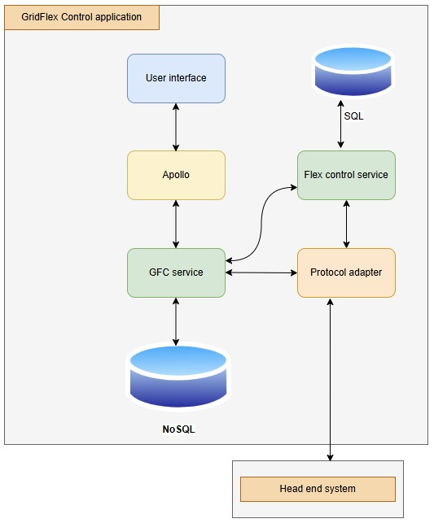
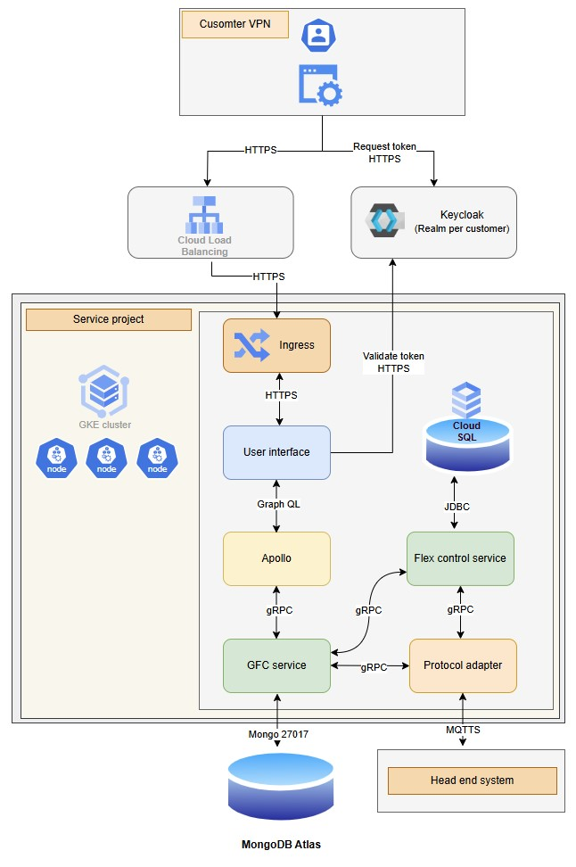
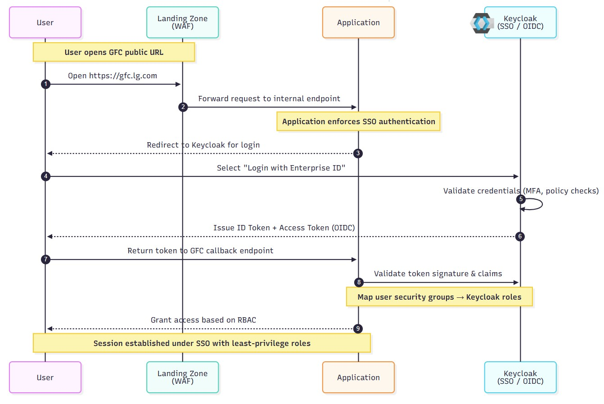
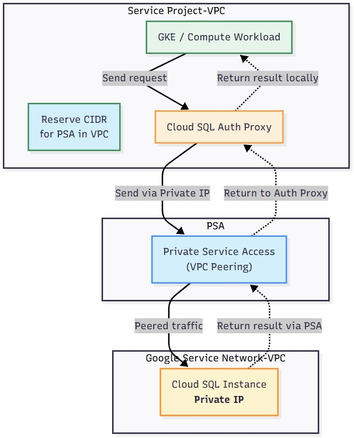

# Flexibility control
- [Application overview](#application-overview)
- [Software frameworks](#software-frameworks)
- [Logical architecture](#logical-architecture)
- [Project structure](#project-structure)
- [Networking](#networking)
- [SSL certificates](#ssl-certificates)
- [Authentication and Authorization](#authentication-and-authorization)
- [Private APIs](#private-apis)
- [Communication to HES](#communication-to-hes)
- [Services on GKE](#services-on-gke)
- [GKE nodes](#gke-nodes)
- [Databases](#databases)
  - [Cloud SQL](#cloud-sql)
  - [MongoDB Atlas cluster](#mongodb-atlas-cluster)
- [Multitenancy](#multitenancy)
## Application overview
- The Grid Flex Control application will be developed using Angular, GraphQL and Java.
- The application will be containerized to run as private GKE cluster in Google Cloud Platform.

 * **User interface**
  * Frontend for user interaction
  * Communicates with GraphQL API
* **GraphQL**
  * Acts as API layer
  * Orchestrates data between UI and GFC service
* **GFC service**
  * Core backend logic handler
  * Interacts with NoSQL database
  * Exchanges data with Flex Control Service and IEC Adapter
* **Flex control service**
  * Business logic for flex control operations
  * Communicates with both GFC service and IEC Adapter
  * Persists data to SQL database
* **IEC adapter**
  * Protocol adapter (IEC-61968-9) for external communication
  * Connects Flex Control Service with external Head End System
* **Databases**
  * **SQL:** stores structured operational data
  * **NoSQL:** stores unstructured data for GFC service
## Software frameworks
- The Grid Flex Control application will be developed using these frameworks and tools:
  -	Frontend - AngularJS, HTML5, Nginx gateway
  -	Backend - Java, Restful APIs
  -	Storage – PostgreSQL, MongoDB
  -	CI/CD – GitLab, Docker, Helm Charts
## Logical architecture
- To support the requirements for Grid Flex Control, the diagram demonstrates the logical architecture.

## Project structure
- Each deployment (either staging, hosted for a specific tenant, or a multi-tenant solution) consists of two projects, as shown in logical architecture.
- The projects are designed with considerations for IAM, cost management and operations.
- Specific considerations include security boundaries, exposure to the internet, costs relating to specific types of GCP resources, CI/CD pipelines and related manual security and operation processes.

| Project logical index in iac       | Project root name | Note                                                        |
| ---------------------------------- | ----------------- | ----------------------------------------------------------- |
| Grid Flex Control Service project  | srv               | Grid Flex Control services in GKE and database in Cloud SQL |
| Grid Flex Control Security project | scr               | Secret Manager, Artifact Registry and KMS                   |

- **Required GCP APIs**

| API                                | srv | scr |
| ---------------------------------- | :-: | :-: |
| Compute Engine                     |  x  |     |
| Google Kubernetes Engine           |  x  |     |
| Cloud SQL                          |  x  |     |
| Google Cloud Storage               |  x  |     |
| Secret Manager                     |     |  x  |
| Artifact Registry                  |     |  x  |
| Cloud Key Management Service (KMS) |     |  x  |
| Cloud Logging                      |  x  |  x  |
| Cloud Monitoring                   |  x  |  x  |
| Container Analysis                 |  x  |  x  |
| Container Security                 |  x  |     |

## Networking
- The networking currently proposed is shown in the following diagram.

## SSL certificates
- As Grid Flex Control application exposes critical infrastructure, it will be accessible only within a private network.
  - The application will be exposed through **internal DNS name**.
  - All communication to the application is encrypted using SSL/TLS, application uses a **publicly trusted certificate**.

### Process
-	The application will be exposed through internal DNS name (~ DNS that is internal to the VPN or VPC)
  -	This means external users or networks cannot resolve or access the DNS name.
  -	Only clients connected through the VPN tunnel or internal network can reach it.
-	All communication to the application is encrypted using SSL/TLS:
  -	This ensures that data in transit is secure, protecting it from eavesdropping or tampering.
  -	The application uses a publicly trusted certificate:
    -	Even though the DNS is internal, using a publicly trusted certificate avoids issues with certificate warnings.
    -	It also simplifies management because clients automatically trust the certificate without needing to install private CA certificates.
---
- Private/internal DNS restricts access to VPN-connected clients only.
- SSL/TLS ensures secure communication, also on an internal network.
-	Using a publicly trusted certificate balances security and ease-of-use for internal clients.

## Authentication and Authorization
- Access to Grid Flex Control application for end-customers is provided via JWT token generated by Keycloak instance.
- Refer detailed flow as shown below.

## Private APIs
* **Scada**
  * An IEC 60870-5-104 interface is used to establish connections to customers’ SCADA systems (critical OT infrastructure; communication via private IP and site-to-site VPN is mandatory).
  * Grid Flex Control’s SCADA connector can be configured as either an IEC104 client or IEC104 server, per connection.
  * Customers (e.g., DNO/TSO) can optionally be provided with one private endpoint each to establish an IEC 60870-5-104 connection to or from the customer’s SCADA environment (customer OT).
  * Careful setup is required (e.g., site-to-site VPN, access management of customers’ OT/SCADA networks), since IEC 60870-5-104 does not support encryption or authentication by design.
* **Flexibility data provider**
  * Grid Flex Control can receive flexibility master data pushed from authenticated and authorized clients (customer middleware or ESB) via REST API (REST/CSV) with TLS. REST/JSON available on request.
  * Customers (e.g., DSO/TSO) can optionally be provided with two private endpoints to automate transfers of flexibility master data to GFC.
  * The first endpoint accesses Keycloak to request client tokens; these tokens are used for authenticated and authorized access to the second API endpoint that imports flexibility-master data into GFC.
  * Alternatively, authenticated and authorized customers can manually upload master-data files using GFC's web UI.
## Communication to HES
- GFC communicates with the HES-systems via L+G’s IEC4HES-interface (IEC 61968-9).
- Messaging is realized using MQTT with TLS.
- The IEC4HES interfaces have a private IP (communication via site-to-site VPN).
## Services on GKE
- The Grid Flex Control application will run on GKE cluster.
- The cluster will run a user interface and microservices.
  - Services will be secured by mTLS.
  - JWT tokens (Keycloak) for endpoints.
  - ACL in service-to-service invocation.
  - OWASP based dependency checker against CVEs and upgrade and/or exclude transitive dependencies
## GKE nodes
- Node specs
  - `4 vCPUs` and `16GB of RAM`
- The sizing will be re-evaluated for production.
## Databases
### Cloud SQL
- Cloud SQL instance: 2 vCPUs and 8GB of RAM
- [**PSA setup**](https://cloud.google.com/sql/docs/mysql/connect-kubernetes-engine)
  - PSA is a mechanism to allocate a private IP range in your VPC for Google-managed services.
  - Steps
    - Reserve a CIDR range in your VPC.
    - Google allocates IPs from this range to the service (e.g., Cloud SQL).
    - GKE cluster accesses the service privately via the host VPC.
- **Auth proxy** placement
  - Sidecar container (best practice)
    - Add the Cloud SQL Auth Proxy as a sidecar in the same pod that needs SQL access.
    - Simplest, no extra networking hops, per-pod isolation.

### MongoDB Atlas cluster
- [**PSC setup**](https://www.mongodb.com/docs/atlas/security-private-endpoint/)
  - PSC is designed for private service endpoints like Atlas.
  - Private Service Connect (PSC) is used to connect Grid Flex Control service project’s VPC to the Atlas project.
  - Steps:
    - Create a PSC endpoint in Grid Flex Control service project VPC.
    - Configure MongoDB Atlas VPC peering to accept connections from that endpoint.
    - Use the private IP in your connection string from the service.

## Multitenancy
- The Grid Flex Control (GFC) solution uses a multi-tenant architecture with **logical data separation** in the application layer.
- This allows authorized users to securely access and manage data across tenants.
- Keycloak manages all user access and roles.
- **How access control works**
  - Each customer has their own `Keycloak Realm`, which issues JWT tokens containing the user’s roles and permissions.
  - GraphQL and gRPC services check the JWT and allow actions based on the user’s roles and permissions.
- **Platform architecture**
  - `One shared Kubernetes namespace for all customers`, with tenant isolation handled in the backend.
  - `One shared MongoDB Atlas database used by all tenants`.
  - Collections include `group` and `subgroup` fields to logically isolate each tenant’s data.

