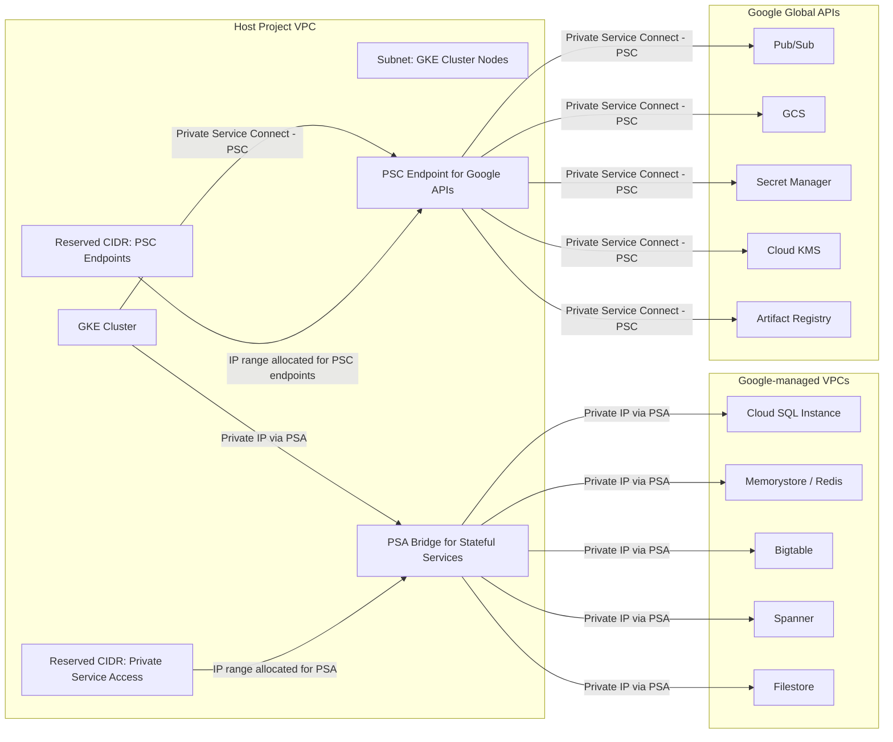

# PSA and PSC
* [Understanding GKE networking, Cloud SQL, and Private Service Access](#understanding-gke-networking-cloud-sql-and-private-service-access)
* [Service project and host VPC](#service-project-and-host-vpc)
* [Cloud SQL and Private Service Access (PSA)](#cloud-sql-and-private-service-access-psa)
* [Why Cloud SQL behaves differently](#why-cloud-sql-behaves-differently)
* [Private Service Access (PSA) overview](#private-service-access-psa-overview)
* [Does PSA create VPC transitivity?](#does-psa-create-vpc-transitivity-?)
* [PSA best practice](#psa-best-practice)
* [Global APIs and Private Service Connect (PSC)](#global-apis-and-private-service-connect-psc)
* [PSA vs PSC](#psa-vs-psc)
* [Production network diagram](#production-network-diagram)
* [Takeaways](#takeaways)
# Understanding GKE networking, Cloud SQL, and private service access
- As I was setting up a **GKE cluster** in a **service project** on Google Cloud, I ran into several confusing points about networking, private access, and connectivity to Google services.
- Here’s what I learned, step by step, including the **pain areas**, my confusions, and the solutions that clarified everything.
## Service project and host VPC
* My service project uses **Shared VPC from a host project**, meaning all subnets and IP ranges are inherited from the host.
* The **GKE cluster nodes** run inside these subnets.
* The first question: *“If my cluster needs to access Cloud SQL, where will it be provisioned? Will it share my VPC?”*
## Cloud SQL and Private Service Access (PSA)
* **Cloud SQL is always provisioned in its own project’s VPC** — it does not automatically live in the service project’s VPC.
* Access options:
  * **Private IP + PSA / VPC peering** → recommended for private, internal traffic.
  * **Public IP + authorized networks** → less secure, over public Internet.
## Why Cloud SQL behaves differently
* Cloud SQL is **stateful and regional**, managing persistent data.
* By default, Google isolates it in its own network for **operational control, replication, backup, and security**.
* Stateful services like **Memorystore, Bigtable, Spanner, Filestore** follow the same model.
* Global APIs like **Pub/Sub, KMS, Secret Manager, Artifact Registry** are **multi-tenant and global**, so they don’t need private IPs in your VPC; access is API-level.
## Private Service Access (PSA) overview
* PSA is a **mechanism to allocate a private IP range in your VPC** for Google-managed services.
* Workflow:
  1. Reserve a **CIDR range** in your VPC.
  2. Google allocates IPs from this range to the service (e.g., Cloud SQL).
  3. GKE cluster accesses the service **privately via the host VPC**.
* Services that support PSA: **Cloud SQL, Memorystore, Spanner, Bigtable, Filestore**.
## Does PSA create VPC transitivity?
* No — **PSA does not introduce VPC transitivity**.
* Cloud SQL lives in a **Google-managed VPC**, which is **not directly peered** with your service project VPC.
* When PSA is enabled, Google allocates **private IPs inside *your* VPC**, and these IPs act as a **proxy/bridge** to the Cloud SQL instance.
* Your GKE nodes connect only to **IP addresses that belong to your VPC**, not Cloud SQL’s VPC.
* Because PSA traffic flows through a **Google-managed bridge**, not through direct VPC-to-VPC routing, **no transitive routing is possible**.
* **Conclusion:**
  * PSA provides private connectivity **without exposing or chaining VPCs**, avoiding the transitivity problem entirely.
## PSA best practice
* Cluster **does not connect directly to Cloud SQL**; it uses the **PSA allocation as a bridge**.
* Ensures all traffic stays **internal, private, and secure**.
## Global APIs and Private Service Connect (PSC)
* Google APIs (Pub/Sub, GCS, KMS, Secret Manager, Artifact Registry) are **not in your VPC**.
* By default, cluster accesses them over **public Google APIs**.
* **Private Service Connect (PSC)** enables **private endpoints inside your VPC** for these APIs:
  * One PSC endpoint can serve multiple APIs.
  * PSC endpoints **consume IPs from a reserved CIDR** (smaller than PSA).
* Cluster connects to **PSC endpoint → Google API**, not directly.
## PSA vs PSC

| Feature        | PSA                                                        | PSC                                                              |
| -------------- | ---------------------------------------------------------- | ---------------------------------------------------------------- |
| Target         | Regional, stateful services (Cloud SQL, Memorystore, etc.) | Global, API-managed services (Pub/Sub, GCS, KMS, Secret Manager) |
| Mechanism      | Reserves CIDR in VPC; Google maps service IPs              | Creates private endpoint in VPC; consumes small IP block         |
| Cluster access | Cluster → PSA bridge → service                             | Cluster → PSC endpoint → API                                     |
| Traffic        | Private IP                                                 | Private API endpoint                                             |

## Production network diagram
* **Cluster → PSA bridge → stateful services** (private IP, fully internal).
* **Cluster → PSC endpoint → global APIs** (private access to managed APIs).
* **Reserved CIDRs** ensure no public Internet traffic.
* **Production best-practice**: cluster never talks directly to Cloud SQL or global APIs; PSA and PSC act as intermediaries.

## Takeaways
* Stateful, regional services like Cloud SQL require **PSA and private IP**.
* Global, multi-tenant APIs like Pub/Sub or GCS require **PSC for private access**, or default to public APIs.
* Understanding **VPC boundaries, reserved ranges, and PSA/PSC roles** is critical for secure GKE networking.
* Misunderstandings around PSA vs PSC were my main pain points — now the network architecture makes sense: **everything private, everything controlled**.
* This setup ensures:
  * Fully private, internal traffic between cluster and services.
  * Compliance with corporate security standards.
  * Clear separation between **regional stateful services** and **global APIs**.
