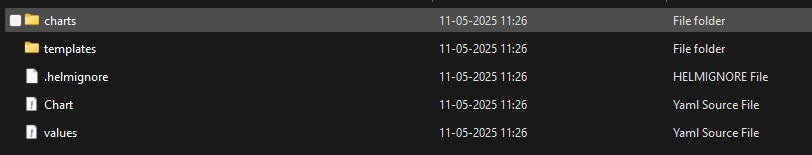

# [Helm charts](https://github.com/sbhrwl/system_design/blob/main/docs/deployment/containerisation/Kubernetes/deploymentstrategies/README.md)
- [Setup](setup/README.md)
- [Create Helm chart structure](#create-helm-chart-structure)
- [Clean up the default templates](#clean-up-the-default-templates)
- [Convert deployment YAMLs into a Helm template](#convert-deployment-yamls-into-a-helm-template)
- [Chart structure](#chart-structure)
- [Cleanup existing Kubernetes deployment](#cleanup-existing-kubernetes-deployment)
- [Install Helm release](#install-helm-release)
- [Verify deployment](#verify-deployment)
- [Access services](#access-services)
- [Update Helm release](#update-helm-release)
- [Uninstall Helm release](#uninstall-helm-release)
- [Troubleshooting](#troubleshooting)
## Create Helm chart structure
- Generate the basic `Helm chart directory`. 
- Run this in your terminal:
  ```
  helm create orchestrate-hubtosensor-services
  ```
- This creates a directory called [**orchestrate-hubtosensor-services**](orchestrate-hubtosensor-services) with default templates and values.


## Clean up the default templates
- Helm’s `create` command generates a bunch of example templates we don’t need. Let’s simplify.
- Go to the `templates` folder:
  ```
  cd orchestrate-hubtosensor-services/templates
  ```
- Delete all the default templates *except* `_helpers.tpl`.
  - *(Use **`del`** if you’re in Command Prompt on Windows instead of Git Bash or PowerShell)*
  ```bash
  del deployment.yaml service.yaml hpa.yaml ingress.yaml serviceaccount.yaml tests\test-connection.yaml
  del tests\test-connection.yaml & rmdir tests & del NOTES.txt

  rm deployment.yaml service.yaml hpa.yaml ingress.yaml serviceaccount.yaml tests/test-connection.yaml
  ```
- You should only have this file left:
  ```
  _helpers.tpl
  ```
## Convert deployment YAMLs into a Helm template
- [**flexibility-hub-simulator-deployment**](orchestrate-hubtosensor-services/templates/flexibility-hub-simulator-deployment.yaml)
- [**flexibility-hub-simulator-service**](orchestrate-hubtosensor-services/templates/flexibility-hub-simulator-service.yaml)
- [**storage-service-deployment**](orchestrate-hubtosensor-services/templates/storage-service-deployment.yaml)
- [**storage-service-service**](orchestrate-hubtosensor-services/templates/storage-service-service.yaml)
- [**flexibility-bridge-deployment**](orchestrate-hubtosensor-services/templates/flexibility-bridge-deployment.yaml)
- [**protocol-adapter-deployment**](orchestrate-hubtosensor-services/templates/protocol-adapter-deployment.yaml)
- [**hes-simulator-deployment**](orchestrate-hubtosensor-services/templates/hes-simulator-deployment.yaml)
- [**data-api-deployment**](orchestrate-hubtosensor-services/templates/data-api-deployment.yaml)
- [**data-api-service**](orchestrate-hubtosensor-services/templates/data-api-service.yaml)
- [**ui-app-deployment**](orchestrate-hubtosensor-services/templates/ui-app-deployment.yaml)
- [**ui-app-service**](orchestrate-hubtosensor-services/templates/ui-app-service.yaml)
- [**`values.yaml`**](orchestrate-hubtosensor-services/values.yaml)
### Chart structure
```pgsql
orchestrate-hubtosensor-services/
├── templates/
│   ├── flexibility-hub-simulator-deployment.yaml
│   ├── flexibility-hub-simulator-service.yaml
│   ├── storage-service-deployment.yaml
│   ├── storage-service-service.yaml
│   ├── flexibility-bridge-deployment.yaml
│   ├── protocol-adapter-deployment.yaml
│   ├── hes-simulator-deployment.yaml
│   ├── data-api-deployment.yaml
│   ├── data-api-service.yaml
│   ├── ui-app-deployment.yaml
│   ├── ui-app-service.yaml
│   └── _helpers.tpl
├── Chart.yaml
├── values.yaml
├── .helmignore
```
## Cleanup existing Kubernetes deployment 
```
kubectl delete -f orchestrate-hubtosensor-services.yaml
```
## Install Helm release
- Go to Helm chart folder [**orchestrate-hubtosensor-services**](orchestrate-hubtosensor-services)
```powershell
helm install ocs-h2s-release .
```
- **`ocs-h2s-release`** is the name you're assigning to this Helm release (you can change it if you like).
- `.` means Helm will *install using the chart in the current directory*.
## Verify deployment
```
C:\Git\microservices\hubToSensor\helmcharts\orchestrate-hubtosensor-services>helm install ocs-h2s-release .
Error: INSTALLATION FAILED: template: orchestrate-hubtosensor-services/templates/ui-app-service.yaml:4:11: executing "orchestrate-hubtosensor-services/templates/ui-app-service.yaml" at <include "uiApp.name" .>: error calling include: template: no template "uiApp.name" associated with template "gotpl"

C:\Git\microservices\hubToSensor\helmcharts\orchestrate-hubtosensor-services>helm install ocs-h2s-release .
Error: INSTALLATION FAILED: template: orchestrate-hubtosensor-services/templates/protocol-adapter-deployment.yaml:19:26: executing "orchestrate-hubtosensor-services/templates/protocol-adapter-deployment.yaml" at <.Values.protocolAdapter.image>: nil pointer evaluating interface {}.image

C:\Git\microservices\hubToSensor\helmcharts\orchestrate-hubtosensor-services>helm install ocs-h2s-release .
NAME: ocs-h2s-release
LAST DEPLOYED: Sun Oct 12 11:31:07 2025
NAMESPACE: default
STATUS: deployed
REVISION: 1
TEST SUITE: None

C:\Git\microservices\hubToSensor\helmcharts\orchestrate-hubtosensor-services>helm list
NAME            NAMESPACE       REVISION        UPDATED                                 STATUS          CHART                                   APP VERSION
ocs-h2s-release default         1               2025-10-12 11:31:07.1780478 +0300 EEST  deployed        orchestrate-hubtosensor-services-0.1.0  1.16.0

C:\Git\microservices\hubToSensor\helmcharts\orchestrate-hubtosensor-services>helm list -A
NAME            NAMESPACE       REVISION        UPDATED                                 STATUS          CHART                                   APP VERSION
ocs-h2s-release default         1               2025-10-12 11:31:07.1780478 +0300 EEST  deployed        orchestrate-hubtosensor-services-0.1.0  1.16.0

C:\Git\microservices\hubToSensor\helmcharts\orchestrate-hubtosensor-services>kubectl get pods
NAME                                                    READY   STATUS    RESTARTS     AGE
data-api-65c7b7b9d7-n5nnv                               1/1     Running   0            36s
flexibility-bridge-deployment-54884f5cc4-qrpqg          1/1     Running   1 (9s ago)   36s
flexibility-hub-simulator-deployment-6d4c545887-7rgkt   1/1     Running   0            36s
hes-simulator-deployment-6f8f6b66-5vnhh                 1/1     Running   0            36s
protocol-adapter-deployment-5b499cb96c-bkxnf            1/1     Running   1 (9s ago)   36s
storage-service-deployment-6f99954b-8tdmn               1/1     Running   1 (4s ago)   36s
ui-app-676567d78f-smk9m                                 1/1     Running   0            36s

C:\Git\microservices\hubToSensor\helmcharts\orchestrate-hubtosensor-services>kubectl get svc
NAME                                TYPE        CLUSTER-IP       EXTERNAL-IP   PORT(S)          AGE
flexibility-hub-simulator-service   NodePort    10.102.128.78    <none>        8081:30881/TCP   47s
storage-service-service             ClusterIP   10.98.125.63     <none>        9090/TCP         47s
data-api-service                    NodePort    10.109.147.145   <none>        8085:30885/TCP   47s
ui-app-service                      NodePort    10.106.186.119   <none>        8080:30880/TCP   47s
```
- [Check status and perform other Kubernetes operations](https://github.com/sbhrwl/microservices/blob/main/motivation/generatemessage/kubernetes/README.md#deploy-docker-images-on-kubernetes)
## Access services
* List of exposed URLs for your current services, assuming typical **NodePort** or **port-forwarding** access mappings for local development:
  * `flexibility-hub-simulator` → `http://localhost:30881/api/messages`
  * `data-api-service` → `http://localhost:30885/api/v1/requests/<requestID>/tracker`
  * `ui-app` → `http://localhost:30880/`
## Update Helm release
```
helm upgrade --install ocs-h2s-release .
```
## Uninstall Helm release
- Delete all Kubernetes resources (Deployments, Services, etc.) that were created by the Helm release named `ocs-h2s-release`
```
helm uninstall ocs-h2s-release
``` 
## Troubleshooting
**Problem:**
- After deploying via Helm, the `flexibility-hub-simulator-service` (NodePort 30881) was unreachable from the host, even though it worked before manual deployment.
**Approach to diagnose:**
1. **Check pods and services** — confirm all running in the `default` namespace:
   ```bash
   kubectl get pods
   kubectl get svc
   ```
2. **Get ClusterIP of the service** (used for internal pod access):
   ```bash
   kubectl get svc flexibility-hub-simulator-service -o jsonpath='{.spec.clusterIP}'
   ```

   * This gives the internal service IP (`10.x.x.x`).
3. **Get Node IP of the cluster node** (used for NodePort access inside the cluster):
   ```bash
   kubectl get nodes -o wide
   ```

   * This shows the internal node IP (`192.168.65.3` for Docker Desktop).
4. **Check NodePort mapping in service YAML** (ensure `targetPort` matches container port):
   ```bash
   kubectl get svc flexibility-hub-simulator-service -o yaml
   ```

   * Confirms `port: 8081` → `nodePort: 30881`.

5. **Check internal pod connectivity** using ClusterIP:
   ```bash
   kubectl exec -it <pod-name> -- curl http://<cluster-ip>:8081
   ```

   → Responded `404` → service working internally.

6. **Test NodePort inside the cluster** using node IP:
   ```bash
   kubectl exec -it <pod-name> -- curl http://<node-ip>:30881
   ```

   → Responded `404` → NodePort routing fine.

7. **Test NodePort externally from Windows host**:
   ```bash
   curl http://localhost:30881
   ```

   → Responded `404` → NodePort exposed correctly to host.

** Conclusion:**
- Kubernetes and Helm setup were correct; the service was reachable.
 The `404` response simply shows that `/` is not a valid endpoint — network connectivity is working as expected.
