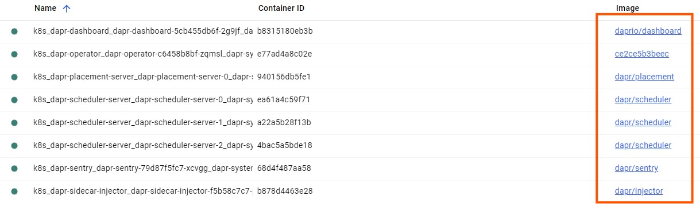

# Pre-requisites
- [Installation](#installation)
- [Control plane components](#control-plane-components)
- [Pub Sub and State store components](#pub-sub-and-state-store-components)
## Installation
* Version
```
C:\Git\microservices\hubToSensor\hpa\orchestrate-hubtosensor-services>dapr --version
CLI version: 1.12.0
Runtime version: 1.12.2
```
## Control plane components
* Setup **Control plane components**
 * `dapr-operator` manages sidecar injection and component configs.
 * `dapr-sentry` handles mTLS (can be disabled, but still part of setup).
 * `dapr-placement` is needed for actor placement, but gets installed anyway.
```
dapr init -k

C:\Git\microservices\hubToSensor\hpa\orchestrate-hubtosensor-services>dapr init -k
Making the jump to hyperspace...
Note: To install Dapr using Helm, see here: https://docs.dapr.io/getting-started/install-dapr-kubernetes/#install-with-helm-advanced
Container images will be pulled from Docker Hub
Deploying the Dapr control plane with latest version to your cluster...
Deploying the Dapr dashboard with latest version to your cluster...
Success! Dapr has been installed to namespace dapr-system. To verify, run `dapr status -k' in your terminal. To get started, go here: https://aka.ms/dapr-getting-started
```

* Verify
```
C:\Git\microservices\hubToSensor\hpa\orchestrate-hubtosensor-services>dapr status -k
  NAME                   NAMESPACE    HEALTHY  STATUS   REPLICAS  VERSION  AGE  CREATED
  dapr-dashboard         dapr-system  True     Running  1         0.15.0   2m   2025-10-27 18:17.14
  dapr-sentry            dapr-system  True     Running  1         1.16.1   2m   2025-10-27 18:17.10
  dapr-placement-server  dapr-system  True     Running  1         1.16.1   2m   2025-10-27 18:17.10
  dapr-operator          dapr-system  True     Running  1         1.16.1   2m   2025-10-27 18:17.10
  dapr-sidecar-injector  dapr-system  True     Running  1         1.16.1   2m   2025-10-27 18:17.10

C:\Git\microservices\hubToSensor\hpa\orchestrate-hubtosensor-services>kubectl get pods -n dapr-system
NAME                                    READY   STATUS    RESTARTS      AGE
dapr-dashboard-5cb455db6f-2g9jf         1/1     Running   0             2m29s
dapr-operator-c6458b8bf-zqmsl           1/1     Running   2 (86s ago)   2m33s
dapr-placement-server-0                 1/1     Running   0             2m33s
dapr-scheduler-server-0                 1/1     Running   0             2m33s
dapr-scheduler-server-1                 1/1     Running   0             2m33s
dapr-scheduler-server-2                 1/1     Running   0             2m33s
dapr-sentry-79d87f5fc7-xcvgg            1/1     Running   0             2m33s
dapr-sidecar-injector-f5b58c7c7-p6rgz   1/1     Running   0             2m33s
```


## Pub Sub and State store components
* Setup **Pub Sub and State store components**
- [rabbitmq-pubsub.yaml](config-files/rabbitmq-pubsub.yaml)
  - `Undo`: `kubectl delete -f rabbitmq-pubsub.yaml`
- [postgres-statestore.yaml](config-files/postgres-statestore.yaml)
  - `Undo`: `kubectl delete -f postgres-statestore.yaml`
```
C:\Git\microservices\hubToSensor\dapr\config-files>kubectl apply -f rabbitmq-pubsub.yaml
component.dapr.io/rabbitmq-pubsub created

C:\Git\microservices\hubToSensor\dapr\config-files>kubectl apply -f postgres-statestore.yaml
component.dapr.io/postgres-statestore created

C:\Git\microservices\hubToSensor\dapr\config-files>kubectl get components
NAME                  AGE
postgres-statestore   108s
rabbitmq-pubsub       2m18s
```