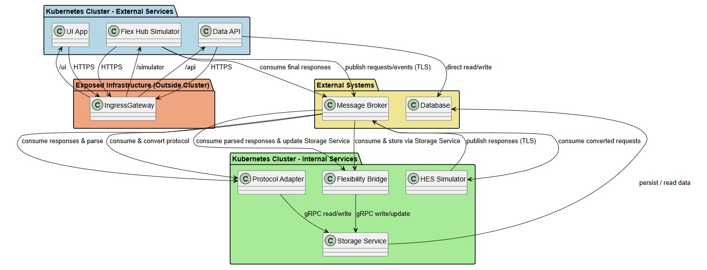

# Ingress
- [External services](#external-services)
- [Ingress controller for external routing](#ingress-controller-for-external-routing)
- [Ingress setup](setup/README.md)
  - [Restarting Ingress controller](restartIngress/README.md)
- [Changes to existing helm charts](#changes-to-existing-helm-charts)
- [Install Helm release](#install-helm-release)
- [Verify release](#verify-release)
- [Access services](#access-services)
- [Uninstall Helm release](#uninstall-helm-release)
- [Upgrade Helm release](#upgrades-helm-release)
- [Migration plan for production](prod/README.md)
- [Design](#design)
## External services
* **UI App** → Web frontend
* **Data API** → REST API for external clients
* **Flexibility Hub Simulator** → REST entry point
## Ingress controller for external routing
* **Single public endpoint** (e.g., `flex-hub-connector.example.com`)
* **Routing paths:**
  * `/api` → `data-api`
  * `/ui` → `ui-app`
  * `/simulator` → `flexibility-hub-simulator`
* Purpose: clean external access without exposing multiple NodePorts
## Changes to existing helm charts
- Copy existing helm charts to [ingress folder](orchestrate-hubtosensor-services)
  - Lets not update the existing one
- Modify [values.yaml](orchestrate-hubtosensor-services/values.yaml) and add section for `ingress`
```yaml
ingress:
  enabled: true
  host: fhs.local
  paths:
    uiApp: /ui
    dataApi: /api
    flexibilityHubSimulator: /simulator
  tls: false   # set true later when you configure TLS/Keycloak
```
- Create [ingress.yaml](orchestrate-hubtosensor-services/templates/ingress.yaml)
- Update [values.yaml](orchestrate-hubtosensor-services/values.yaml) ports to ClusterIP and remove nodePort for these services so **`Ingress` can route them `internally`**.
  - Remove rows with `  nodePort: ` for `dataApi`, `uiApp` and `flexibilityHubSimulator`
## Install Helm release
- [values-staging.yaml](orchestrate-hubtosensor-services/values-staging.yaml)
- Go to Helm chart folder (e.g., [orchestrate-hubtosensor-services](orchestrate-hubtosensor-services), run this command:
```bash
helm install ocs-staging . -f values-staging.yaml -n staging --set ingress.enabled=true --set ingress.host=fhs.local
```

## Verify release
```
C:\Git\microservices\hubToSensor\ingress\orchestrate-hubtosensor-services>helm install ocs-staging . -f values-staging.yaml -n staging --set ingress.enabled=true --set ingress.host=fhs.local
W1022 10:42:50.305260   30288 warnings.go:70] annotation "kubernetes.io/ingress.class" is deprecated, please use 'spec.ingressClassName' instead
NAME: ocs-staging
LAST DEPLOYED: Wed Oct 22 10:42:49 2025
NAMESPACE: staging
STATUS: deployed
REVISION: 1
TEST SUITE: None

C:\Git\microservices\hubToSensor\ingress\orchestrate-hubtosensor-services>helm list -A
NAME            NAMESPACE       REVISION        UPDATED                                 STATUS          CHART                                   APP VERSION
ingress-nginx   ingress-nginx   1               2025-10-21 19:57:47.7135786 +0300 EEST  deployed        ingress-nginx-4.13.3                    1.13.3
ocs-staging     staging         1               2025-10-22 10:42:49.6158514 +0300 EEST  deployed        orchestrate-hubtosensor-services-0.1.0  1.16.0

C:\Git\microservices\hubToSensor\ingress\orchestrate-hubtosensor-services>helm list -n staging
NAME            NAMESPACE       REVISION        UPDATED                                 STATUS          CHART                                   APP VERSION
ocs-staging     staging         1               2025-10-22 10:42:49.6158514 +0300 EEST  deployed        orchestrate-hubtosensor-services-0.1.0  1.16.0

C:\Git\microservices\hubToSensor\ingress\orchestrate-hubtosensor-services>kubectl get all -n staging
NAME                                                        READY   STATUS    RESTARTS   AGE
pod/data-api-7d85678bb6-kq6jk                               1/1     Running   0          73s
pod/flexibility-bridge-deployment-589b4bd9bc-pjpbf          1/1     Running   0          73s
pod/flexibility-hub-simulator-deployment-6dd799b5b8-j9kk7   1/1     Running   0          73s
pod/hes-simulator-deployment-6b8575c677-xqn2l               1/1     Running   0          73s
pod/protocol-adapter-deployment-6d6fd5698b-sf95p            1/1     Running   0          73s
pod/storage-service-deployment-6bcdd8df9c-2s852             1/1     Running   0          73s
pod/ui-app-67695df6bc-5qsfj                                 1/1     Running   0          73s

NAME                                        TYPE        CLUSTER-IP       EXTERNAL-IP   PORT(S)          AGE
service/data-api-service                    NodePort    10.102.78.96     <none>        8085:32088/TCP   73s
service/flexibility-hub-simulator-service   NodePort    10.106.117.3     <none>        8081:32209/TCP   73s
service/storage-service-service             ClusterIP   10.111.249.43    <none>        9090/TCP         73s
service/ui-app-service                      NodePort    10.100.101.135   <none>        8080:30616/TCP   73s

NAME                                                   READY   UP-TO-DATE   AVAILABLE   AGE
deployment.apps/data-api                               1/1     1            1           73s
deployment.apps/flexibility-bridge-deployment          1/1     1            1           73s
deployment.apps/flexibility-hub-simulator-deployment   1/1     1            1           73s
deployment.apps/hes-simulator-deployment               1/1     1            1           73s
deployment.apps/protocol-adapter-deployment            1/1     1            1           73s
deployment.apps/storage-service-deployment             1/1     1            1           73s
deployment.apps/ui-app                                 1/1     1            1           73s

NAME                                                              DESIRED   CURRENT   READY   AGE
replicaset.apps/data-api-7d85678bb6                               1         1         1       73s
replicaset.apps/flexibility-bridge-deployment-589b4bd9bc          1         1         1       73s
replicaset.apps/flexibility-hub-simulator-deployment-6dd799b5b8   1         1         1       73s
replicaset.apps/hes-simulator-deployment-6b8575c677               1         1         1       73s
replicaset.apps/protocol-adapter-deployment-6d6fd5698b            1         1         1       73s
replicaset.apps/storage-service-deployment-6bcdd8df9c             1         1         1       73s
replicaset.apps/ui-app-67695df6bc                                 1         1         1       73s

NAME                                                                REFERENCE                                         TARGETS                                     MINPODS   MAXPODS   REPLICAS   AGE
horizontalpodautoscaler.autoscaling/data-api-hpa                    Deployment/data-api-deployment                    cpu: <unknown>/50%, memory: <unknown>/60%   1         2         0          73s
horizontalpodautoscaler.autoscaling/flexibility-hub-simulator-hpa   Deployment/flexibility-hub-simulator-deployment   cpu: <unknown>/50%, memory: <unknown>/60%   1         2         1          73s
```
- [Check status and perform other Kubernetes operations](https://github.com/sbhrwl/microservices/blob/main/motivation/generatemessage/kubernetes/README.md#deploy-docker-images-on-kubernetes)
## Verify services at ingress
- Get ingress pod name: `kubectl get pods -n ingress-nginx -l app.kubernetes.io/component=controller`
- Replace ingress pod name: `kubectl logs ingress-nginx-controller-7d8cffd99c-rqz6d -n ingress-nginx --tail 50`
```
PS C:\Git\microservices\hubToSensor\ingress\trial\orchestrate-hubtosensor-services> kubectl get pods -n ingress-nginx -l app.kubernetes.io/component=controller
NAME                                        READY   STATUS    RESTARTS        AGE
ingress-nginx-controller-7d8cffd99c-rqz6d   1/1     Running   1 (2d13h ago)   2d16h
PS C:\Git\microservices\hubToSensor\ingress\trial\orchestrate-hubtosensor-services> kubectl logs ingress-nginx-controller-7d8cffd99c-rqz6d -n ingress-nginx --tail 50
```
- Check ingress conf: `kubectl exec ingress-nginx-controller-7d8cffd99c-8f64k -n ingress-nginx -- cat /etc/nginx/nginx.conf`
## Access services
- After moving these services behind **Ingress**, the URLs change because the **NodePorts are no longer used externally**.
- Instead, you use the `fhs.local` host + the paths defined in your Ingress.
  * Paths come from `values.yaml.ingress.paths`.
  * The host `fhs.local` replaces `localhost` because Ingress uses it for routing.
  * Internal service-to-service calls (like `ui-app` → `data-api`) should use **ClusterIP service names**, e.g., `http://data-api:8085`, not the Ingress URL.
  * External clients (your browser or Postman) use the new Ingress URLs.

| Service                   | Old URL (NodePort)                                           | New URL via Ingress                                    |
| ------------------------- | ------------------------------------------------------------ | ------------------------------------------------------ |
| ui-app                    | `http://localhost:30880/`                                    | `http://fhs.local/ui/`                                 |
| data-api                  | `http://localhost:30885/api/v1/requests/<requestID>/tracker` | `http://fhs.local/api/v1/requests/<requestID>/tracker` |
| flexibility-hub-simulator | `http://localhost:30881/api/messages`                        | `http://fhs.local/simulator/api/messages`              |

## Uninstall Helm release
```
helm uninstall ocs-dev -n dev
helm uninstall ocs-staging -n staging
helm uninstall ocs-prod -n prod
```
## Upgrade Helm release
```
helm upgrade ocs-staging . -f values-staging.yaml -n staging --set ingress.enabled=true --set ingress.host=fhs.local
```

## Design


<details>
  <summary>uml</summary>
 
**UML**
```uml
@startuml
!define RECTANGLE class

' Colors
skinparam rectangle {
  BackgroundColor White
  BorderColor Black
  Shadowing true
}

' Packages for visual grouping
package "Kubernetes Cluster - External Services" #ADD8E6 {
    RECTANGLE "UI App"
    RECTANGLE "Data API"
    RECTANGLE "Flex Hub Simulator"
}

package "Kubernetes Cluster - Internal Services" #90EE90 {
    RECTANGLE "Flexibility Bridge"
    RECTANGLE "Protocol Adapter"
    RECTANGLE "HES Simulator"
    RECTANGLE "Storage Service"
}

package "Exposed Infrastructure (Outside Cluster)" #FFA07A {
    RECTANGLE "IngressGateway"
}

package "External Systems" #F0E68C {
    RECTANGLE "Message Broker"
    RECTANGLE "Database"
}

' External access
"UI App" --> "IngressGateway" : HTTPS
"Data API" --> "IngressGateway" : HTTPS
"Flex Hub Simulator" --> "IngressGateway" : HTTPS

' Routing
"IngressGateway" --> "Data API" : /api
"IngressGateway" --> "UI App" : /ui
"IngressGateway" --> "Flex Hub Simulator" : /simulator

' Broker flow
"Flex Hub Simulator" --> "Message Broker" : publish requests/events (TLS)
"Message Broker" --> "Flexibility Bridge" : consume & store via Storage Service
"Message Broker" --> "Protocol Adapter" : consume & convert protocol
"Message Broker" --> "HES Simulator" : consume converted requests
"HES Simulator" --> "Message Broker" : publish responses (TLS)
"Message Broker" --> "Protocol Adapter" : consume responses & parse
"Message Broker" --> "Flexibility Bridge" : consume parsed responses & update Storage Service
"Flex Hub Simulator" --> "Message Broker" : consume final responses

' Storage service to Database
"Flexibility Bridge" --> "Storage Service" : gRPC write/update
"Protocol Adapter" --> "Storage Service" : gRPC read/write
"Storage Service" --> "Database" : persist / read data

' Data API direct connection to Database
"Data API" --> "Database" : direct read/write

@enduml
```

</details>
