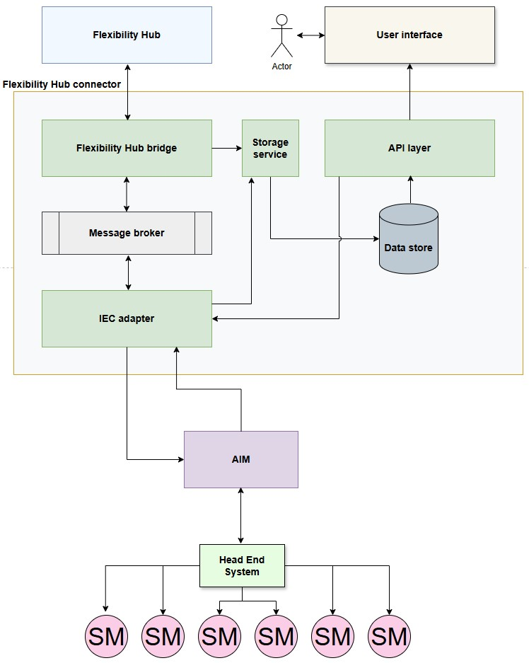

## Architecture
- [Overview](#overview)
- [Services and flow of information](#services-and-flow-of-information)
- [Key aspects](#key-aspects)
## Overview

## Services and flow of information
1. **Flexibility Hub Simulator → Message Broker**
   * Publishes flexibility requests/events over **TLS-secured connections**.
2. **Message Broker → Flexibility Bridge**
   * Consumes requests over **TLS**.
   * **Creates request records in the database via Storage Service**.
   * Pushes requests back to the broker for protocol conversion.
3. **Message Broker → Protocol Adapter Service**
   * Consumes requests over **TLS**, converts them to the target protocol, and republishes to the broker.
4. **Message Broker → HES Simulator**
   * Consumes converted requests over **TLS**.
   * Simulates execution and sends a **response** (success/failure) back to the broker.
5. **Message Broker → Protocol Adapter Service**
   * Consumes simulated responses over **TLS**, parses them, and republishes to the broker.
6. **Message Broker → Flexibility Bridge**
   * Consumes parsed responses over **TLS**.
   * **Updates the final status of requests in the database via Storage Service**.
   * Publishes **final responses** to the broker for the Flexibility Hub Simulator.
7. **Message Broker → Flexibility Hub Simulator**
   * Consumes final responses over **TLS** to track the **status of its requests**.
8. **Data API Layer → User Interface**
   * Exposes APIs to fetch request statuses, telemetry, and results.
   * **UI and Data API Layer are secured via Keycloak**.
   * UI is exposed over **HTTPS**.
## Key aspects
* **Storage Service** handles all database operations.
* **HES Simulator** generates responses.
* **Message Broker** orchestrates async communication and is secured via **TLS**.
* **Flexibility Hub Simulator** tracks requests through broker responses.
* **UI and Data API Layer** secured with **Keycloak**, with HTTPS for encrypted client access.
* **[Data store and API design](datastore/README.md)**

---
#### 🖥️ **Slide 1 – System Architecture**

* **Visual:** Clean layered diagram showing all services.
* **Content:**
  * Flex Hub Simulator
  * Message Broker (TLS)
  * Flexibility Bridge
  * Protocol Adapter
  * HES Simulator
  * Storage Service
  * Data API + UI (Keycloak secured)
* **Speaker note:**

  > “This is our end-to-end simulation ecosystem — each box is a microservice working independently yet securely connected through TLS.”

---

#### 🔁 **Slide 2 – Request Flow: From Creation to Response**

* **Visual:** Sequential arrows or animation showing message movement.
* **Flow:**

  1. Flex Hub Simulator creates request → Storage Service (saves to DB)
  2. Request → Message Broker (TLS)
  3. Flexibility Bridge → Protocol Adapter → Message Broker
  4. HES Simulator simulates response → Message Broker
  5. Flexibility Bridge updates status via Storage Service → Message Broker → Flex Hub Simulator
* **Speaker note:**

  > “Here’s how one command travels across services and comes back as a simulated response.”

---

#### 🧩 **Slide 3 – Microservice Roles**

* **Visual:** Table or grid with two columns (Service | Purpose).
* **Examples:**

  * Flex Hub Simulator – Generates requests and listens for results.
  * Flexibility Bridge – Manages orchestration & status updates.
  * Protocol Adapter – Performs protocol conversion.
  * HES Simulator – Mocks the external system’s response.
  * Storage Service – Centralized DB access and updates.
  * Data API + UI – Secure access via Keycloak.
* **Speaker note:**

  > “Notice how each service owns a single responsibility — this is the power of microservices.”

---

#### 🔐 **Slide 4 – Security & Transport**

* **Visual:** Lock icons over lines, Keycloak logo near UI, TLS label near broker.
* **Content:**

  * UI + API secured by Keycloak (OIDC).
  * All broker communications → TLS.
  * HTTPS exposure for UI.
* **Speaker note:**

  > “Security isn’t an afterthought — every service talks over TLS, and access is controlled centrally.”

---

#### ☁️ **Slide 5 – Scalability & Modularity**

* **Visual:** Cloud background, multiple pods of Protocol Adapter/Bridge.
* **Content:**

  * Independent scaling per service.
  * Asynchronous messaging for elasticity.
  * Fault-isolation by design.
* **Speaker note:**

  > “We can scale or upgrade any part without stopping the system — that’s the real-world advantage.”

---

🚀 Section 7: Scalability & Cloud Resilience (10 min)

---

📈 Slide 1 – Horizontal Scaling

Visual: Multiple pods for Protocol Adapter and Flexibility Bridge in Kubernetes.

Key points:

Each service can scale independently based on CPU or message queue depth.

Autoscaling ensures performance under heavy load.

Speaker note:

> “If one service is overloaded, we just spin up more instances — the rest of the system keeps running smoothly.”

---

⚖️ Slide 2 – Load Balancing

Visual: Incoming traffic distributed among service pods.

Key points:

Internal load balancing for microservices.

External load balancing for UI/API endpoints.

Ensures even distribution of requests.

Speaker note:

> “Load balancers prevent hotspots and make sure no single pod becomes a bottleneck.”

---

💥 Slide 3 – Fault Tolerance

Visual: Pod crash icon → self-healing arrow.

Key points:

Kubernetes restarts failed pods automatically.

Dead-letter queues and retry mechanisms for message loss.

Circuit breakers to isolate failing services.

Speaker note:

> “Failures happen — but the system recovers automatically without human intervention.”

---

🔄 Slide 4 – Deployment Strategies

Visual: Blue-green or rolling update illustration.

Key points:

Rolling updates for zero-downtime upgrades.

Blue-green or canary deployments for safe feature rollouts.

Speaker note:

> “We can deploy updates safely without affecting users, which is critical in production systems.”

---

💰 Slide 5 – Cost Optimization

Visual: Cloud resource scaling graph (scale-to-zero, variable pods).

Key points:

Idle services can scale down to reduce cost.

Dynamic scaling ensures optimal cloud resource usage.

Speaker note:

> “Scalability isn’t just about performance — it’s about using resources efficiently to save costs.”

---

Next, we can move to Section 8: Configuration & Service Discovery (5 min).
Do you want me to draft that now?

Perfect 👌 moving on to Section 8: Configuration & Service Discovery (5 min) — focusing on how services find each other and manage environment-specific configurations.

---

⚙️ Section 8: Configuration & Service Discovery (5 min)

---

🗂️ Slide 1 – Environment-Specific Configuration

Visual: ConfigMaps / values.yaml icon → microservices.

Key points:

Configurations separated from code using Helm values or ConfigMaps.

Allows different setups for dev, staging, and production.

No hardcoded secrets or endpoints in the code.

Speaker note:

> “This separation ensures that moving between environments is safe and predictable.”

---

🧭 Slide 2 – Service Discovery

Visual: Kubernetes DNS resolving service names to pods.

Key points:

Microservices discover each other via Kubernetes DNS or internal service registry.

No need to hardcode IP addresses.

Supports scaling: new pods automatically register and are reachable.

Speaker note:

> “Service discovery is like having a dynamic phonebook — any service can find another at runtime.”

---

🌐 Slide 3 – Optional: Service Mesh

Visual: Istio or Linkerd overlay with arrows between services.

Key points:

Handles routing, retries, load balancing, and security automatically.

Adds observability and telemetry without changing service code.

Speaker note:

> “Service mesh is optional, but in large systems it adds an extra layer of resilience and insight.”

---

Next, we can move to Section 9: Live Demo / Walkthrough (10 min).
Shall I draft that next?

Perfect 👌 moving on to Section 9: Live Demo / Walkthrough (10 min) — this section shows the end-to-end flow in action to make the concepts tangible for students.

---

🎬 Section 9: Live Demo / Walkthrough (10 min)

---

🖥️ Slide 1 – End-to-End Flow Overview

Visual: Simplified diagram showing:
Flex Hub Simulator → Message Broker → Flexibility Bridge → Protocol Adapter → HES Simulator → Message Broker → Storage Service → UI.

Speaker note:

> “Here’s the full journey of a request — from creation to final status update in the UI.”

---

🔄 Slide 2 – Step-by-Step Simulation

Visual: Animated arrows or numbered steps showing:

1. Flex Hub Simulator creates request.

2. Storage Service saves request.

3. Message Broker forwards to Flexibility Bridge.

4. Protocol Adapter converts protocol and returns to broker.

5. HES Simulator responds to broker.

6. Flexibility Bridge updates status via Storage Service.

7. Flex Hub Simulator consumes final response.

Speaker note:

> “We can see how microservices interact asynchronously while keeping the system resilient.”

---

🐳 Slide 3 – Deployment Demonstration

Visual: Screenshot or schematic of Helm deployment:

helm install / helm upgrade logs.

Multiple pods for services showing scaling.

Speaker note:

> “This is how we deploy the system in Kubernetes using Helm — everything is automated and repeatable.”

---

📊 Slide 4 – Live Status & Monitoring

Visual: Grafana dashboard or logging console.

Speaker note:

> “While the demo runs, we monitor logs and metrics — verifying performance, errors, and request lifecycle.”

---

This section should tie theory to practice, leaving students with a concrete mental model of your architecture and flow.

Next, we can draft Section 10: Q&A + Career Insights (5 min). Do you want me to do that?

