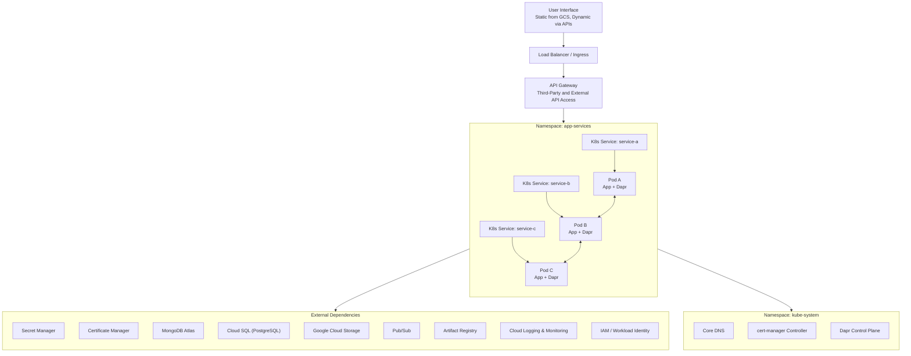

# Kubernetes service account
* The application runs on a Kubernetes cluster and connects to multiple cloud services: Secret Manager, Certificate Manager, Database, Pub/Sub, and S3.
* A dedicated **Kubernetes Service Account (KSA)** will be created for the application.
* This KSA will be **mapped via Workload Identity** to a single **GCP IAM Service Account** that represents the application in the cloud.
* The IAM Service Account will be granted the following roles:
  * **Secret Manager:** `roles/secretmanager.secretAccessor`
  * **Certificate Manager:** `roles/certificatemanager.viewer`
  * **Database (Cloud SQL):** `roles/cloudsql.client`
  * **Pub/Sub:** `roles/pubsub.publisher`, `roles/pubsub.subscriber`
  * **S3 / Cloud Storage:** `roles/storage.objectAdmin`
* This IAM Service Account will provide unified access control across all required cloud resources.
* The application uses **Dapr** for service integration and messaging. Dapr does **not** change or add to the identity or access model; it uses the same credentials provided through the mapped IAM Service Account.

