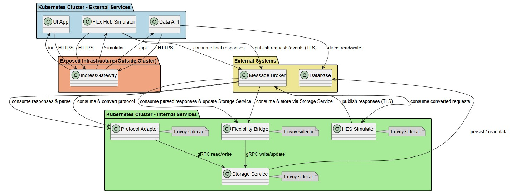

# Service mesh
- [Internal services and TLS traffic](#internal-services-and-tls-traffic)
- [Database for storage service](#database-for-storage-service)
- [External access](#external-access)
- [Observability and debugging](#observability-and-debugging)
- [Optional improvements](#optional-improvements)
- [UML](#uml)
## Internal services and TLS traffic
* **Message Broker ↔ Flexibility Bridge / Protocol Adapter / HES Simulator**
  * Istio can **automatically inject Envoy sidecars** into all services.
  * **mTLS**: all TLS traffic between services can be managed by Istio. No need to handle custom TLS in your services.
  * **Service discovery**: broker and clients locate each other via **service names** (K8s DNS) → no hardcoded endpoints.
## Database for storage service
* Accessed by Flexibility Bridge and Protocol Adapter.
* With Istio:
  * gRPC traffic can be routed via sidecars.
  * Only healthy pods receive traffic (readiness checks).
  * **Retries / circuit breaking** can protect Storage Service from overload.
## External access
* External access for UI, Data API and Flexibility hub simulator)
* Istio **IngressGateway** replaces your Ingress controller:
  * Expose **single public endpoint**.
  * Routing paths `/api`, `/ui`, `/simulator` → **VirtualService rules**.
  * TLS termination at the gateway.
  * Can integrate with **Keycloak** for auth.
## Observability and debugging
* Istio adds:
  * Metrics per service / per path.

  * Distributed tracing: track **Flexibility request through broker → services → back**.
  * Logs automatically include source/destination service info.
## Optional improvements
* **Traffic splitting**: test new versions of Protocol Adapter or Flexibility Bridge.
* **Rate limiting**: protect Message Broker from sudden spikes.
* **Fault injection**: simulate failures in HES Simulator or adapters.
## UML


<details>
  <summary>prompt</summary>
 
**UML**
```uml
@startuml
!define RECTANGLE class

' Colors
skinparam rectangle {
  BackgroundColor White
  BorderColor Black
  Shadowing true
}

' Packages for visual grouping
package "External Services (Exposed to Users)" #ADD8E6 {
    RECTANGLE "UI_App"
    RECTANGLE "Data_API"
    RECTANGLE "Flex_Hub_Simulator"
}

package "Kubernetes Cluster - Internal Services" #90EE90 {
    RECTANGLE "Flexibility_Bridge"
    RECTANGLE "Protocol_Adapter"
    RECTANGLE "HES_Simulator"
    RECTANGLE "Storage_Service"

    ' Sidecars as separate color
    note right of "Flexibility_Bridge" #D3D3D3 : Envoy sidecar
    note right of "Protocol_Adapter" #D3D3D3 : Envoy sidecar
    note right of "HES_Simulator" #D3D3D3 : Envoy sidecar
    note right of "Storage_Service" #D3D3D3 : Envoy sidecar
}

package "Exposed Infrastructure (Outside Cluster)" #FFA07A {
    RECTANGLE "IngressGateway"
}

package "External Systems" #F0E68C {
    RECTANGLE "Message_Broker"
    RECTANGLE "Database"
}

' External access
"UI_App" --> "IngressGateway" : HTTPS
"Data_API" --> "IngressGateway" : HTTPS
"Flex_Hub_Simulator" --> "IngressGateway" : HTTPS

' Routing
"IngressGateway" --> "Data_API" : /api
"IngressGateway" --> "UI_App" : /ui
"IngressGateway" --> "Flex_Hub_Simulator" : /simulator

' Broker flow
"Flex_Hub_Simulator" --> "Message_Broker" : publish requests/events (TLS)
"Message_Broker" --> "Flexibility_Bridge" : consume & store via Storage_Service
"Message_Broker" --> "Protocol_Adapter" : consume & convert protocol
"Message_Broker" --> "HES_Simulator" : consume converted requests
"HES_Simulator" --> "Message_Broker" : publish responses (TLS)
"Message_Broker" --> "Protocol_Adapter" : consume responses & parse
"Message_Broker" --> "Flexibility_Bridge" : consume parsed responses & update Storage_Service
"Flex_Hub_Simulator" --> "Message_Broker" : consume final responses

' Storage service to Database
"Flexibility_Bridge" --> "Storage_Service" : gRPC write/update
"Protocol_Adapter" --> "Storage_Service" : gRPC read/write
"Storage_Service" --> "Database" : persist / read data

@enduml
```

</details>
