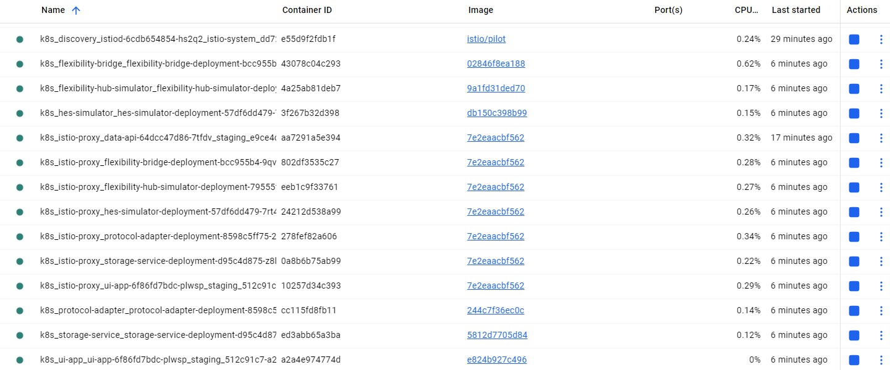

# Application onboarding
  - [Automatic envoy sidecar injection](#automatic-envoy-sidecar-injection)
  - [Verify release](#verify-release)
  - [Access services](#access-services)
## Automatic envoy sidecar injection
* Label the namespace where your services are deployed.
```
kubectl label namespace <YOUR_APP_NAMESPACE> istio-injection=enabled
kubectl label namespace staging istio-injection=enabled
```
* Redeploy Services: Upgrade your existing service Helm charts to trigger the injection.
```
helm upgrade <YOUR_RELEASE_NAME> <YOUR_CHART_PATH> -n <YOUR_APP_NAMESPACE>
helm upgrade ocs-staging . -f values-staging.yaml -n staging
```
* If upgrade doesnot helps, 
  * restart all deployments at once
```
kubectl rollout restart deployment -n staging --all
```

  * If `-all` does not work, restart each deployment
```
kubectl rollout restart deployment data-api -n staging
kubectl rollout restart deployment ui-app -n staging
kubectl rollout restart deployment flexibility-hub-simulator-deployment -n staging
kubectl rollout restart deployment flexibility-bridge-deployment -n staging
kubectl rollout restart deployment protocol-adapter-deployment -n staging
kubectl rollout restart deployment storage-service-deployment -n staging
kubectl rollout restart deployment hes-simulator-deployment -n staging
```
## Verify release
* Wait for the new pods to be ready. 
  * They should now show `2/2 containers` (your app + Envoy sidecar).
```
helm list -n staging
kubectl get pod -n staging
kubectl get svc -n staging
kubectl get all -n staging
```
* Console logs
```
C:\Git\microservices\hubToSensor\hpa\orchestrate-hubtosensor-services>kubectl get pod -n staging
NAME                                                   READY   STATUS    RESTARTS   AGE
data-api-64dcc47d86-7tfdv                              2/2     Running   0          13m
flexibility-bridge-deployment-bcc955b4-9qvnd           2/2     Running   0          97s
flexibility-hub-simulator-deployment-79555f4cd-q764z   2/2     Running   0          104s
hes-simulator-deployment-57df6dd479-7rt4r              2/2     Running   0          78s
protocol-adapter-deployment-8598c5ff75-2s8f7           2/2     Running   0          91s
storage-service-deployment-d95c4d875-z8lth             2/2     Running   0          85s
ui-app-6f86fd7bdc-plwsp                                2/2     Running   0          111s

C:\Git\microservices\hubToSensor\hpa\orchestrate-hubtosensor-services>kubectl get svc -n staging
NAME                                TYPE        CLUSTER-IP      EXTERNAL-IP   PORT(S)          AGE
data-api-service                    NodePort    10.107.22.78    <none>        8085:30885/TCP   30m
flexibility-hub-simulator-service   NodePort    10.110.227.18   <none>        8081:30881/TCP   30m
storage-service-service             ClusterIP   10.110.178.99   <none>        9090/TCP         30m
ui-app-service                      NodePort    10.104.19.178   <none>        8080:30880/TCP   30m
```
## Access services
* List of exposed URLs for your current services, assuming typical **NodePort** or **port-forwarding** access mappings for local development:
  * `flexibility-hub-simulator` → `http://localhost:30881/api/messages`
  * `data-api-service` → `http://localhost:30885/api/v1/requests/<requestID>/tracker`
  * `ui-app` → `http://localhost:30880/`
